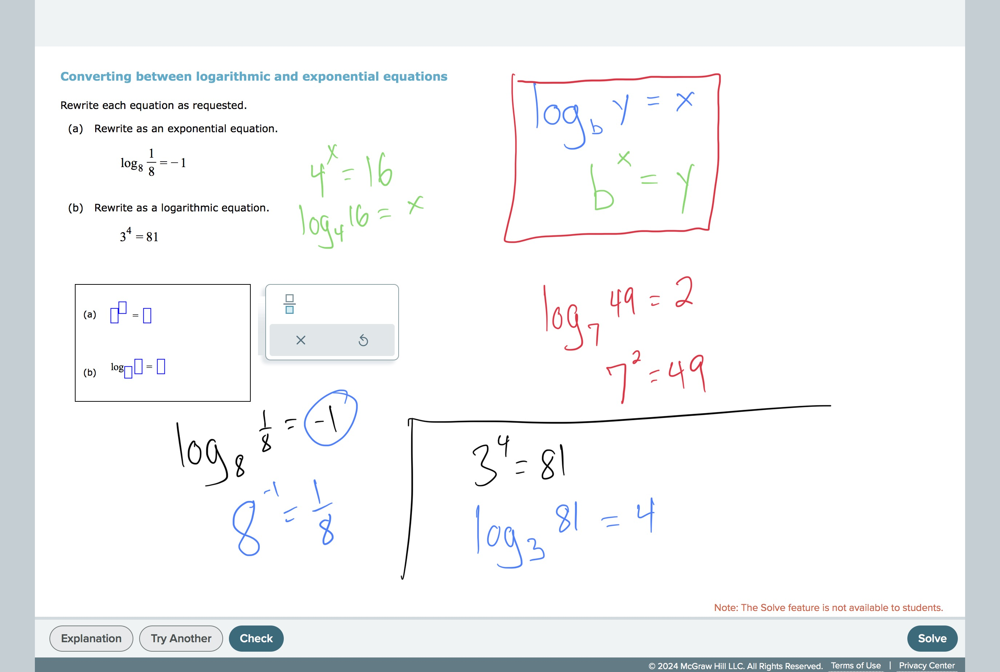

# Converting between logarithmic and exponential equations

## TimelyMathTutor Video:
[Converting between logarithmic and exponential equations
](https://youtu.be/lUZHqXyTOhU?si=7MMs-QaIjQSsVdWU)## 
Worked Examples:

#ExponentialAndLogarithmicFunctions 