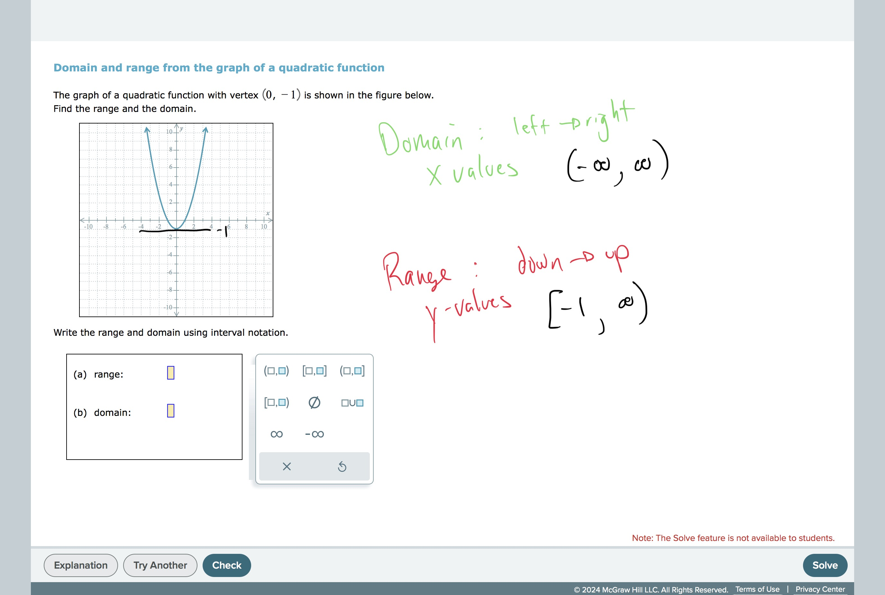

# Domain and range from the graph of a quadratic function

## TimelyMathTutor Video:[Domain and range from the graph of a quadratic function
](https://youtu.be/9A_Y1lS3U6c?si=r3v0aXlKBz_wX4uB)## 
Worked Examples:
# 

#GraphsAndFunctions 