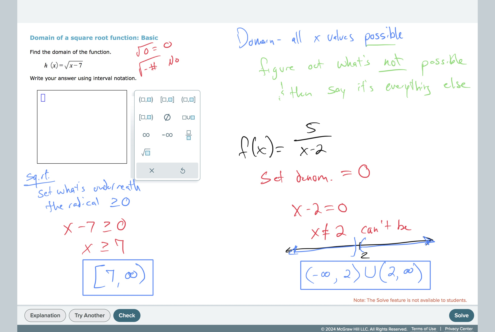

# Domain of a square root function: Basic

## TimelyMathTutor Video:[Domain of a square root function: Basic
](https://youtu.be/oLCEaTkwE_I?si=6tJYdkMIO4I1HKUe)
## Worked Examples:
# 

#GraphsAndFunctions 