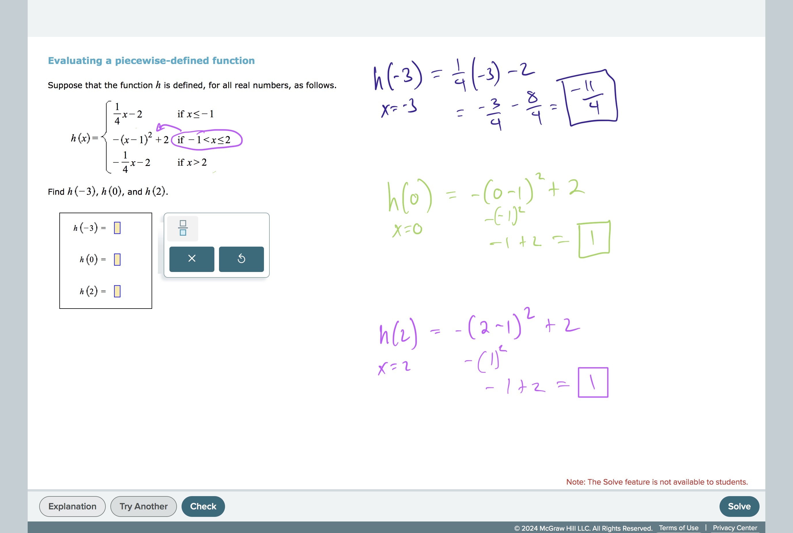
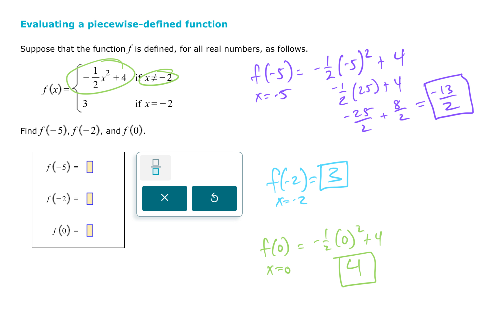
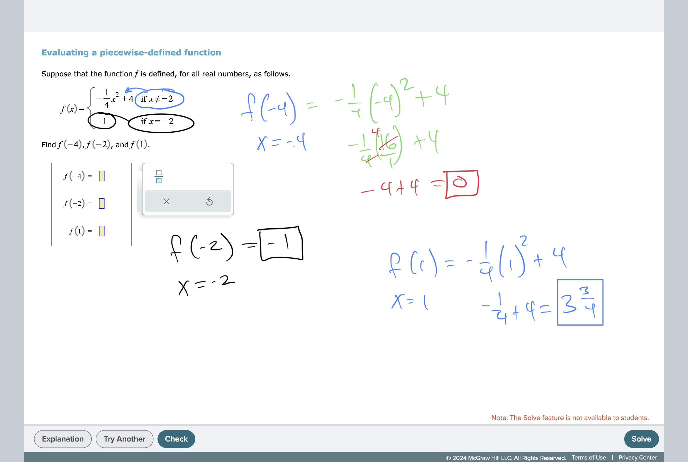
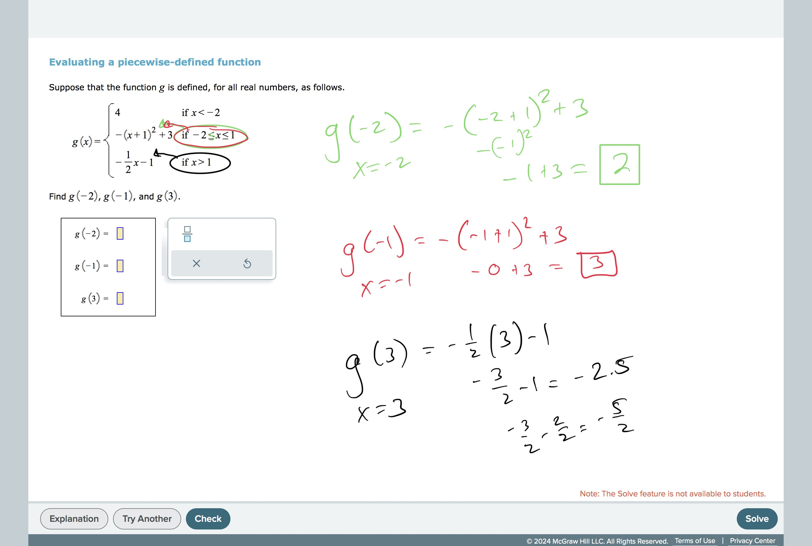

# Evaluating a piecewise-defined function

## TimelyMathTutor Video:[Evaluating a piecewise-defined function
](https://youtu.be/LtJd7Mb0CCk?si=YHtE2dblMSyVsxlh)
## Worked Examples:

#GraphsAndFunctions 