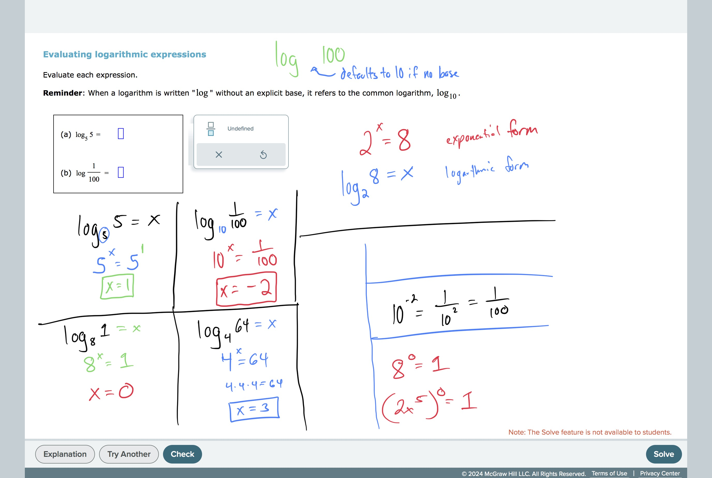

# Evaluating logarithmic expressions

## TimelyMathTutor Video:[Evaluating logarithmic expressions
](https://youtu.be/CqS2HTAjmgU?si=WLJYdoC4UQgtQIsr)
## Worked Examples:
# 

#ExponentialAndLogarithmicFunctions 