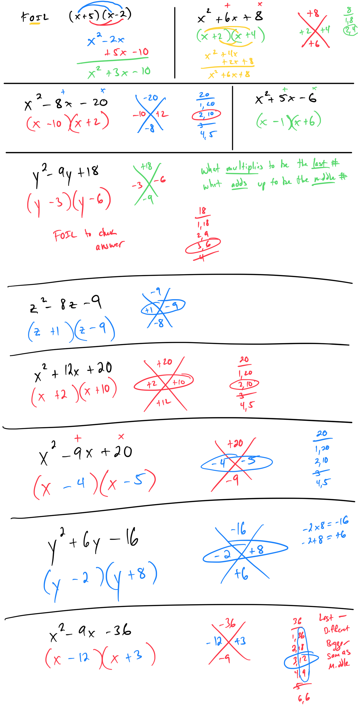

# Factoring a quadratic with leading coefficient 1

# 
Help with signs:
Last sign is positive: both signs will be the same as the middle number.
Last sign is negative: signs will be different, the bigger numbers gets the same sign as the middle number.

|                                | Last sign: +                   | Last sign: -                   |
|--------------------------------|--------------------------------|--------------------------------|
| Middle sign: +                 | Both: +                        | Bigger #: +      Smaller # : - |
| Middle sign: -                 | Both: -                        | Bigger #: -      Smaller # : + |

# 
 
# 
#ExponentsAndPolynomials 