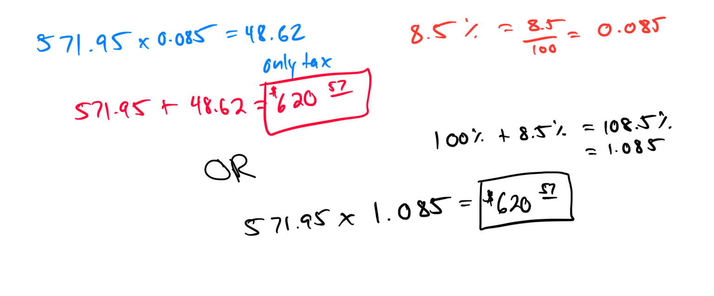

# Finding the total cost including tax or markup

A TV has a listed price of $571.95 before tax. If the sales tax rate is 8.5%, find the total cost of the TV with sales tax included.
Round your answer to the nearest cent, as necessary.

