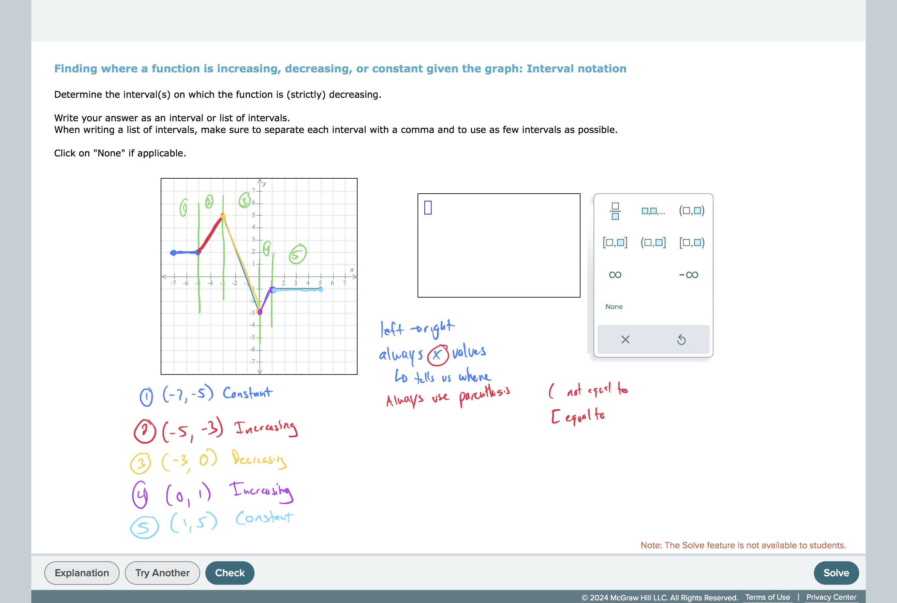
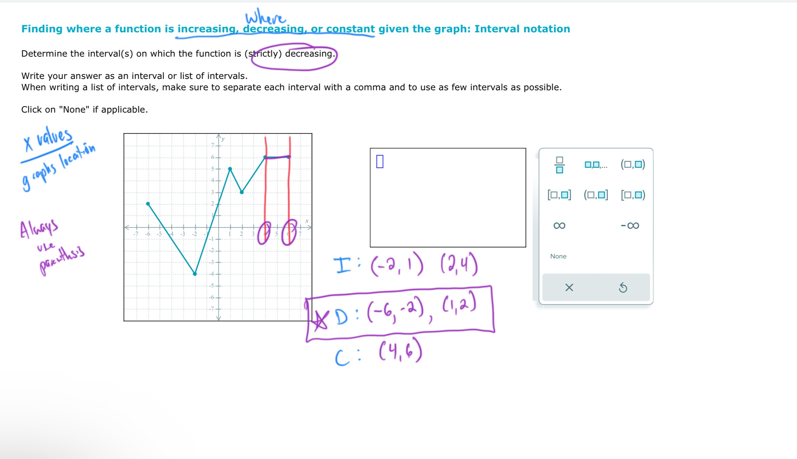

# Finding where a function is increasing, decreasing, or constant given…

# Finding where a function is increasing, decreasing, or constant given the graph: Interval Notation

## TimelyMathTutor Video:
[Finding where a function is increasing, decreasing, or constant given the graph: Interval Notation](https://youtu.be/mC3nIY3CTNM?si=d2NmmrtEGQ-EwRD6)

## Worked Examples:
# 

#GraphsAndFunctions 