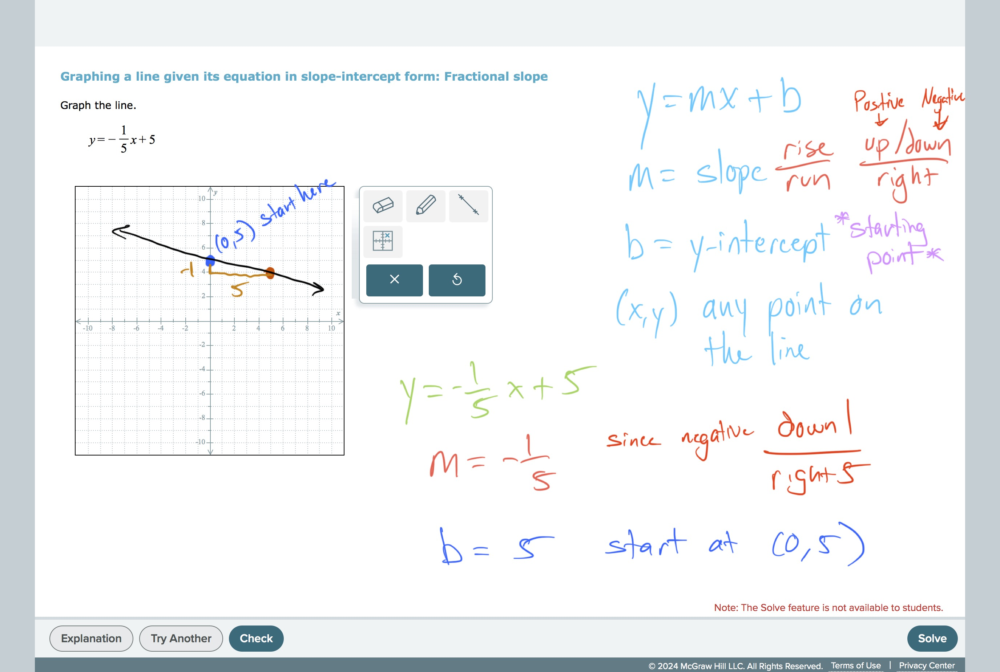

# Graphing a line given its equation in slope-intercept form: Fractional…

# **Graphing a line given its equation in slope-intercept form: Fractional slope**

## **Keys to Success:**
The key to this problem is figuring where to start and go from there.  You want to start at you b (y-intercept) and then do what your slope says. Slope is rise over run so for the top number you go up if it’s positive and down if it’s negative and the bottom number you always go that many to the RIGHT.

## Worked Examples:

#LinesAndFunctions 
#GraphsAndFunctions 
#Lines 