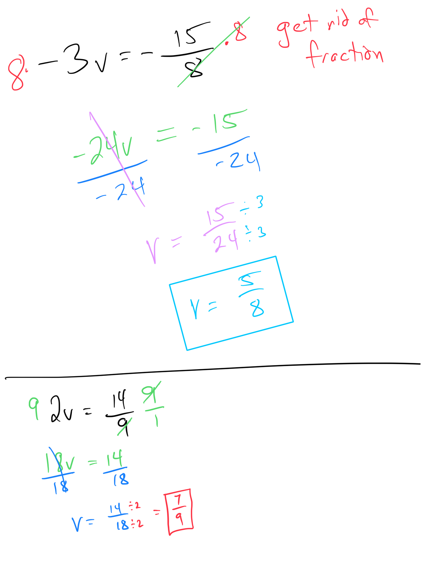

# Multiplicative property of equality with signed fractions

## Worked Examples:
**This way is one extra step.  But we don’t like fractions, right?  So any time you see a fraction in an equation, get rid of it!  You get rid of it by multiplying by the denominator (or least common denominator if there are more than one).**

#LinearEquationsAndInequalities 
#EquationsAndInequalities 