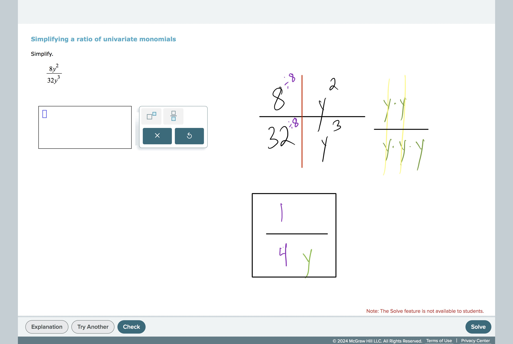
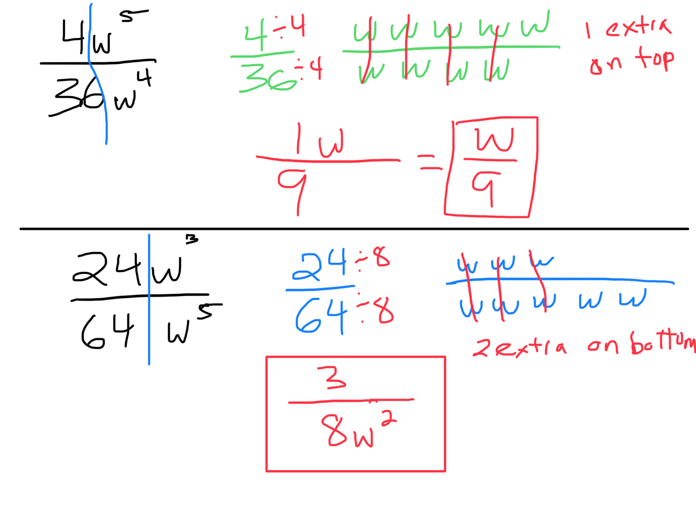

# Simplifying a ratio of univariate monomials

Look at the numbers and variables separately.  Simplify the numbers by dividing 8 and 32 each by 8 and then look at the y’. You have 2 y’s on top and 3 y’s on the bottom, so you have one extra y on the bottom.

#ExponentsAndPolynomials 
#AlgebraAndGeometryReview 