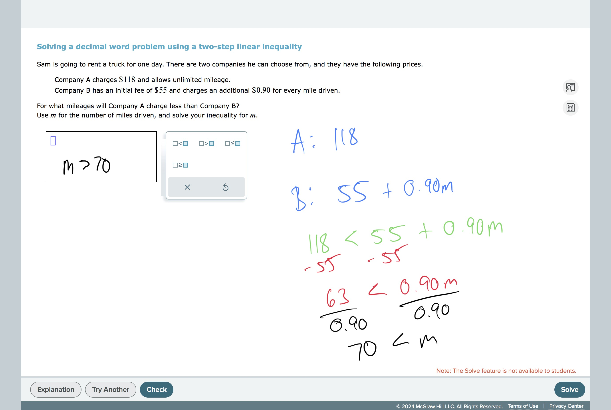
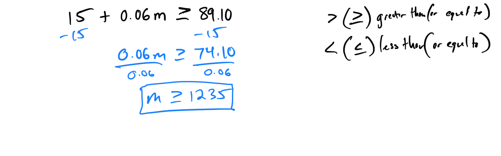

# Solving a decimal word problem using a two-step inequality

## 
Worked Examples:

[D83E9E05-29A9-4E84-8EB1-9A2BA5DD43AA](attachments/D83E9E05-29A9-4E84-8EB1-9A2BA5DD43AA.pdf)
# 

For his phone service, Manuel pays a monthly fee of $15, and he pays an additional $0.06 per minute of use. The least he has been charged in a month is $89.10.
What are the possible numbers of minutes he has used his phone in a month?
Use m for the number of minutes, and solve your inequality for m.

[2D024966-18B9-4E4A-8DE6-30DA42FE85B9](attachments/2D024966-18B9-4E4A-8DE6-30DA42FE85B9.heic)

#LinearEquationsAndInequalities 
#EquationsAndInequalities 
