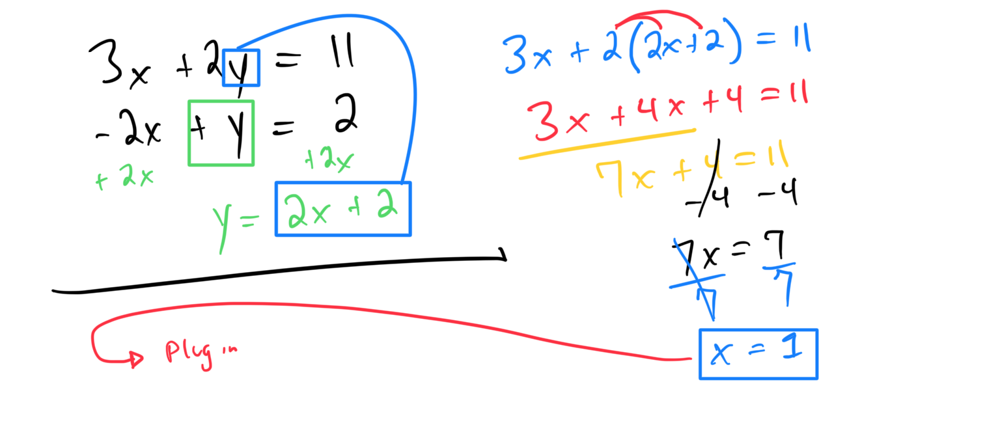

# Solving a system of linear equations with substitution

## 
Worked Examples:

# 

[C280804A-B7D2-45DD-B780-5ED0B2815004](attachments/C280804A-B7D2-45DD-B780-5ED0B2815004.heic)

#SystemsOfLinearEquations 
#SystemofEquationsAndMatrices
