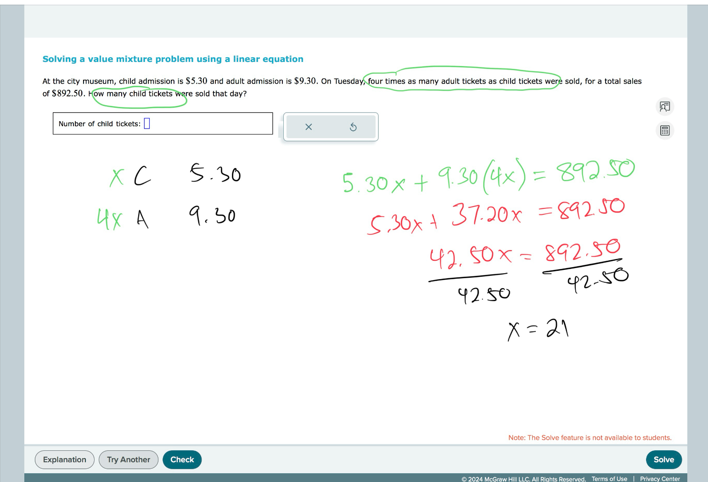
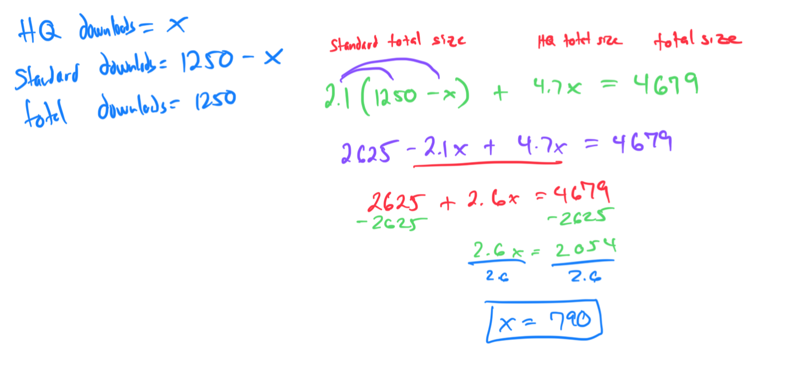

# Solving a value mixture problem using a linear equation

A Web music store offers two versions of a popular song. The size of the standard version is 2.1 megabytes (MB). The size of the high-quality version is 4.7 MB. Yesterday, there were 1250 downloads of the song, for a total download size of 4679 MB. How many downloads of the high-quality version were there?

#Lines 
#LinearEquationsAndInequalities 
