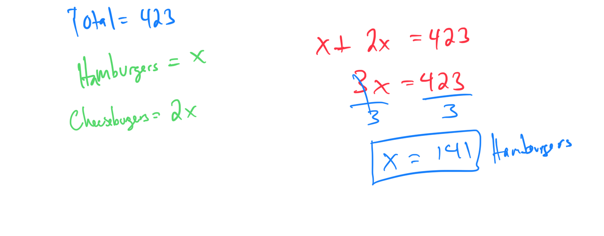

# Solving a word problem with two unknowns using a linear equation

On Saturday, a local hamburger shop sold a combined total of 423 hamburgers and cheeseburgers. The number of cheeseburgers sold was two times the number of hamburgers sold. How many hamburgers were sold on Saturday?

