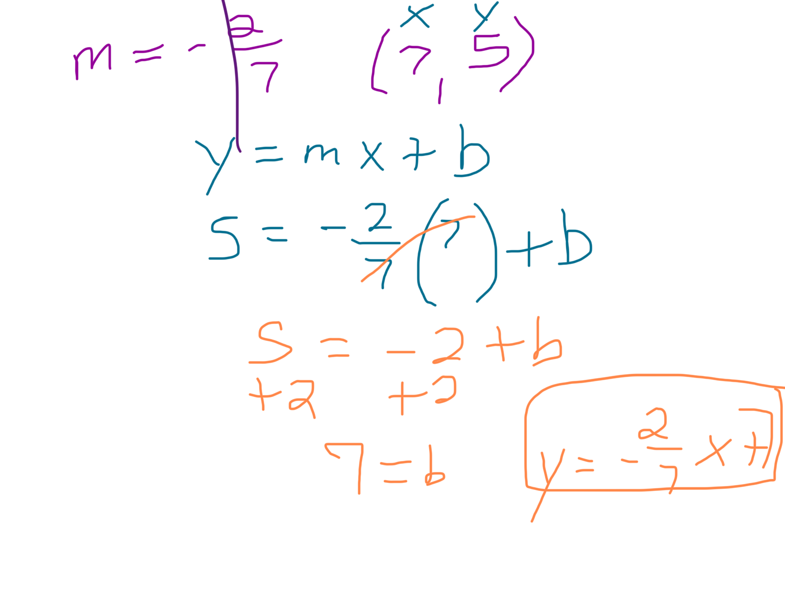
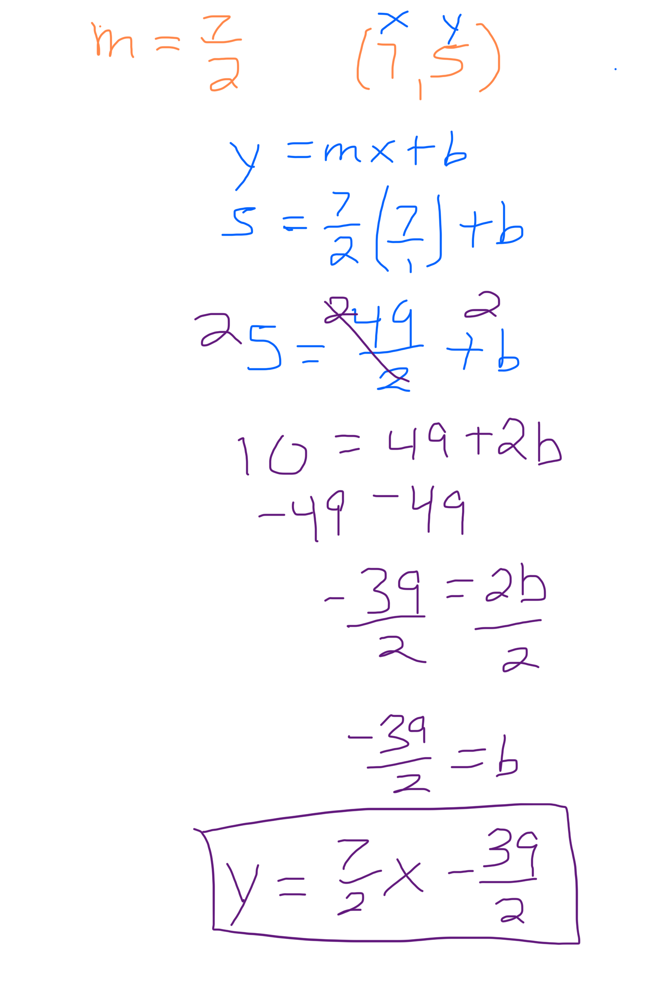

# Writing equations of lines parallel and perpendicular to a given line…

# **Writing equations of lines parallel and perpendicular to a given line through a point**

y=(-2/7)x+4

Parallel passes through (7,5)
Parallel means the same slope as the original. 

Perpendicular passes through (7, 5)
Perpendicular means the slope is opposite reciprocal or “flip it & switch the sign”

