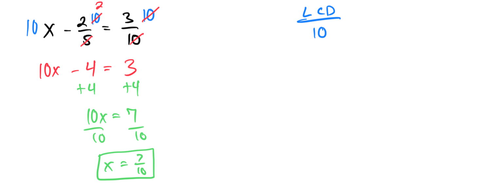
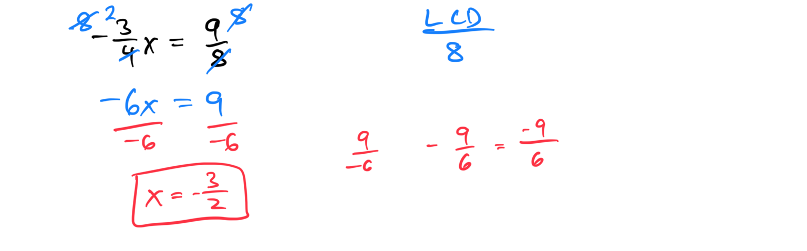
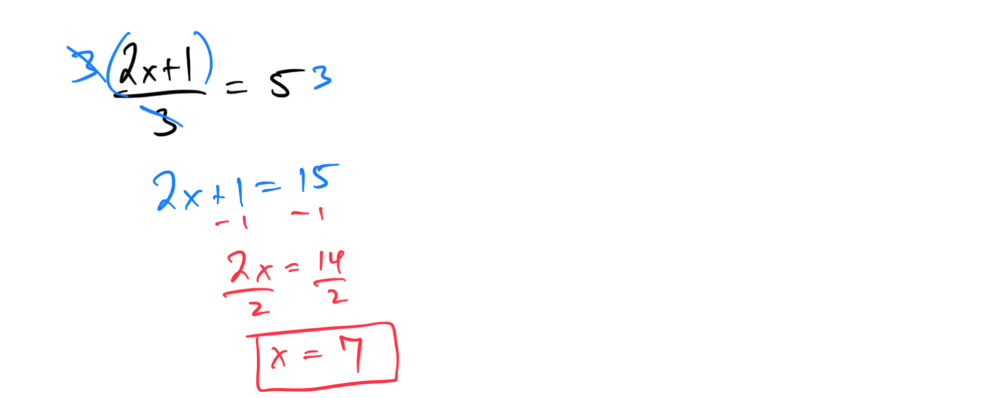
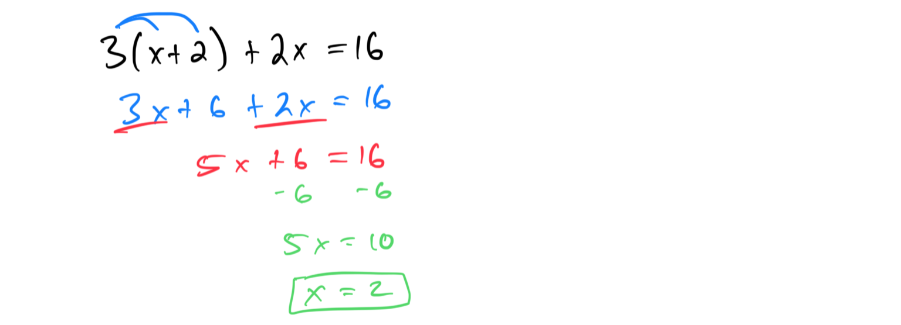
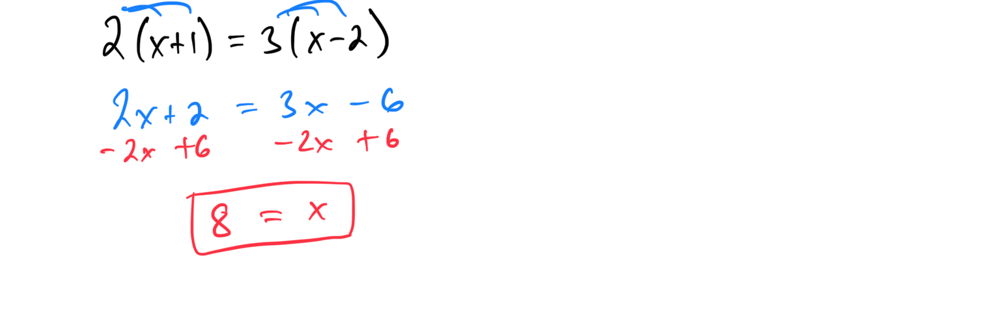
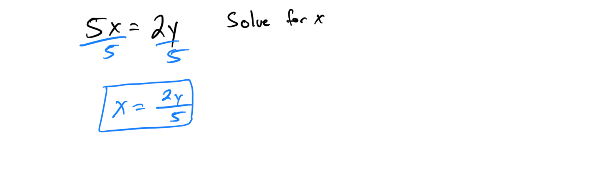
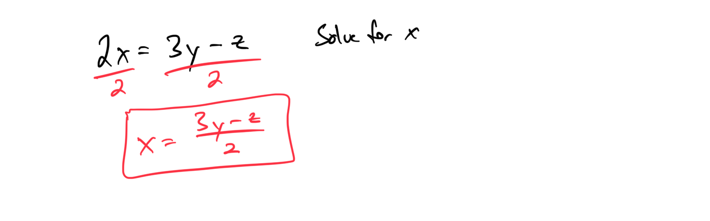
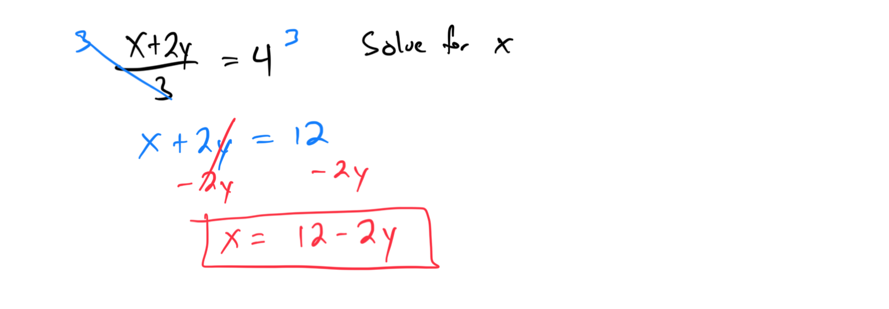
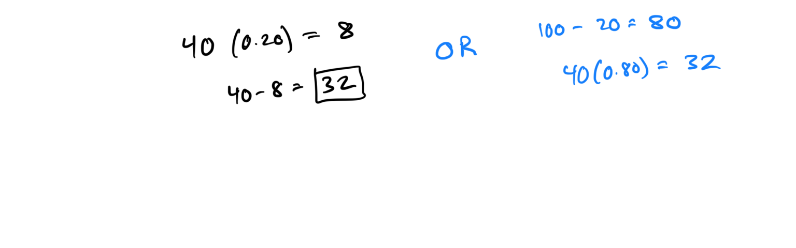
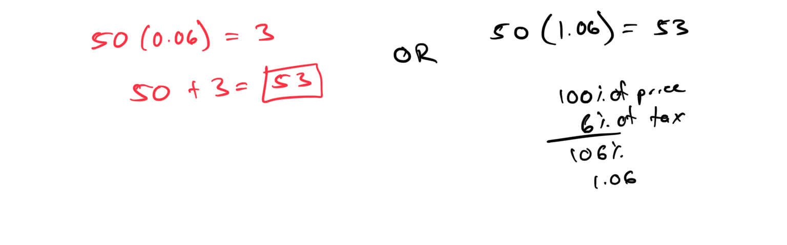

# Module 1 - Linear Equations

# 
[Video](https://youtu.be/OYXOvt9vN_s)

**Topic 1: Additive property of equality with signed fractions**
1. Solve for x: x + (-2/5) = 3/10: **x = 7/10**.

1. If y + 1/3 = -5/6, find y: **y = -7/6**.
**Topic 2: Multiplicative property of equality with signed fractions**
1. Solve for x: (-3/4)x = 9/8: **x = -3/2**.

1. If (2/5)y = -4/15, find y: **y = -2/3**.
**Topic 3: Solving a multi-step equation given in fractional form**
1. Solve for x: (2x + 1)/3 = 5: **x = 7**.

1. If (3y - 2)/4 = 2, find y: **y = 10/3**.
**Topic 4: Solving a linear equation with several occurrences of the variable: Variables on the same side and distribution**
1. Solve for x: 3(x + 2) + 2x = 16: **x = 2**.

1. If 2(y - 3) + 4y = 12, find y: **y = 3**.
**Topic 5: Solving a linear equation with several occurrences of the variable: Variables on both sides and two distributions**
1. Solve for x: 2(x + 1) = 3(x - 2): **x = 8**.

1. If 4(y - 1) = 2(2y + 3), find y: **y = 5**.
**Topic 6: Solving for a variable in terms of other variables using multiplication or division: Basic**
1. Solve for x in terms of y: 5x = 2y: **x = (2/5)y**.

1. If 3z = w, solve for z in terms of w: **z = w/3**.
**Topic 7: Solving for a variable in terms of other variables using multiplication or division: Advanced**
1. Solve for x in terms of y and z: 2x = 3y - z: **x = (3y - z)/2**.

1. If 4a = 2b + c, solve for a in terms of b and c: **a = (2b + c)/4**.
**Topic 8: Solving for a variable in terms of other variables using addition or subtraction with division**
1. Solve for x in terms of y: (x + 2y)/3 = 4: **x = 12 - 2y**.

1. If (z - w)/2 = 5, solve for z in terms of w: **z = 10 + w**.
**Topic 9: Solving a decimal word problem using a linear equation of the form Ax + B = C**
1. A phone plan costs $0.15 per minute plus a $5 base fee. If the total bill is $12.50, how many minutes were used: **50 minutes**.

1. A taxi ride costs $2.25 per mile plus a $3.50 base fare. If the total cost is $10.25, how many miles were traveled: **3 miles**.
**Topic 10: Solving a one-step word problem using the formula d = rt**
1. A car travels at 60 mph for 2 hours. Find the distance traveled using d = rt: **d = 120 miles**.

[DEAC1500-F89E-4BE6-961D-8FDE51071377](attachments/DEAC1500-F89E-4BE6-961D-8FDE51071377.png)

1. A cyclist rides at 15 mph for 3 hours. Calculate the distance using d = rt: **d = 45 miles**.
**Topic 11: Finding the sale price given the original price and percent discount**
1. A shirt originally costs $40 and is discounted by 20%. Find the sale price: **$32**.

1. A laptop priced at $800 has a 15% discount. Calculate the sale price: **$680**.
**Topic 12: Finding the total cost including tax or markup**
1. A $50 item has a 6% sales tax. Find the total cost including tax: **$53**.

1. A store marks up a $30 item by 25%. Calculate the total cost including markup: **$37.50**.
**Topic 13: Finding the original price given the sale price and percent discount**
1. A jacket’s sale price is $48 after a 20% discount. Find the original price: **$60**.

[11F16D9D-CDDB-4D08-9814-0A2AD4CC1A95](attachments/11F16D9D-CDDB-4D08-9814-0A2AD4CC1A95.png)

1. A phone’s sale price is $170 after a 15% discount. Calculate the original price: **$200**.

[E39FA93B-F97C-4217-B472-AACDFCDE0461](attachments/E39FA93B-F97C-4217-B472-AACDFCDE0461.png)