# Module 10 - Operations on Functions

Sorry, the video doesn’t have audio!
[Video](https://youtu.be/yIHVr1OEGNI)

Topic 1: Restriction on a variable in a denominator: Quadratic
Problem 1: Find the restrictions on the variable x in the expression 5/(x^2 - 4). Identify the values that make the denominator zero and state the restrictions. 
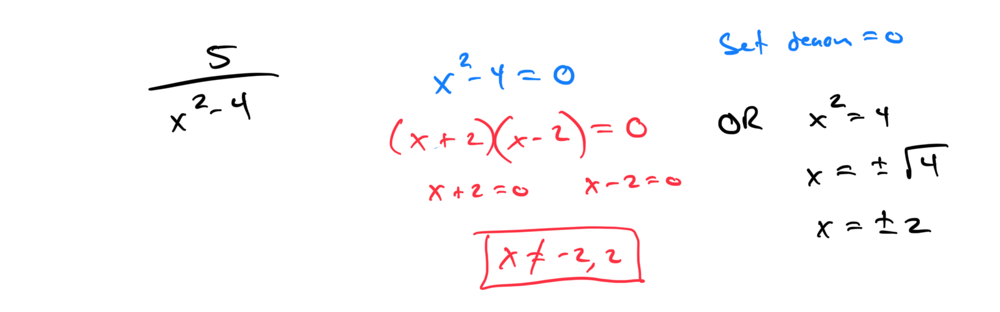
Problem 2: Determine the restrictions on x for the expression 3/(x^2 + 2x - 3). Factor the denominator and list the excluded values.

Topic 2: Finding an output of a function from its graph

Topic 3: Graphing a function of the form f(x) = ax + b: Fractional slope 
Problem 1: Graph the function f(x) = (2/3)x - 1. Identify the slope and y-intercept, and plot the line using two points.

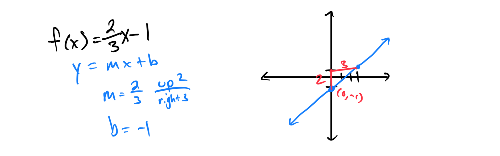

Problem 2: Sketch the function f(x) = -(1/4)x + 2. Label the slope and y-intercept, and verify the line by checking a third point.

Topic 4: Even and odd functions: Problem type 1
Problem 1: Determine if the function f(x) = x^4 + 2x^2 is even, odd, or neither. Test by evaluating f(-x) and compare with f(x).

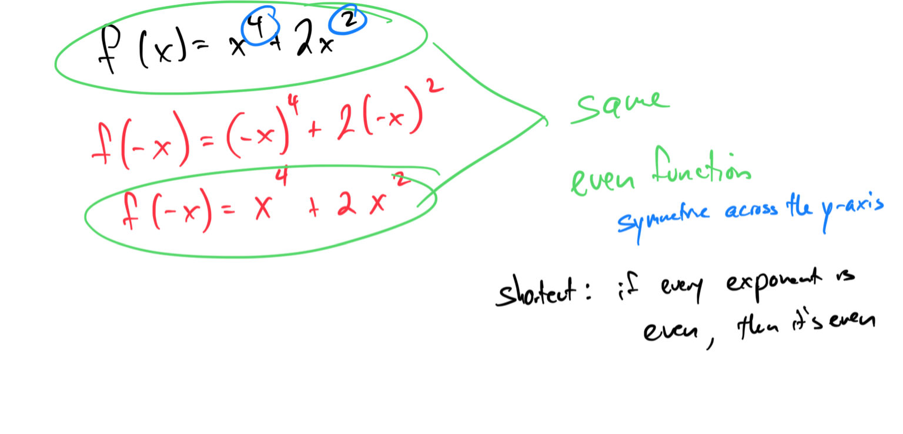

Problem 2: Check if the function g(x) = x^3 - x is even, odd, or neither. Show the algebraic steps using g(-x) and explain the conclusion.

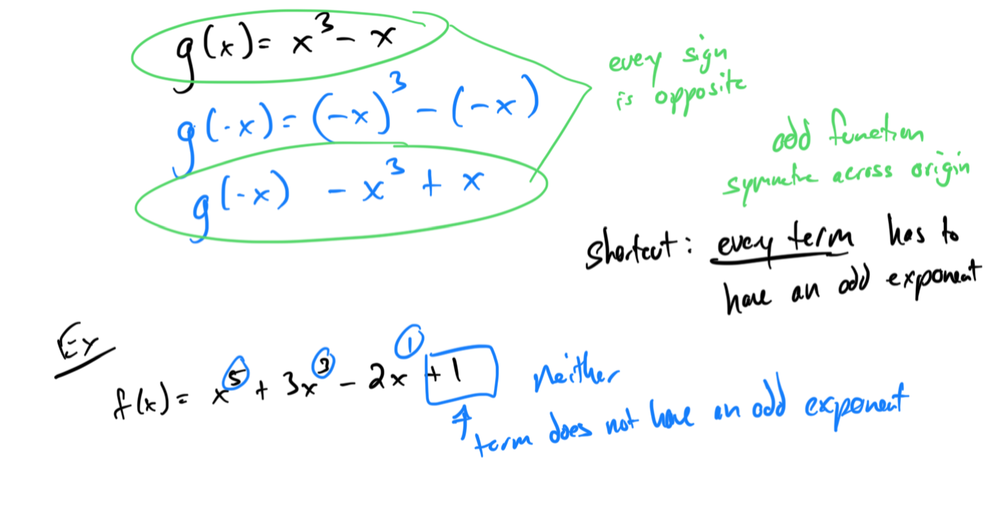

Topic 5: Sum, difference, and product of two functions
Problem 1: Given f(x) = 2x + 1 and g(x) = x - 3, find (f + g)(x), (f - g)(x), and (f * g)(x). Simplify each result.

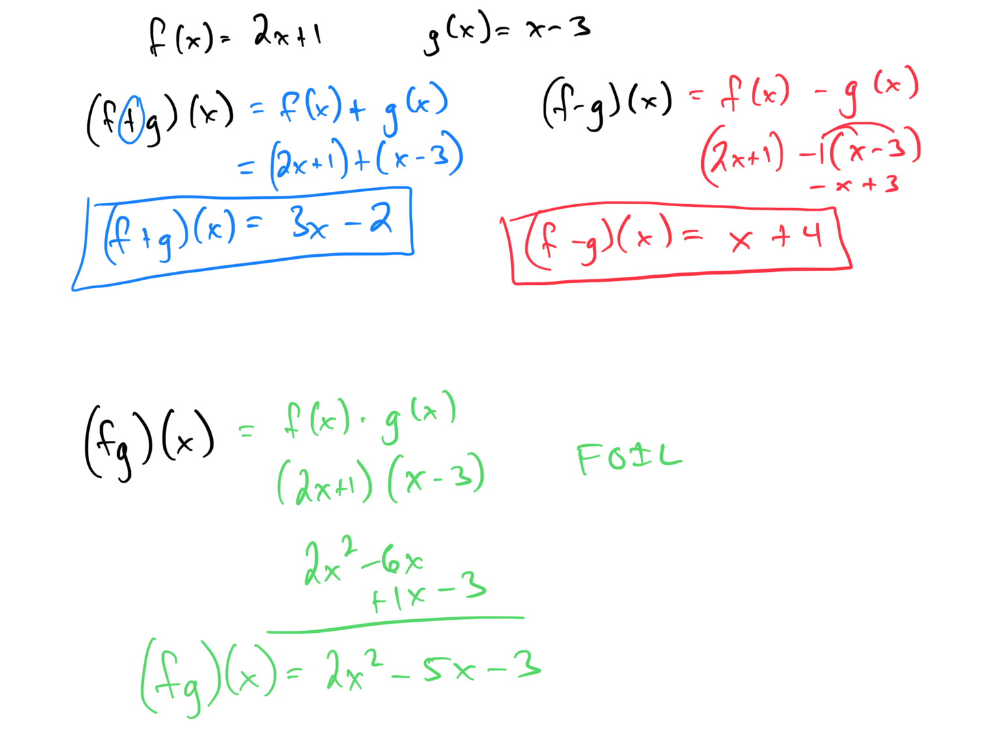

Problem 2: For f(x) = x^2 and g(x) = 3x - 2, compute (f + g)(x), (f - g)(x), and (f * g)(x). Provide the simplified expressions.

Topic 6: Quotient of two functions: Basic
Problem 1: Given f(x) = 4x and g(x) = x + 2, find (f/g)(x) and state its domain. Identify any restrictions due to the denominator.

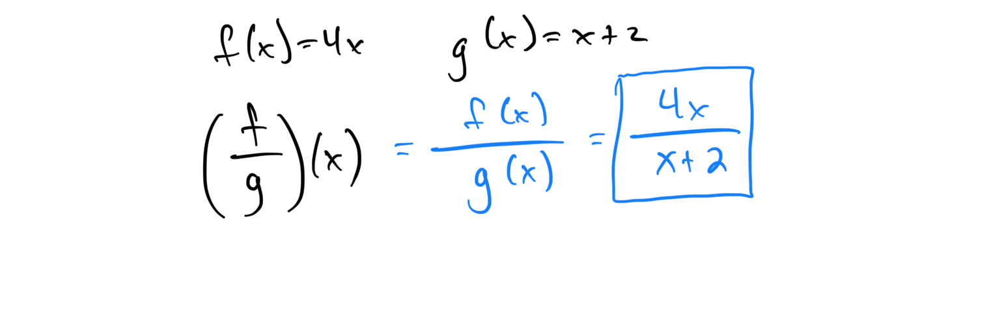

Problem 2: For f(x) = x - 1 and g(x) = x - 5, determine (f/g)(x) and find the domain by identifying excluded values.

Topic 7: Introduction to the composition of two functions
Problem 1: Given f(x) = x + 3 and g(x) = 2x, find (f ∘ g)(x). Show the process of substituting g(x) into f(x).

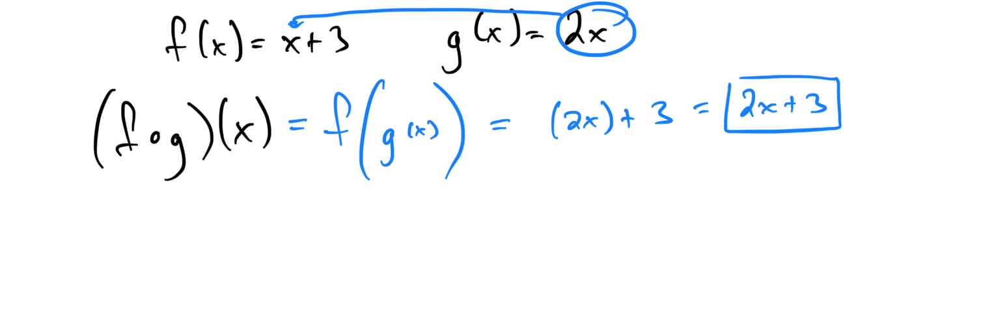

Problem 2: For f(x) = x^2 and g(x) = x - 1, compute (g ∘ f)(x). Explain the steps of composing the functions.

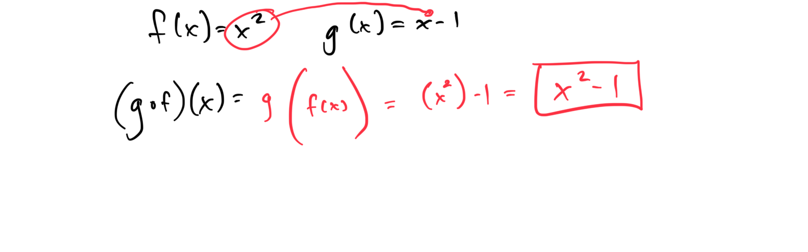

Topic 8: Composition of two functions: Basic

Problem 1: Given f(x) = 3x - 2 and g(x) = x + 4, find (f ∘ g)(2). Compute the composition and evaluate at x = 2.

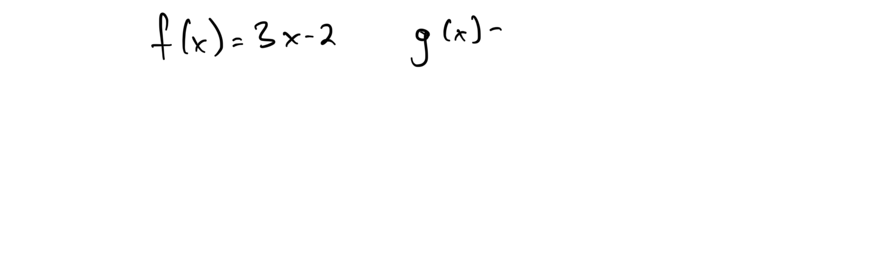

Problem 2: For f(x) = x^2 + 1 and g(x) = 2x, find (g ∘ f)(1). Show the substitution and simplify the result.

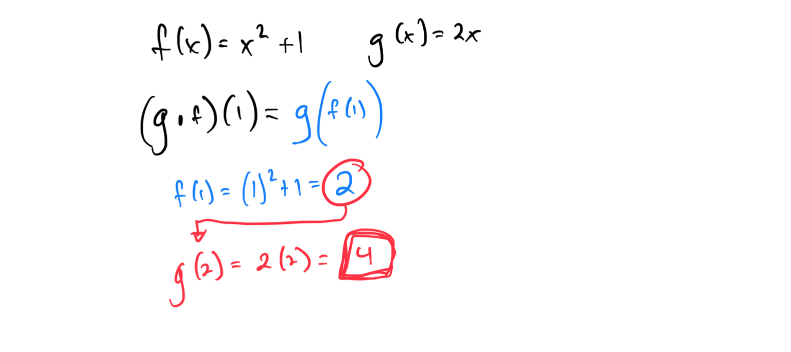

Topic 9: Composition of two functions: Advanced

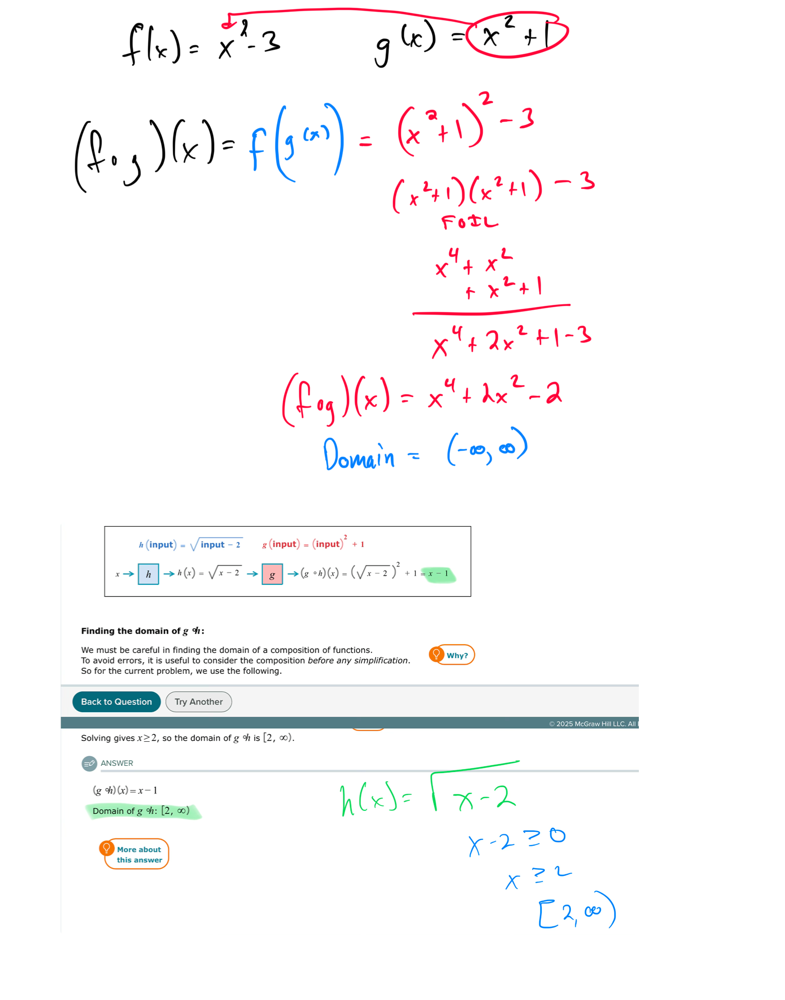
