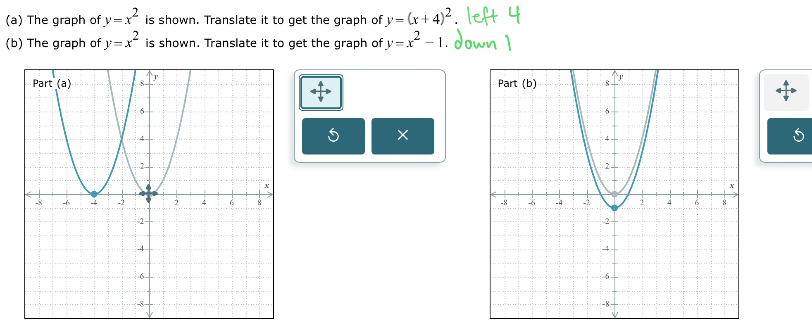

# Module 11 - Graphs of Functions

[Video](https://youtu.be/h35MV38e9so)
Topic 1: Finding inputs and outputs of a function from its graph

Topic 2: Domain and range from the graph of a discrete relation

Topic 3: Domain and range from the graph of a continuous function

Topic 4: Translating the graph of a parabola: One step

Topic 5: Finding where a function is increasing, decreasing, or constant given the graph

Topic 6: Finding where a function is increasing, decreasing, or constant given the graph: Interval notation

Topic 7: Finding local maxima and minima of a function given the graph

Topic 8: Finding domain and range from a linear graph in context

Topic 9: Finding the absolute maximum and minimum of a function given the graph

Topic 10: Finding values and intervals where the graph of a function is zero, positive, or negative

Topic 11: Choosing a graph to fit a narrative: Basic

Topic 12: Classifying the graph of a function

Topic 13: Horizontal line test

Topic 14: Graphing the inverse of a function given its graph

