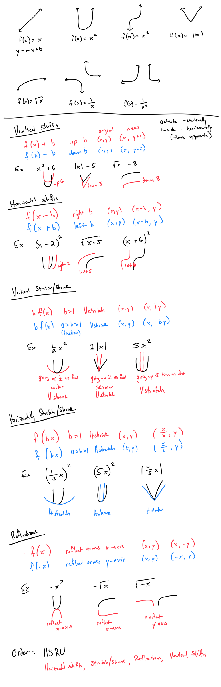
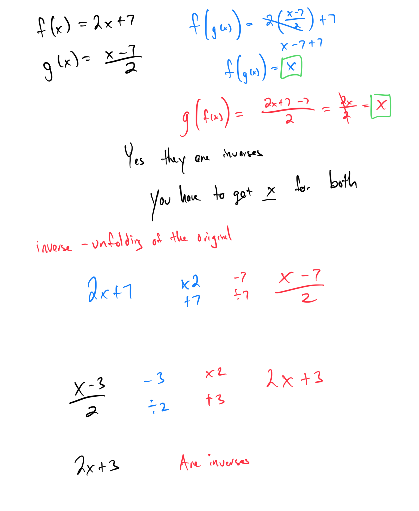

# Module 12 - Transformations

[Video](https://youtu.be/43sq4VIAxJU)

Topic 1: Translating the graph of a parabola: Two steps

Topic 2: Translating the graph of an absolute value function: One step

Topic 3: Translating the graph of an absolute value function: Two steps

Topic 4: How the leading coefficient affects the graph of an absolute value function

Topic 5: Translating the graph of a function: Two steps

Topic 6: Transforming the graph of a function by reflecting over an axis

Topic 7: Transforming the graph of a quadratic, cubic, square root, or absolute value function

Topic 8: How the leading coefficient affects the shape of a parabola

Topic 9: Determining whether two functions are inverses of each other

