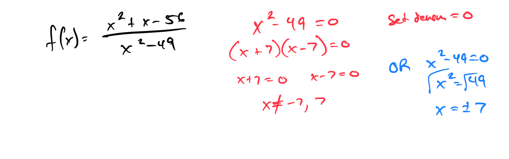
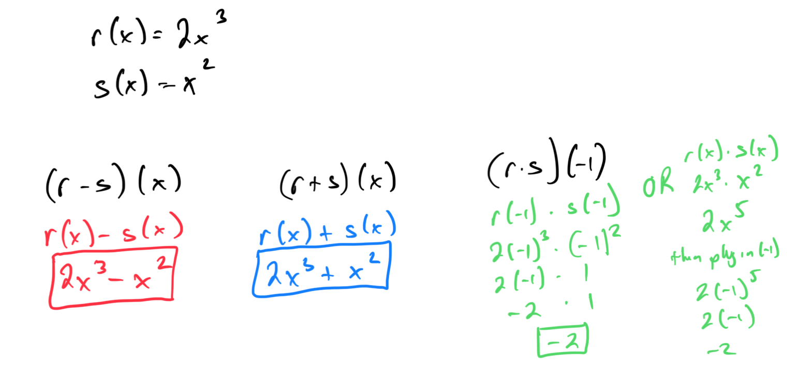
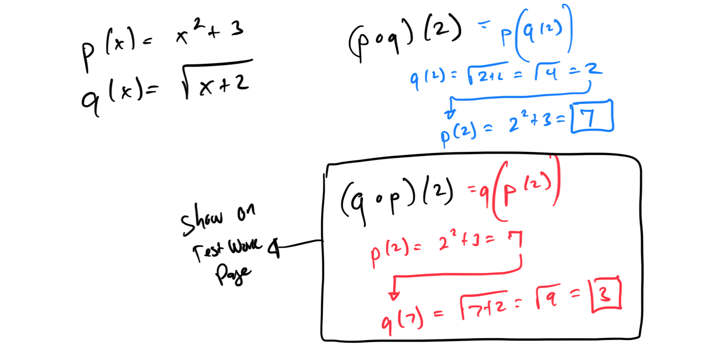

# Module 13 - Functions Exam Review

[Video](https://youtu.be/ghLS9CPR4ic)

Refresh!

Topic 1: Domain of a rational function: Excluded values

Topic 2: Domain and range from the graph of a continuous function

Topic 3: Translating the graph of a function: Two steps

Topic 4: Transforming the graph of a function by reflecting over an axis

Topic 5: Finding where a function is increasing, decreasing, or constant given the graph: Interval notation

Topic 6: Finding local maxima and minima of a function given the graph

Topic 7: Sum, difference, and product of two functions

Topic 8: Composition of two functions: Basic

Topic 9: Domain and range of a linear function that models a real-world situation

Topic 10: Finding domain and range from a linear graph in context

Topic 11: How the leading coefficient affects the shape of a parabola

