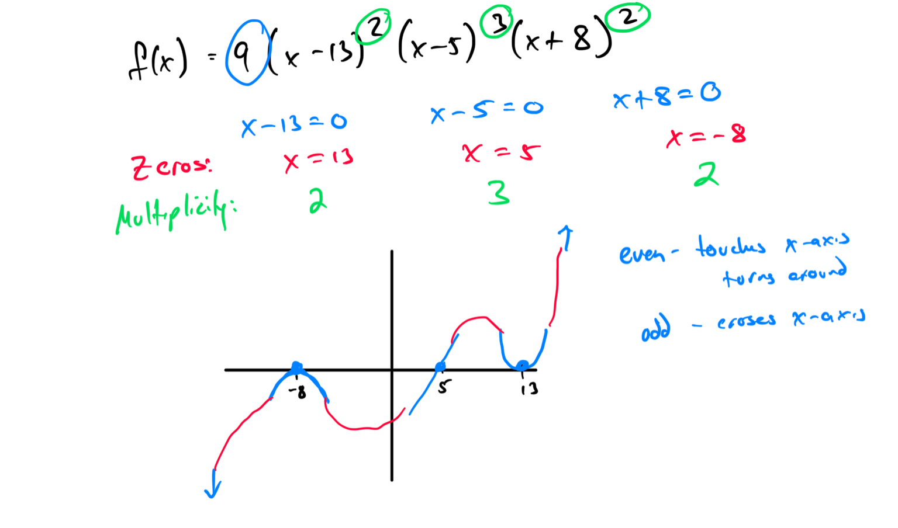
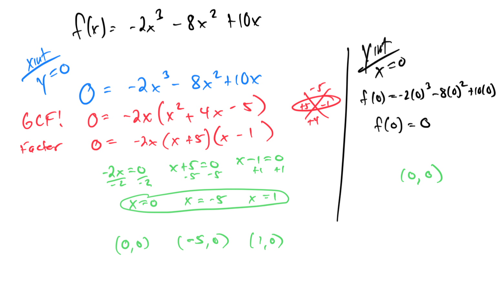
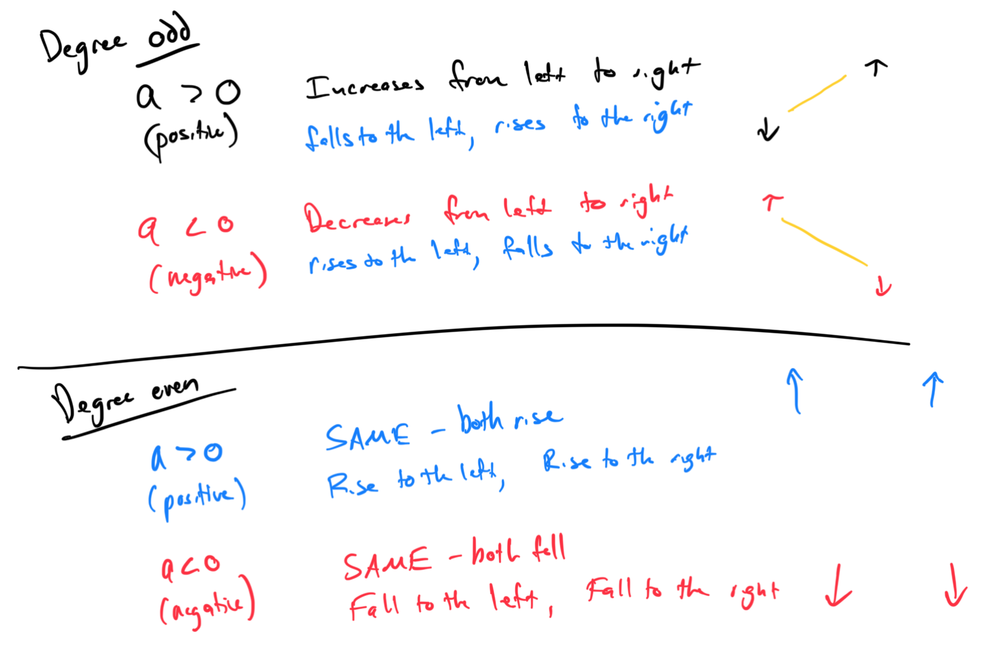

# Module 14 - Polynomial Graphs

[Video](https://youtu.be/EPNBwA7AZnE)

### Topic 1: Using a graphing calculator to find local extrema of a polynomial function
Shown in video.

### Topic 2: Identifying polynomial function

### Topic 3: Finding zeros of a polynomial function written in factored form

### Topic 4: Finding zeros and their multiplicities given a polynomial function written in factored form

### Topic 5: Finding x- and y-intercepts given a polynomial function

### Topic 6: Determining end behavior and intercepts to graph a polynomial function

### Topic 7: Inferring properties of a polynomial function from its graph

Degree can be 9 as well. 

### Topic 8: Using a graphing calculator to find zeros of a polynomial function

Shown in video.