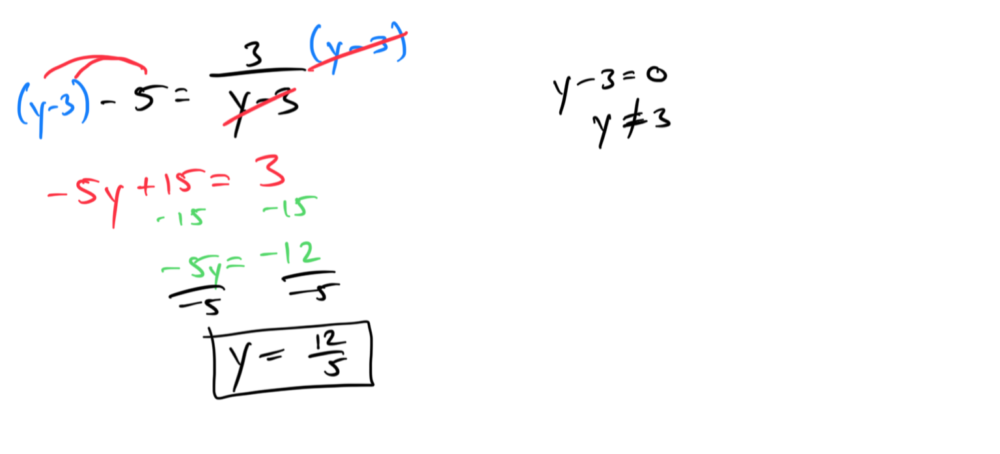
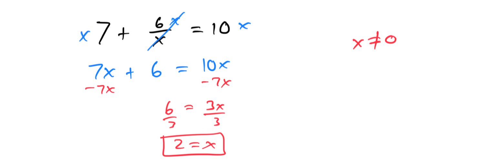
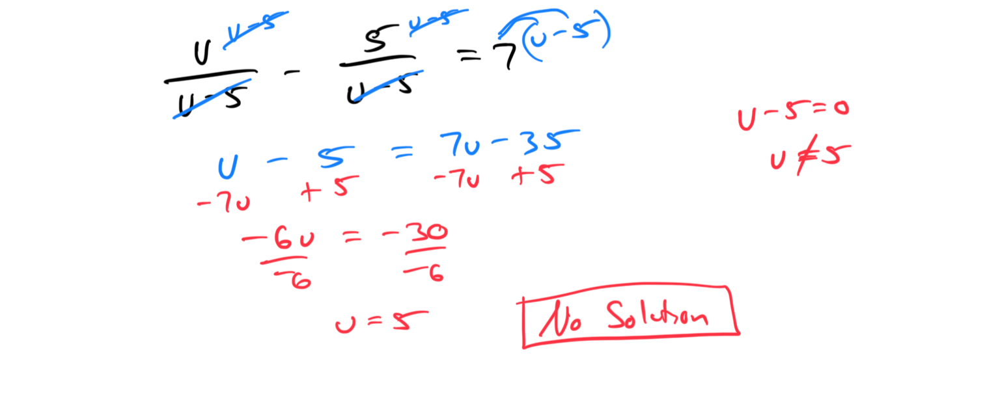
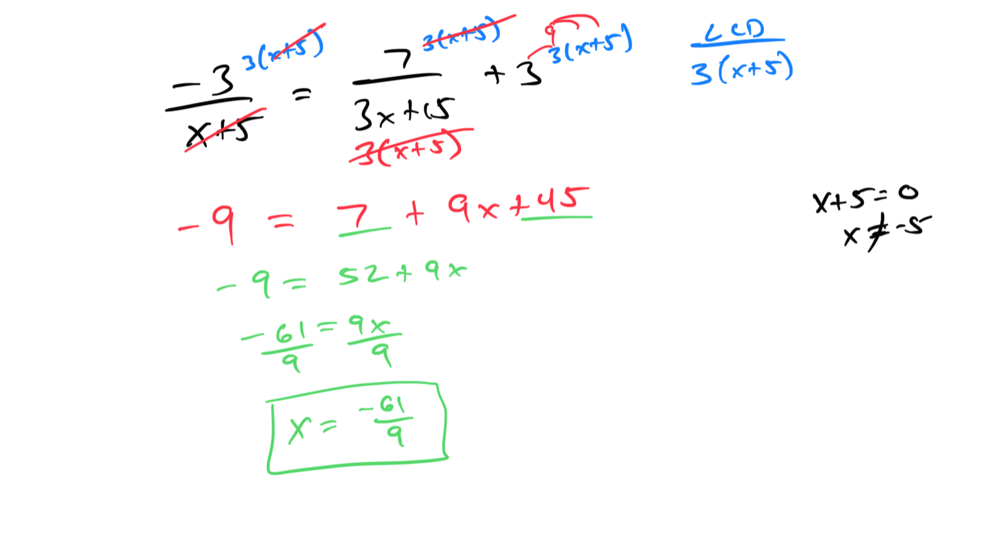
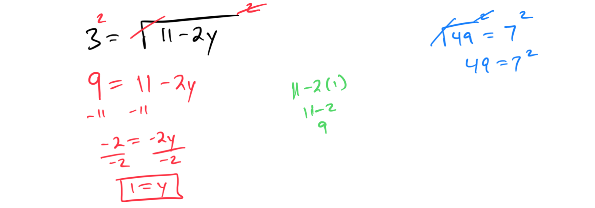
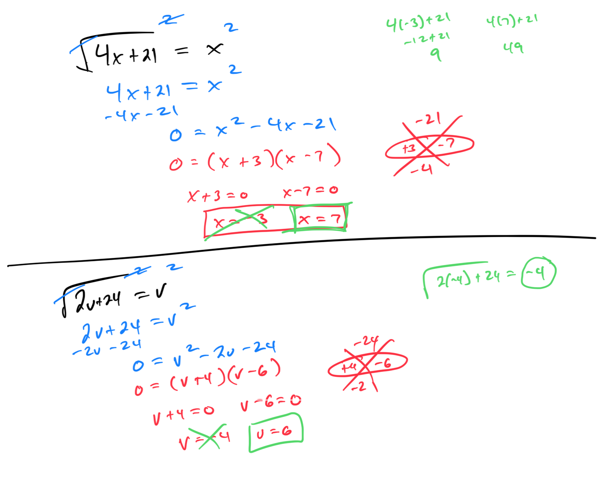
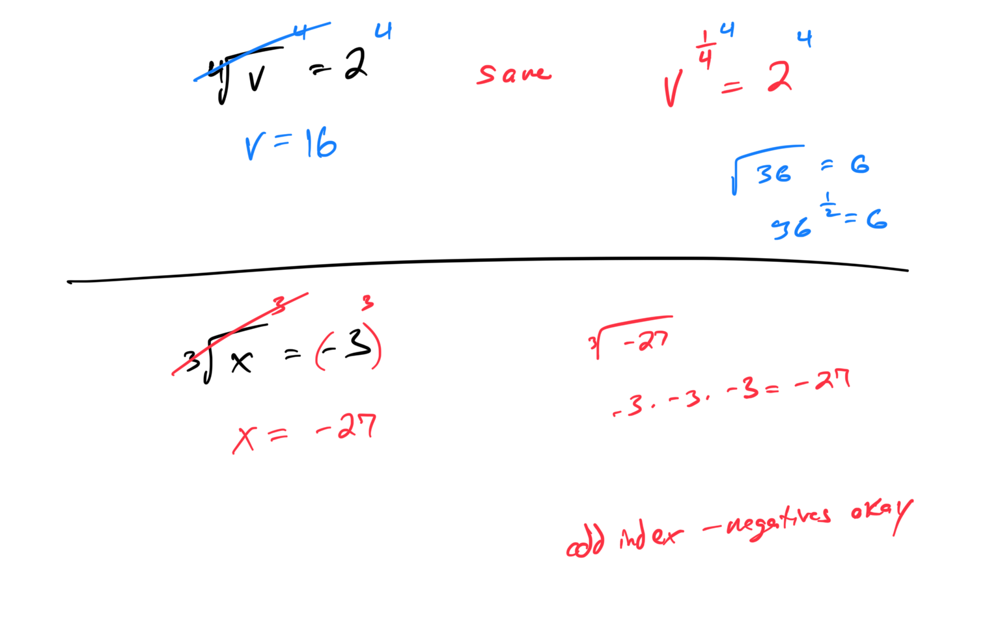

# Module 15 - Rational and Radical Equations

### Topic 1: Solving a rational equation that simplifies to linear: Denominator x+a

### Topic 2: Solving a rational equation that simplifies to linear: Denominators a, x, or ax

### Topic 3: Solving a rational equation that simplifies to linear: Like binomial denominators

### Topic 4: Solving a rational equation that simplifies to linear: Unlike binomial denominators 
### 
Topic 5: Word problem on proportions: Problem type 1

### Topic 6: Solving a radical equation that simplifies to a linear equation: One radical, advanced

### Topic 7: Solving a radical equation that simplifies to a quadratic equation: One radical, basic 
### 
Topic 8: Solving an equation with a root index greater than 2: Problem type 1 
### 