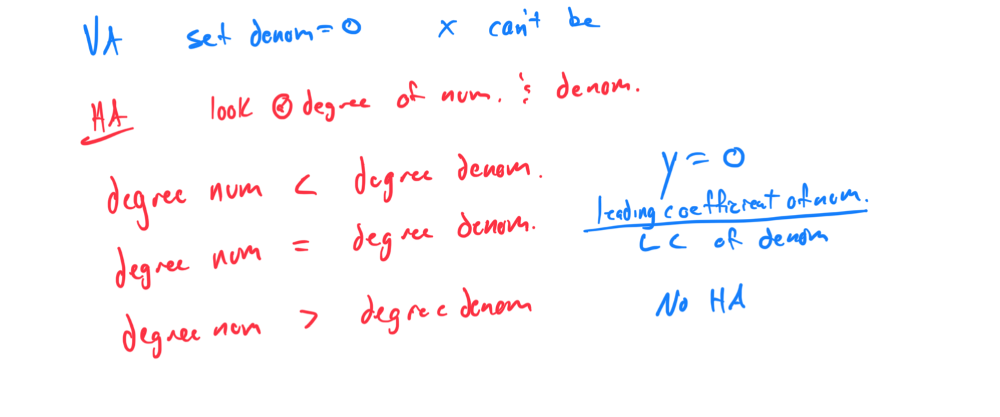

# Module 16 - Rational Graphs

[Video](https://youtu.be/dRkR4rjclAY)

### Topic 1: Finding the intercepts, asymptotes, domain, and range from the graph of a rational function

### Topic 2: Finding the asymptotes of a rational function: Constant over linear

### Topic 3: Finding the asymptotes of a rational function: Linear over linear

### Topic 4: Finding horizontal and vertical asymptotes of a rational function: Quadratic numerator or denominator

### Topic 5: Graphing a rational function: Constant over linear

X=3, y was supposed to be 2. 

### Topic 6: Graphing a rational function: Linear over linear
Topic 7: Transforming the graph of a rational function

