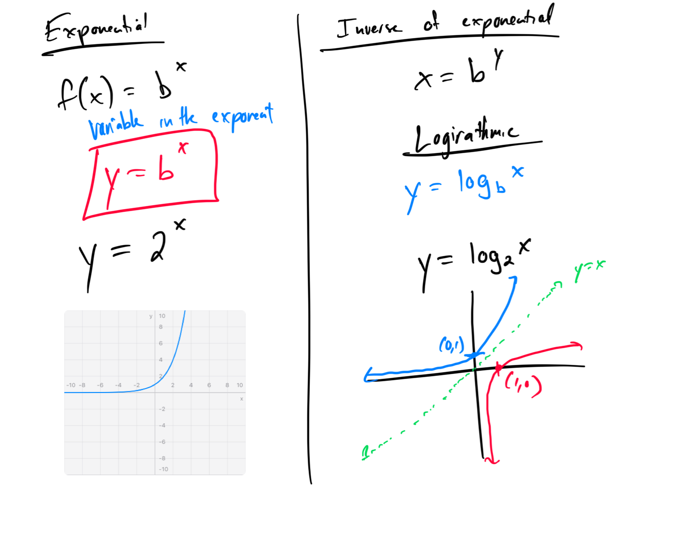
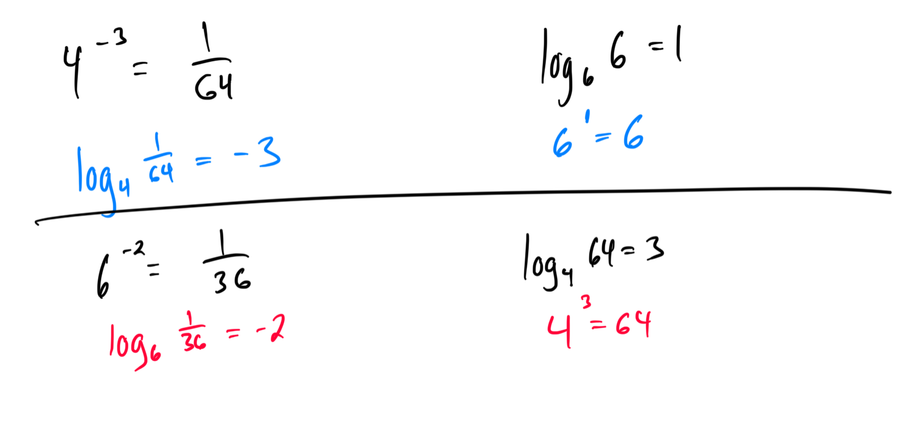
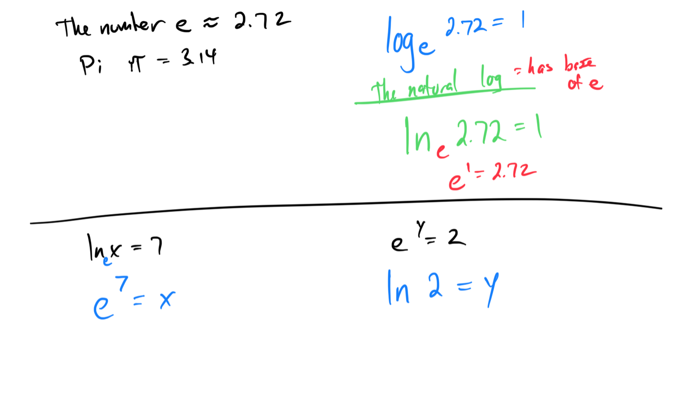
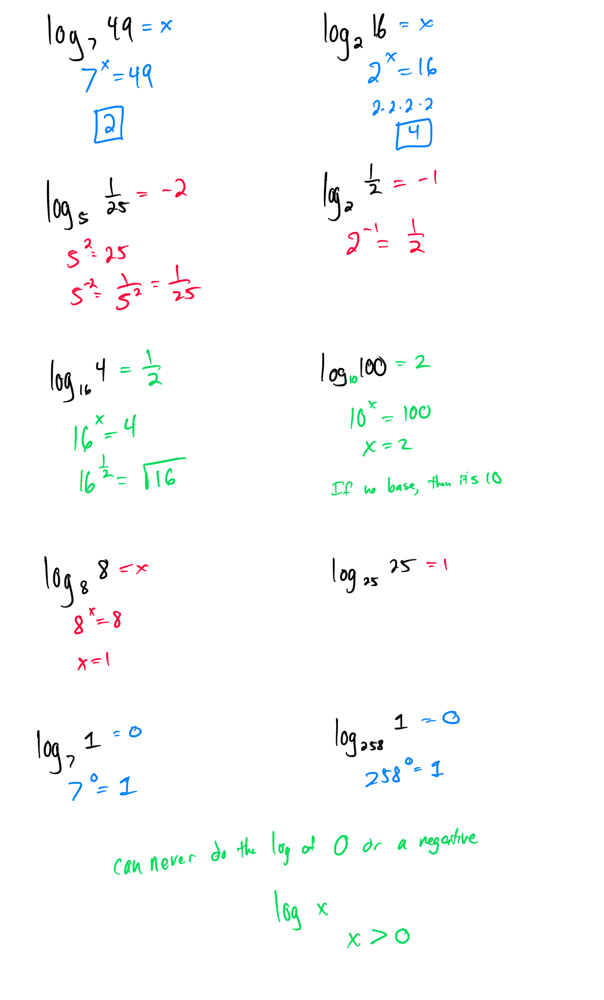
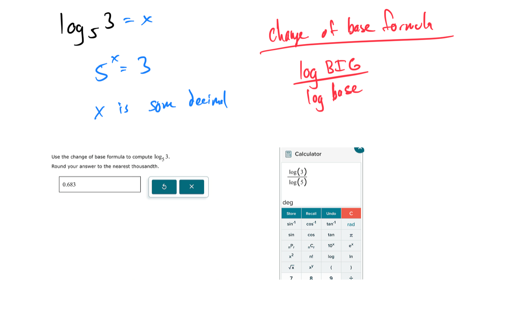

# Module 19 - Definition of Logarithms

[Video](https://youtu.be/9Q64S3xZDbs)

### Topic 1: Using a calculator to evaluate natural and common logarithmic expressions

### Topic 2: Converting between logarithmic and exponential equations

### Topic 3: Converting between natural logarithmic and exponential equations

### Topic 4: Evaluating logarithmic expressions

### Topic 5: Change of base for logarithms: Problem type 1

