# Module 2 - Linear Graphs

[Video](https://youtu.be/nZ6AyKxJ6Pk)

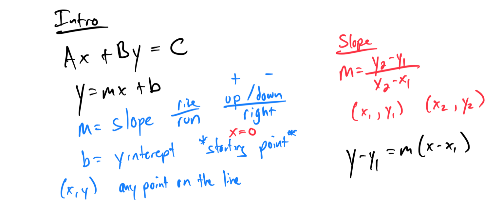
## 
**Topic 1: Finding x- and y-intercepts given the graph of a line on a grid**
1. Identify the x- and y-intercepts of a line passing through (2, 0) and (0, 4) on a grid: **x-intercept: (2, 0), y-intercept: (0, 4)**.

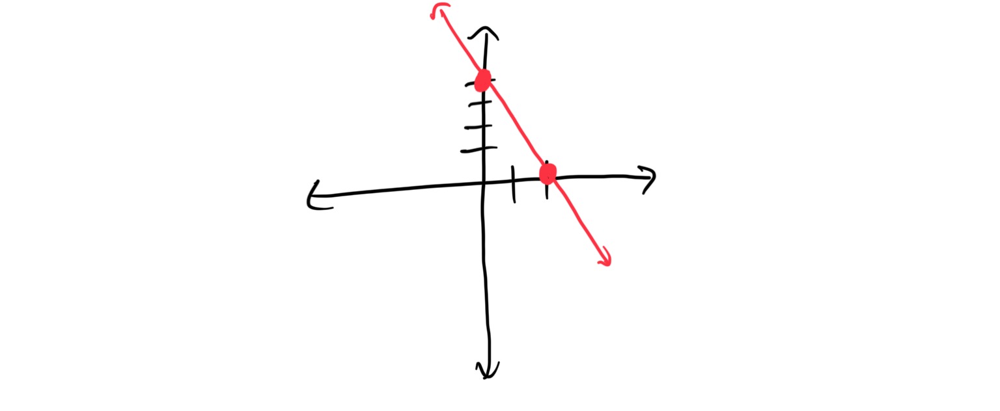

1. Find the x- and y-intercepts of a line crossing the x-axis at (-3, 0) and the y-axis at (0, 6): **x-intercept: (-3, 0), y-intercept: (0, 6)**.
## **Topic 2: Finding intercepts of a nonlinear function given its graph**
1. Determine the x- and y-intercepts of a parabolic graph crossing the x-axis at (1, 0) and (3, 0) and the y-axis at (0, 2): **x-intercepts: (1, 0), (3, 0), y-intercept: (0, 2)**.

[AF87DCB3-40AD-40A4-B65D-90291F825C22](attachments/AF87DCB3-40AD-40A4-B65D-90291F825C22.png)

1. Find the x- and y-intercepts of a nonlinear graph passing through (0, -1), (-2, 0), and (2, 0): **x-intercepts: (-2, 0), (2, 0), y-intercept: (0, -1)**.
## **Topic 3: Table for a linear function**
1. Create a table of values for the linear function y = 2x + 1 for x = -2, -1, 0, 1, 2: **(-2, -3), (-1, -1), (0, 1), (1, 3), (2, 5)**.
| X  | Y  |
|----|----|
| -2 |    |
| -1 |    |
| 0  |    |
| 1  |    |
| 2  |    |

1. Complete a table for the linear function y = -3x + 4 for x = -1, 0, 1, 2, 3: **(-1, 7), (0, 4), (1, 1), (2, -2), (3, -5)**.
## **Topic 4: Finding outputs of a two-step function with decimals that models a real-world situation: Function notation**
1. A taxi fare is given by f(d) = 2.5d + 3.50, where d is miles driven. Find f(4.2): **f(4.2) = $14.00**.

1. The cost of a phone plan is f(m) = 0.15m + 10, where m is minutes used. Find f(20.5): **f(20.5) = $13.075**.
## **Topic 5: Graphing a linear equation of the form y = mx**
1. Graph the linear equation y = 3x on a coordinate plane: **Plot points like (0, 0), (1, 3), (2, 6) and draw a line**.

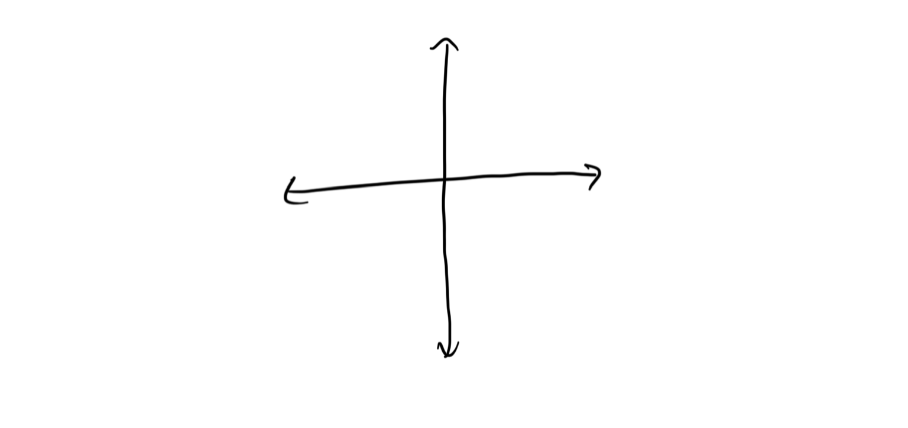

1. Graph the linear equation y = -2x on a coordinate plane: **Plot points like (0, 0), (1, -2), (2, -4) and draw a line**.
## **Topic 6: Graphing a line given its equation in slope-intercept form: Fractional slope**
1. Graph the line y = (2/3)x + 1 on a coordinate plane: **Start at (0, 1), rise 2, run 3**.

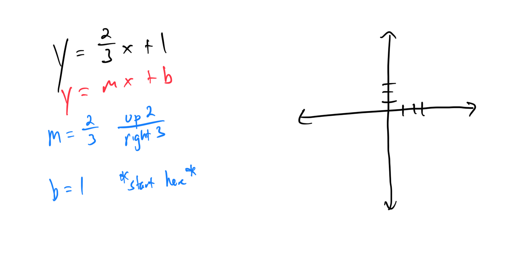

1. Graph the line y = (-1/2)x - 3 on a coordinate plane: **Start at (0, -3), fall 1, run 2**.

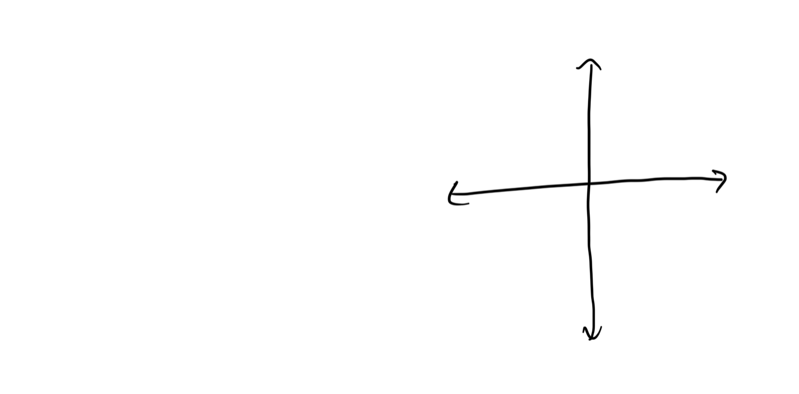

## **Topic 7: Graphing a vertical or horizontal line**
1. Graph the vertical line x = 4 on a coordinate plane: **Draw a vertical line through x = 4**.

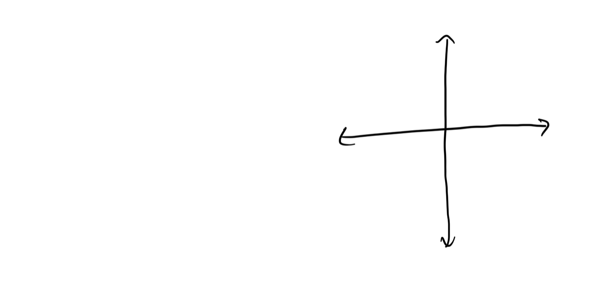

1. Graph the horizontal line y = -2 on a coordinate plane: **Draw a horizontal line through y = -2**.

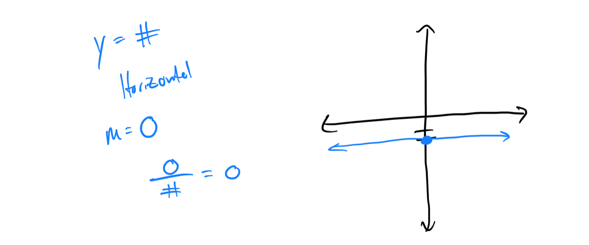

## **Topic 8: Finding x- and y-intercepts of a line given the equation: Basic**
1. Find the x- and y-intercepts of the line 2x + 3y = 6: **x-intercept: (3, 0), y-intercept: (0, 2)**.

1. Determine the x- and y-intercepts of the line 4x - y = 8: **x-intercept: (2, 0), y-intercept: (0, -8)**.
## **Topic 9: Classifying slopes given graphs of lines**

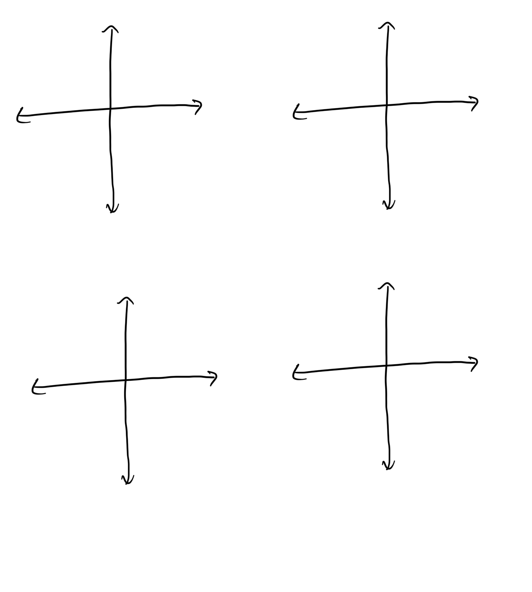

## **Topic 10: Finding slope given the graph of a line on a grid**
1. Find the slope of a line on a grid passing through (1, 2) and (3, 6): **m = 2**.

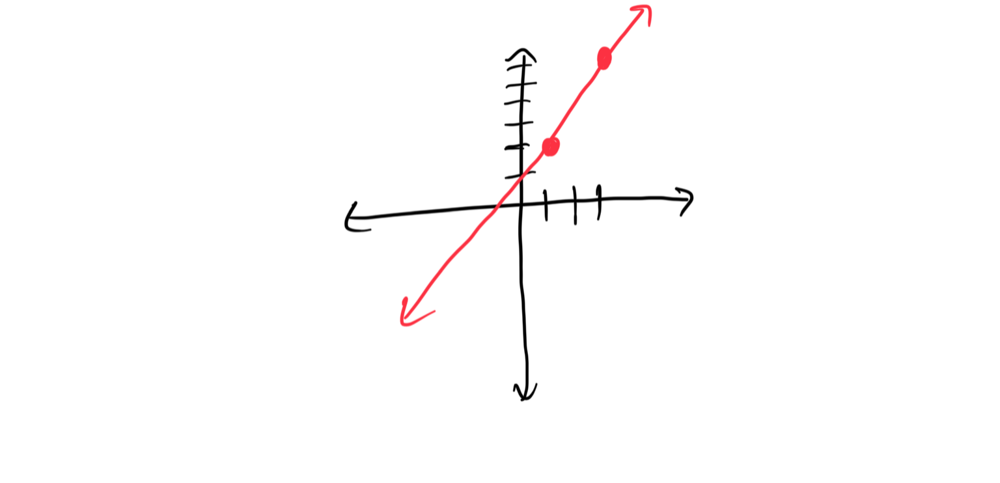

1. Determine the slope of a line on a grid passing through (-2, 4) and (1, -2): **m = -2**.
## **Topic 11: Finding slope given two points on a line**
1. Calculate the slope of a line passing through (2, 5) and (4, 9): **m = 2**.

[3BD00B27-620B-442B-8B9A-4E7E00381BAB](attachments/3BD00B27-620B-442B-8B9A-4E7E00381BAB.png)

1. Find the slope of a line passing through (-1, 3) and (2, -3): **m = -2**.
## **Topic 12: Finding the slopes of horizontal and vertical lines**
1. Determine the slope of the horizontal line y = 5: **m = 0**.

[009B18FE-8BD2-4EF2-881B-249044E7750A](attachments/009B18FE-8BD2-4EF2-881B-249044E7750A.png)

1. Find the slope of the vertical line x = -3: **Undefined**.

## **Topic 13: Graphing a line given its slope and y-intercept**
1. Graph a line with a slope of 2 and a y-intercept of (0, 3): **Start at (0, 3), rise 2, run 1**.

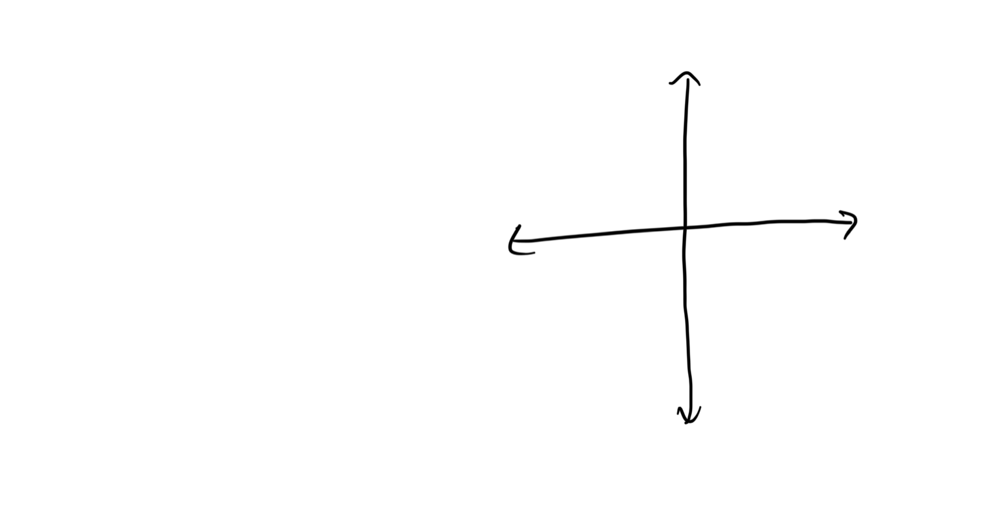

1. Graph a line with a slope of -1 and a y-intercept of (0, -4): **Start at (0, -4), fall 1, run 1**.
## **Topic 14: Finding the slope and y-intercept of a line given its equation in the form y = mx + b**
1. Identify the slope and y-intercept of the equation y = 4x - 2: **Slope: 4, y-intercept: (0, -2)**.

1. Find the slope and y-intercept of the equation y = (-3/2)x + 5: **Slope: -3/2, y-intercept: (0, 5)**.
## **Topic 15: Graphing a line by first finding its slope and y-intercept**
1. Graph the line y = 2x + 3 by finding its slope and y-intercept: **Slope: 2, y-intercept: (0, 3)**.

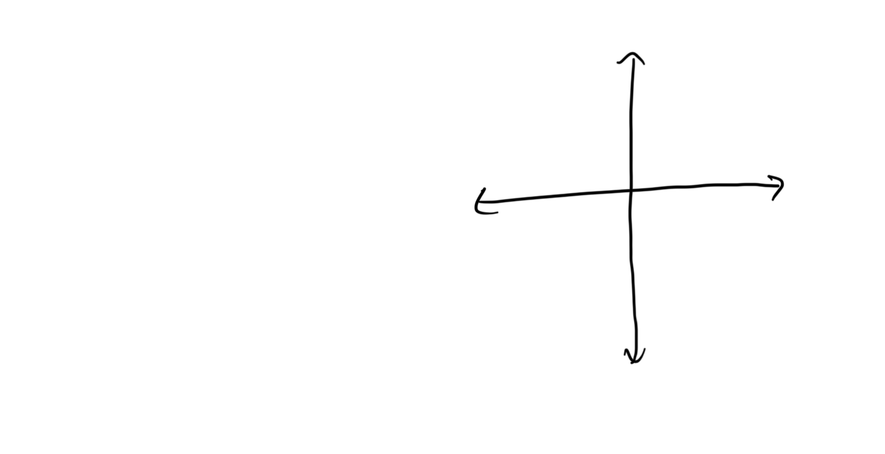

1. Graph the line y = (-1/3)x - 2 by finding its slope and y-intercept: **Slope: -1/3, y-intercept: (0, -2)**.
## **Topic 16: Writing an equation in slope-intercept form given the slope and a point**
1. Write the equation of a line in slope-intercept form with a slope of 3 passing through (1, 4): **y = 3x + 1**.

1. Write the equation of a line in slope-intercept form with a slope of -1/2 passing through (2, -1)

## **Topic 17: Word problem involving average rate of change**
1. A car travels 120 miles in 2 hours. Find the average rate of change: **60 miles per hour**.

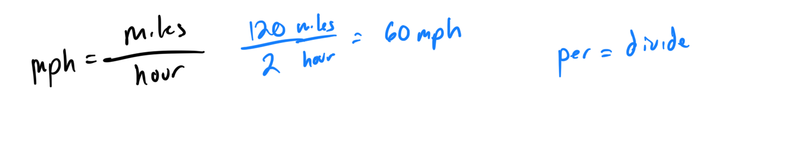

1. A tank fills with 60 gallons of water in 3 minutes. Calculate the average rate of change: **20 gallons per minute**.
## **Topic 18: Sketching the line of best fit**

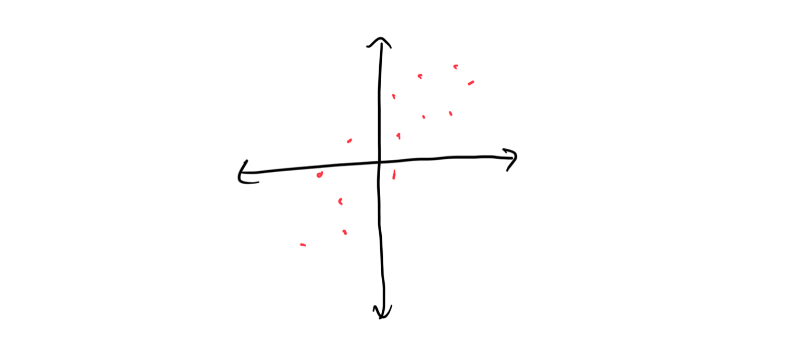

## **Topic 19: Scatter plots and correlation**

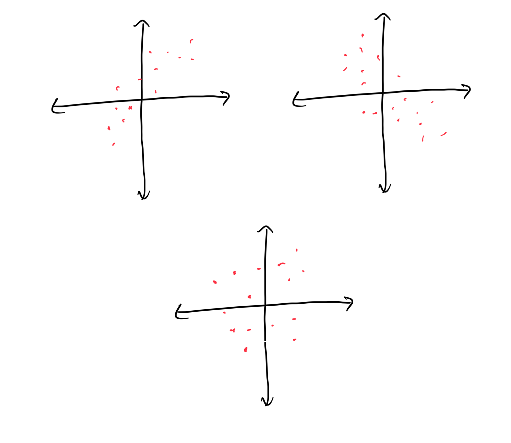

## **Topic 20: Graphing a function of the form f(x) = ax + b: Integer slope**
1. Graph the function f(x) = 2x + 1 on a coordinate plane: **Plot (0, 1), (1, 3), (2, 5), draw a line**.

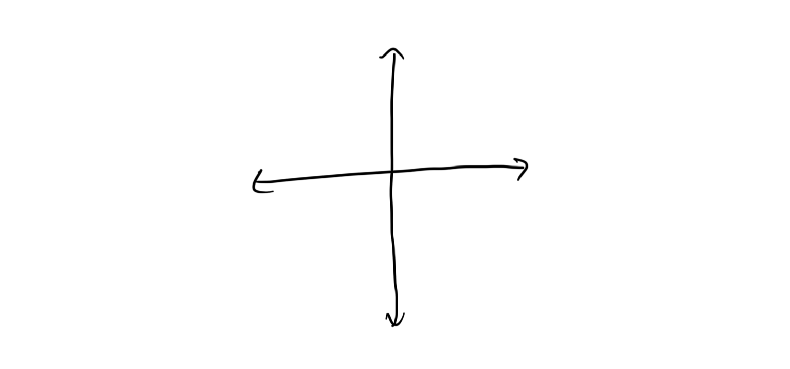

1. Graph the function f(x) = -3x + 4 on a coordinate plane: **Plot (0, 4), (1, 1), (2, -2), draw a line**.
## **Topic 21: Writing an equation and graphing a line given its slope and y-intercept**
1. Write the equation of a line with a slope of 1 and y-intercept of (0, 2), then graph it: **y = x + 2**.

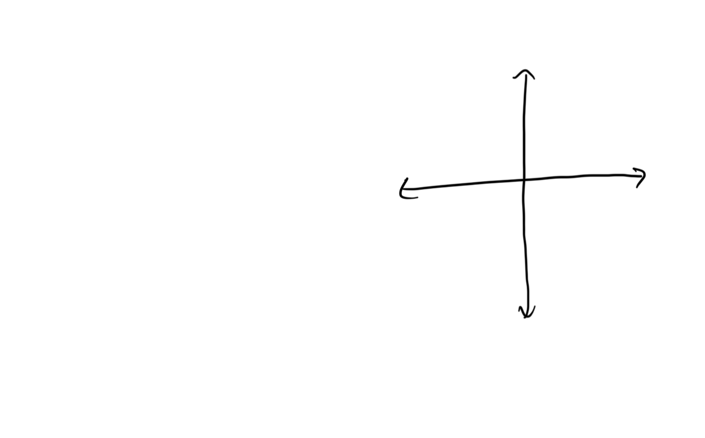

1. Write the equation of a line with a slope of -4 and y-intercept of (0, 3), then graph it: **y = -4x + 3**.
