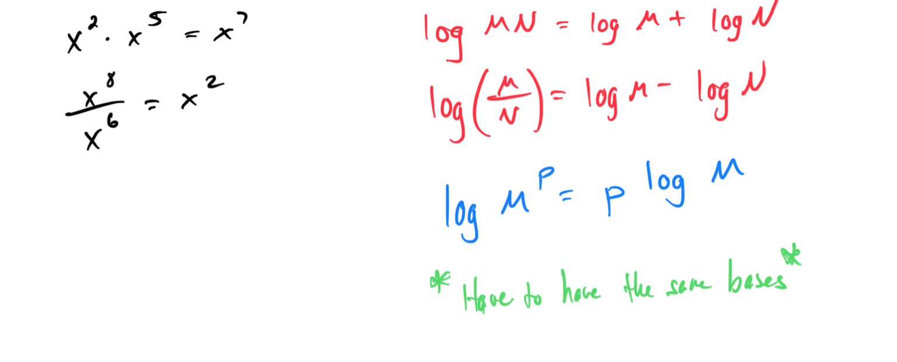
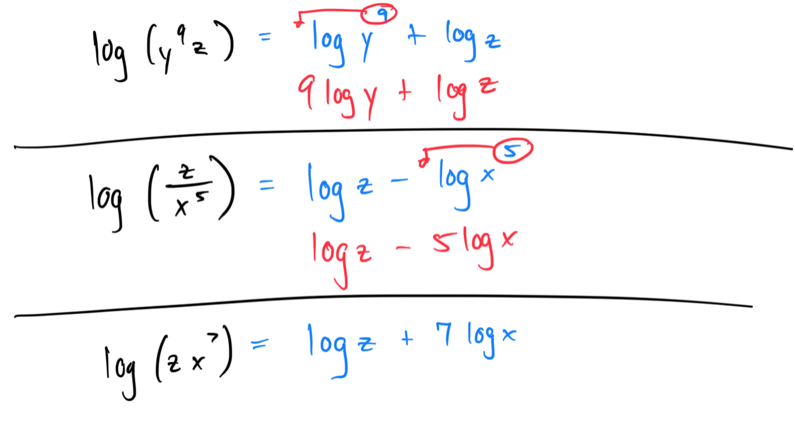
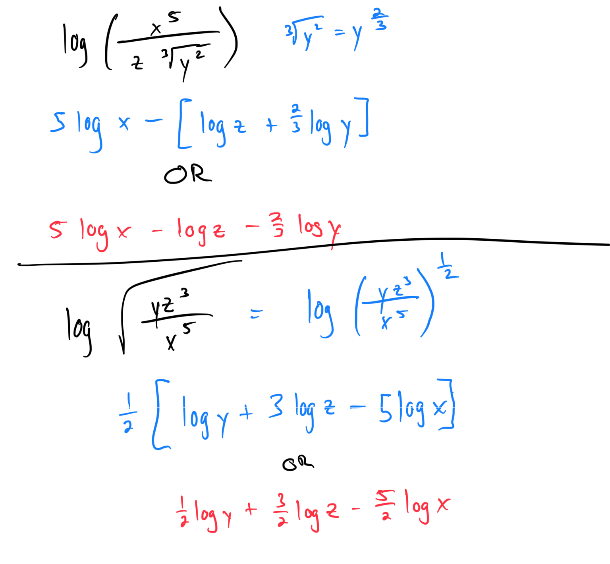
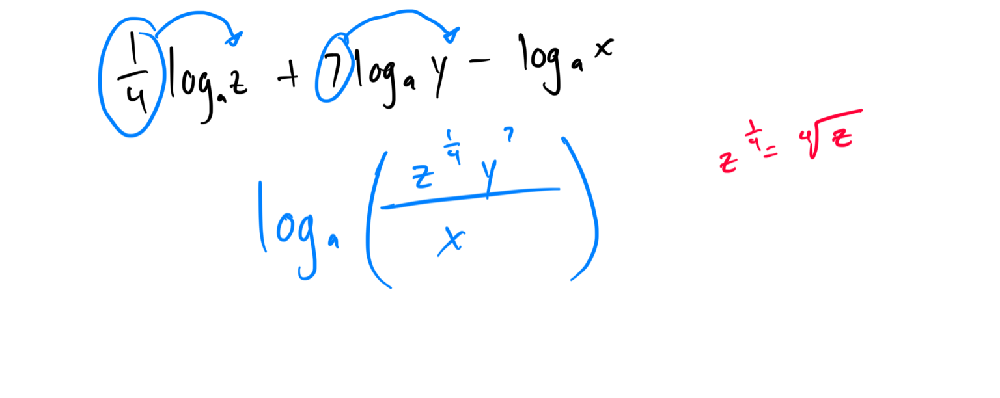

# Module 20 - Properties of Logarithms

[Video](https://youtu.be/2jjQi_zHiM4)

### Topic 1: Basic properties of logarithms

### Topic 2: Expanding a logarithmic expression: Problem type 1

### Topic 3: Expanding a logarithmic expression: Problem type 2

### Topic 4: Writing an expression as a single logarithm

### Topic 5: Change of base for logarithms: Problem type 1
Topic 6: Using properties of logarithms to evaluate expressions

