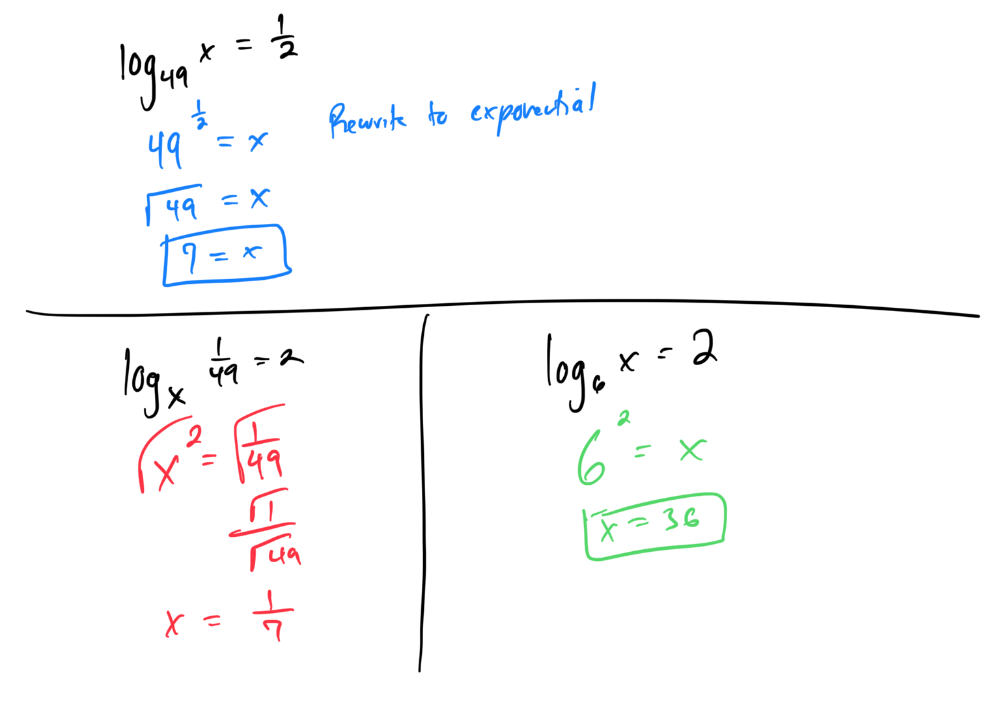
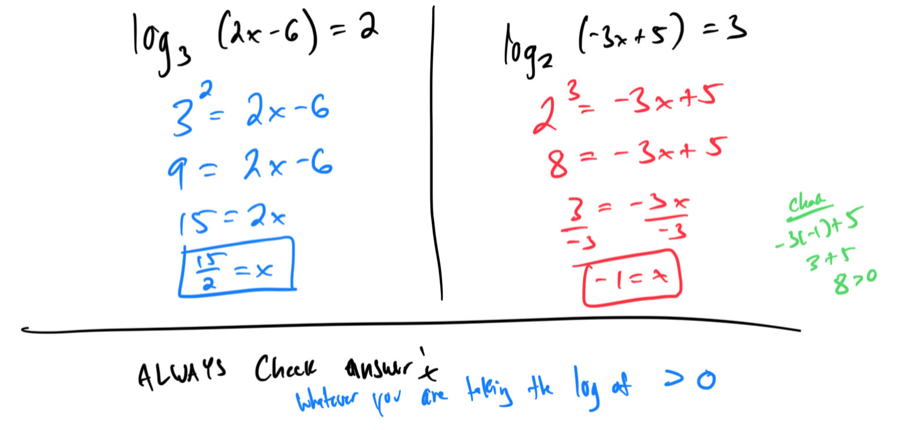
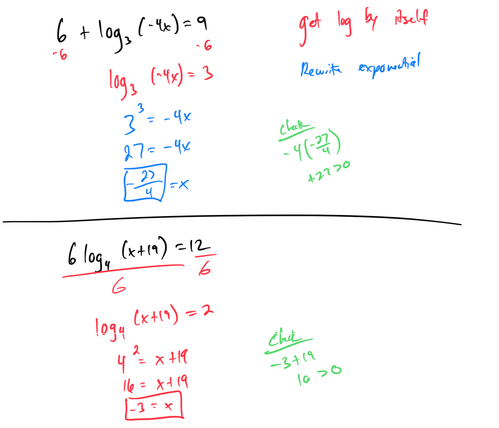
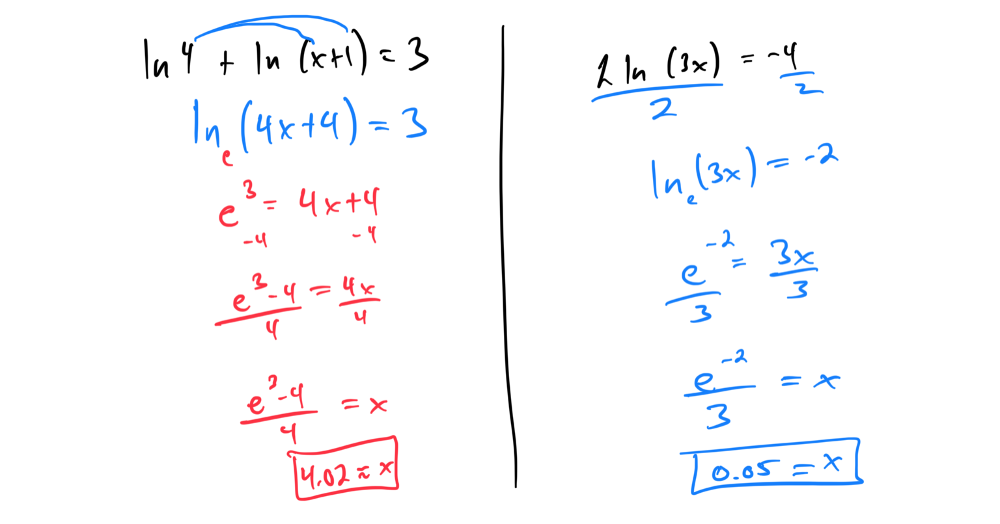
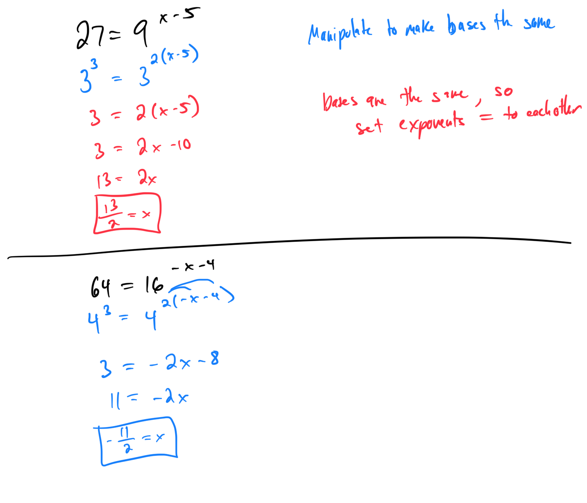
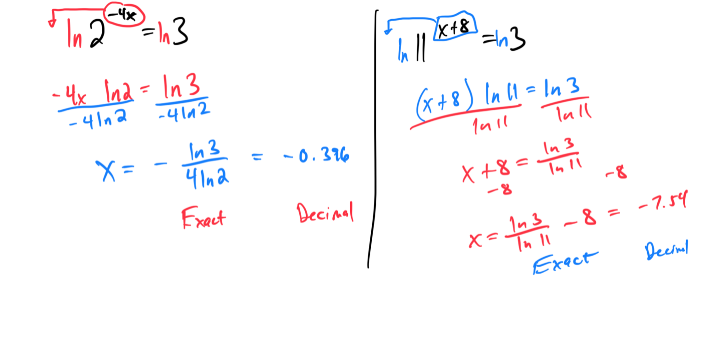
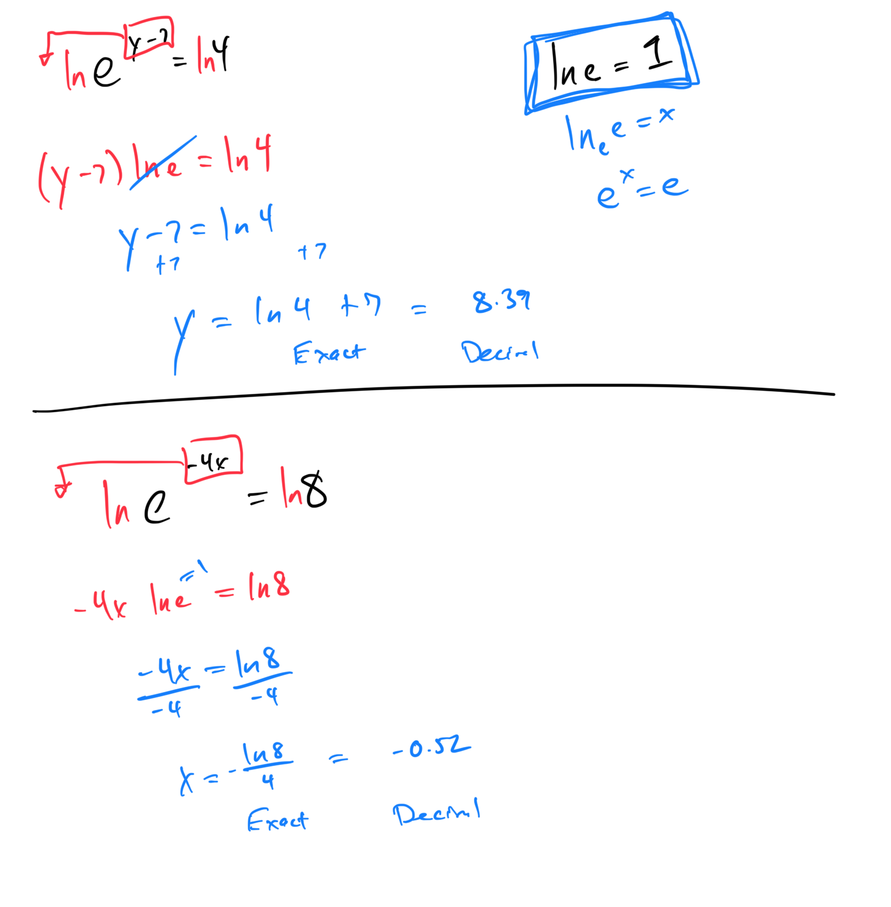

# Module 21 - Exponential and Logarithmic Equations

[Video](https://youtu.be/dpUuzIkwXZo)

### - Topic 1: Using a calculator to evaluate exponential expressions
- Topic 2: Solving an equation of the form logba = c

### - Topic 3: Solving a multi-step equation involving a single logarithm: Problem type 1

### - Topic 4: Solving a multi-step equation involving a single logarithm: Problem type 2
 

### - Topic 5: Solving a multi-step equation involving natural logarithms
, 

### - Topic 6: Solving an exponential equation by finding common bases: Linear exponents

### - Topic 7: Solving an exponential equation by using logarithms: Decimal answers, basic

### - Topic 8: Solving an exponential equation by using natural logarithms: Decimal answers

