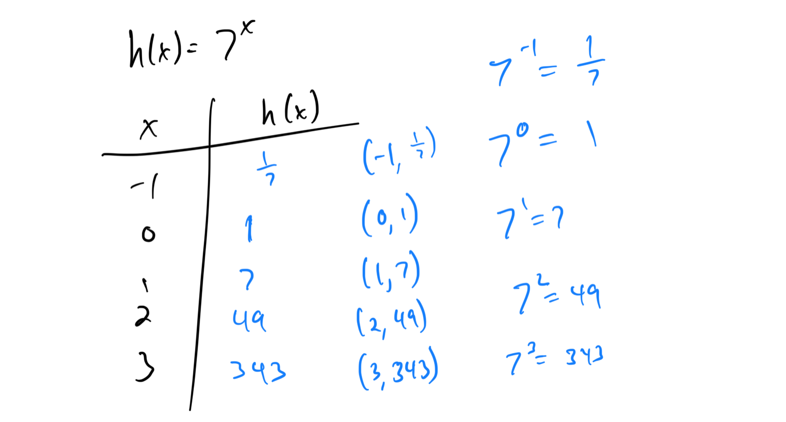
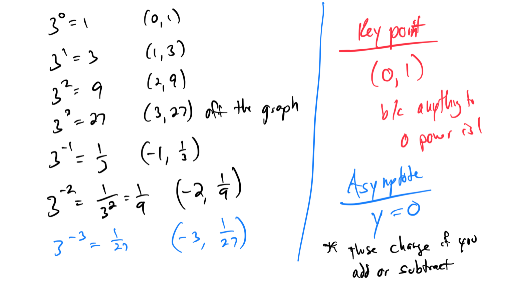
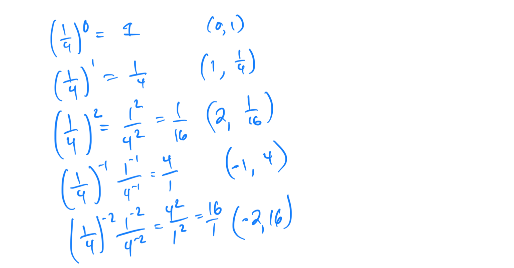
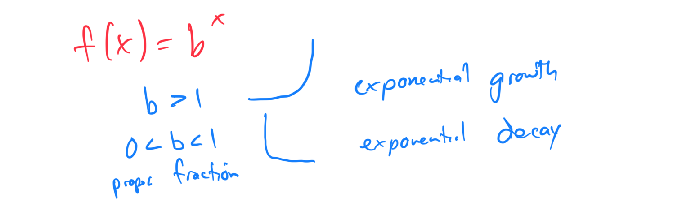
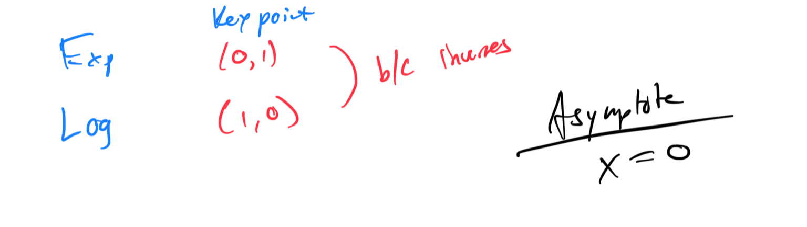

# Module 22 - Exponential and Logarithmic Graphs

[Video](https://youtu.be/TllGs4uoFP8)

### - Topic 1: Table for an exponential function

### - Topic 2: Graphing an exponential function and its asymptote: f(x)=bx

### - Topic 3: Finding domain and range from the graph of an exponential function

### - Topic 4: Transforming the graph of a natural exponential function and finding its domain and range

### - Topic 5: Translating the graph of a logarithmic function

### - Topic 6: Graphing a logarithmic function and finding its domain and range

