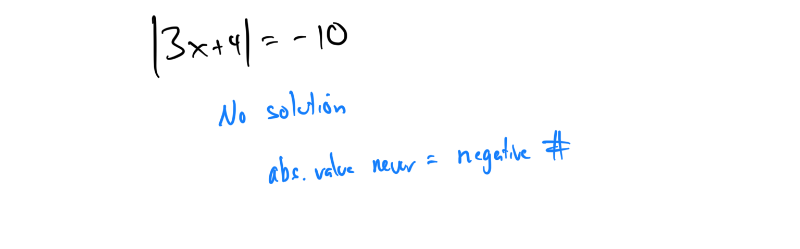
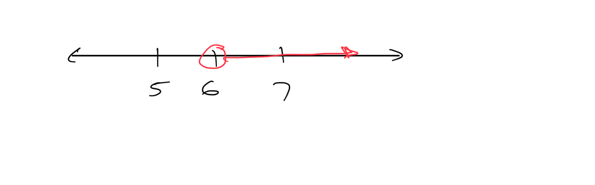
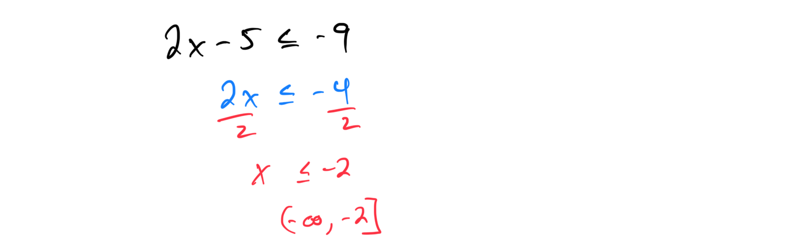
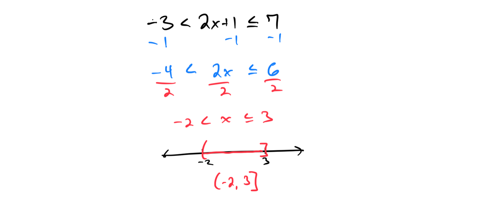
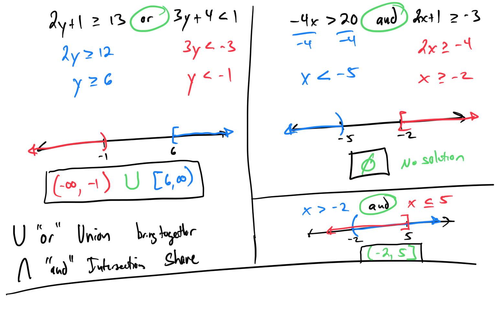

# Module 3 - Absolute Value Equations and Inequalities

[Video](https://youtu.be/DWxQGOA6YOk)

**Topic 1: Graphing a linear inequality on the number line**
1. Graph the inequality x ≥ -3 on the number line. 

[B1BD0D03-2B4C-469A-B3D5-F86C85415E69](attachments/B1BD0D03-2B4C-469A-B3D5-F86C85415E69.png)

1. Graph the inequality x < 5 on the number line.

**Topic 2: Set-builder and interval notation**

[76F0593F-3FE0-419E-A732-CA54B49DA0BB](attachments/76F0593F-3FE0-419E-A732-CA54B49DA0BB.png)

**Topic 3: Solving an absolute value equation: Problem type 2**
1. Solve the equation |x - 3| = 5. 

1. Solve the equation |x + 2| = 7.
**Topic 4: Solving an absolute value equation: Problem type 3**
1. Solve the equation |2x - 1| = 9. 

1. Solve the equation |3x + 4| = -10.

**Topic 5: Solving an absolute value equation: Problem type 4**
1. Solve the equation -4|x - 5| = -24 

1. Solve the equation 3|3x - 2| = 15
**Topic 6: Translating a sentence into a one-step inequality**
1. Translate "A number is at least 12" into a one-step inequality. 

1. Translate "A number is at most 7" into a one-step inequality. 
2. **Topic 7: Writing an inequality for a real-world situation**
1. A car rental company charges $30 per day plus $0.20 per mile. Write an inequality to represent the situation where the total cost must be less than $50. 
2. A store offers a discount if you buy more than 5 items. Write an inequality to represent the number of items needed to qualify for the discount.

**Topic 8: Writing an inequality given a graph on the number line**

**Topic 10: Solving a two-step linear inequality: Problem type 2**
1. Solve the inequality 3x + 4 > 10 and graph the solution on a number line. 

1. Solve the inequality 2x - 5 ≤ -9 and graph the solution on a number line.

**Topic 11: Solving a linear inequality with multiple occurrences of the variable: Problem type 1**
1. Solve the inequality -2x + 8 < 5x - 6. 

1. Solve the inequality 4x - 7 ≥ x + 8.
**Topic 12: Solving a compound linear inequality: Graph solution, basic**
1. Solve the compound inequality -2 ≤ x+2 < 5 and graph the solution on a number line. 

1. Solve the compound inequality -3 < 2x + 1 ≤ 7 and express the solution in interval notation. 

**Topic 13: Solving a compound linear inequality: Interval notation**

1. Solve the compound inequality 1 ≤ 3x - 2 < 10 and express the solution in interval notation.
**Topic 14: Solving a decimal word problem using a two-step linear inequality**
1. A phone plan charges $0.10 per minute plus a $15 monthly fee. Write and solve an inequality to find how many minutes you can use if your bill must be less than $25. 

1. A coffee shop sells drinks for $2.50 each plus a $5 service fee. Write and solve an inequality to determine how many drinks you can buy if your total cost must be at most $20.

