# Module 4 - Quadratic Equations

[Video](https://youtu.be/GzNDUqGmRhY)

**Topic 1: Multiplying binomials with leading coefficients of 1**
1. Multiply the binomials (x + 3)(x + 5). 

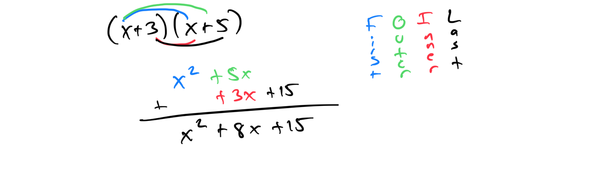

1. Multiply the binomials (x - 4)(x + 7).
**Topic 2: Factoring a quadratic with leading coefficient 1**
1. Factor the quadratic x² + 5x + 6. 

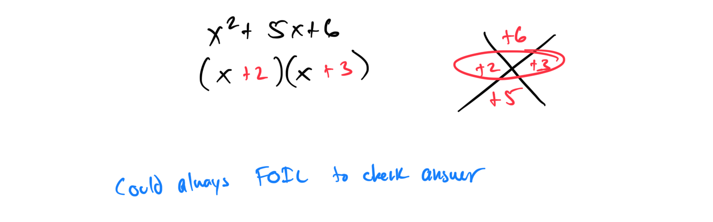

1. Factor the quadratic x² - 7x + 12.

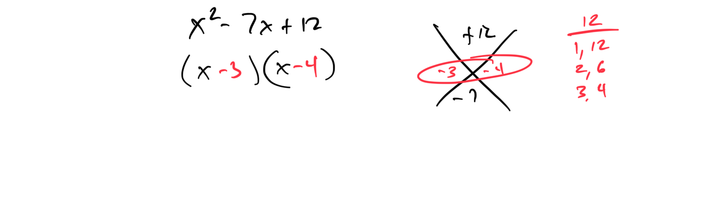

**Topic 3: Factoring a perfect square trinomial with leading coefficient 1**
1. Factor the trinomial x² + 6x + 9. 

1. Factor the trinomial x² - 8x + 16.

**Topic 4: Factoring a difference of squares in one variable: Basic**
1. Factor the expression x² - 25. 

1. Factor the expression x² - 49.

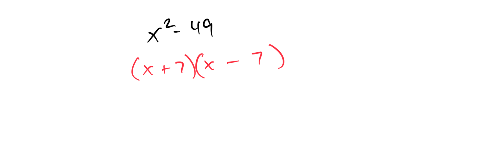

**Topic 5: Solving an equation written in factored form**
1. Solve the equation (x + 2)(x - 3) = 0. 
2. Solve the equation (x - 5)(x + 1) = 0.
**Topic 6: Finding the roots of a quadratic equation of the form ax² + bx = 0**
1. Find the roots of the equation 2x² + 8x = 0. 

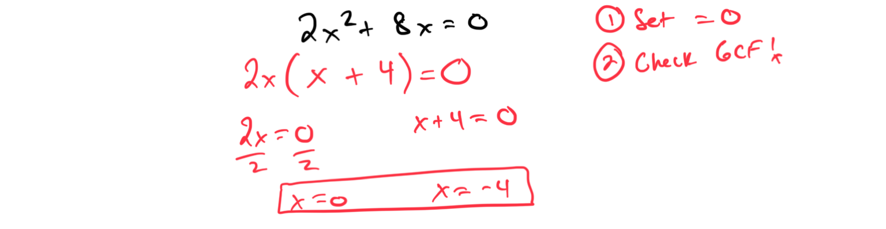

1. Find the roots of the equation 3x² - 12x = 0.
**Topic 7: Finding the roots of a quadratic equation with leading coefficient greater than 1**
1. Find the roots of the equation 2x² + 4x - 6 = 0. 

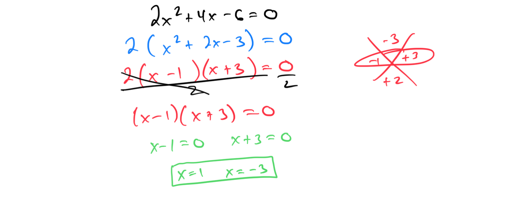

1. Find the roots of the equation 2x² + 9x - 5= 0.

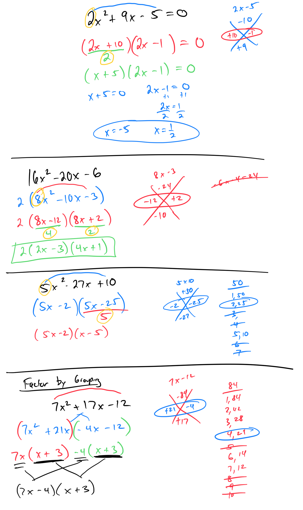

**Topic 8: Solving a quadratic equation needing simplification**
1. Solve the equation 2x² + 10 = 6x + 2. 
\
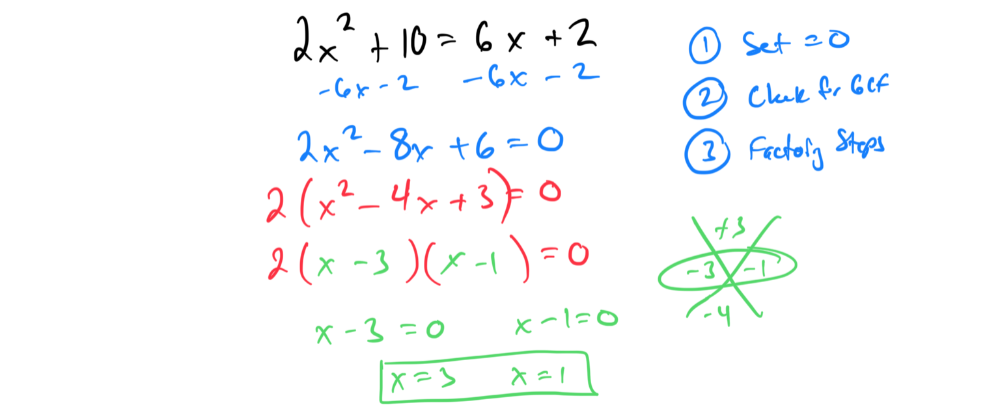

1. Solve the equation 3x² - 12 = 5x - 4.
**Topic 9: Solving an equation of the form x² = a using the square root property**
1. Solve the equation x² = 16. 

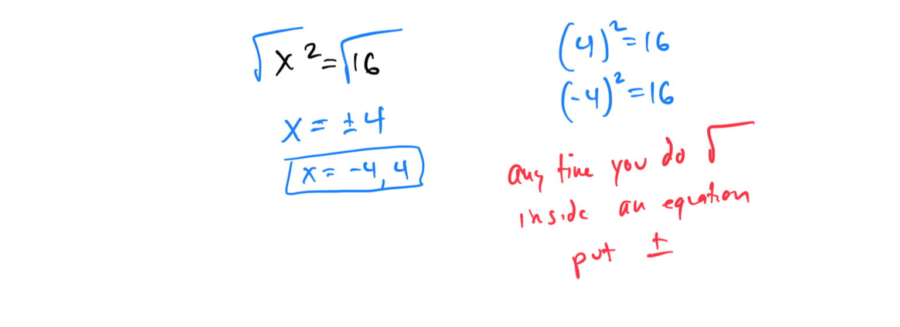

1. Solve the equation x² = 25.
**Topic 10: Solving a quadratic equation using the square root property: Exact answers, basic**
1. Solve the equation (x - 3)² = 9. 

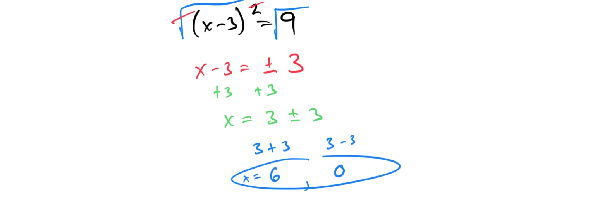

1. Solve the equation (x + 2)² = 4.
**Topic 11: Solving a quadratic equation using the square root property: Exact answers, advanced**
1. Solve the equation 2(x - 1)² = 18. 

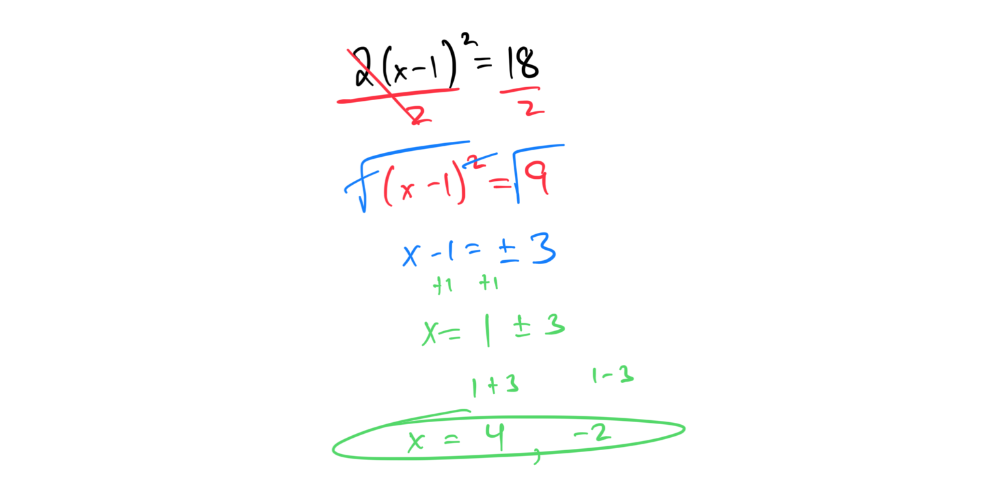

1. Solve the equation 3(x + 4)² = 27.

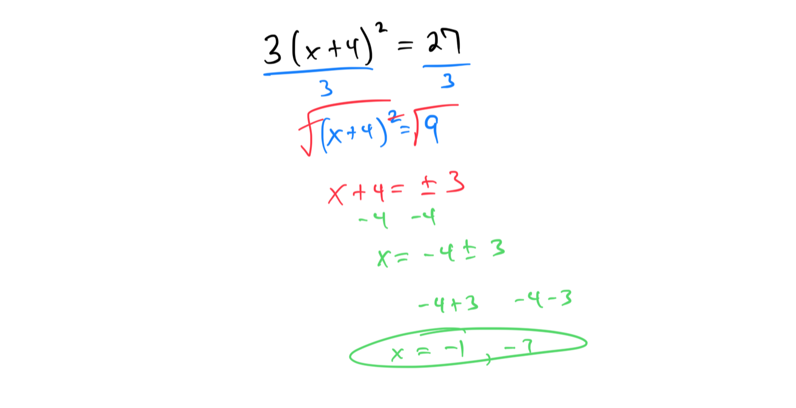

**Topic 12: Completing the square**
1. Complete the square for the expression x² + 10x. 

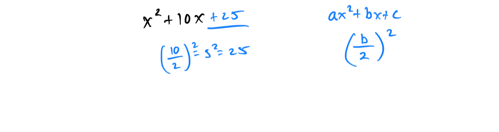

1. Complete the square for the expression x² - 6x.

**Topic 13: Solving a quadratic equation by completing the square: Exact answers**
1. Solve the equation x² + 8x - 5 = 0 by completing the square. 

[5C692793-FAF3-4BB4-99E0-C968C0A912D3](attachments/5C692793-FAF3-4BB4-99E0-C968C0A912D3.png)

1. Solve the equation x² - 10x + 12 = 0 by completing the square.

[70BF4A5A-4D33-4E86-85B3-D539065B3703](attachments/70BF4A5A-4D33-4E86-85B3-D539065B3703.png)

**Topic 14: Applying the quadratic formula: Exact answers**
1. Solve the equation 2x² + 5x - 2 = 0 using the quadratic formula. 

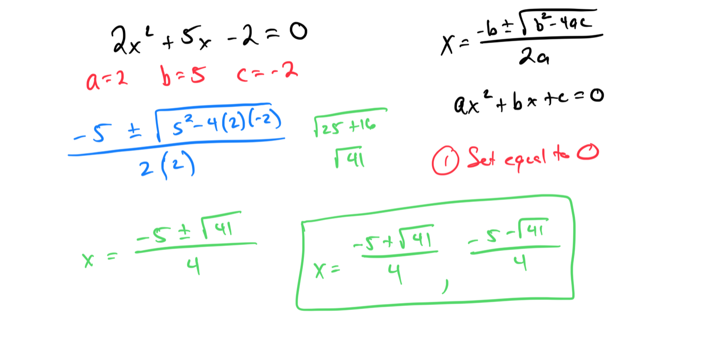

1. Solve the equation 3x² - 5x + 1 = 0 using the quadratic formula.
**Topic 15: Solving a word problem using a quadratic equation with irrational roots**
1. A ball is thrown upward with an initial velocity of 32 ft/s from a height of 5 ft. The height h (in feet) after t seconds is given by h = -16t² + 32t + 5. Find the times when the ball is 10 ft above the ground. 

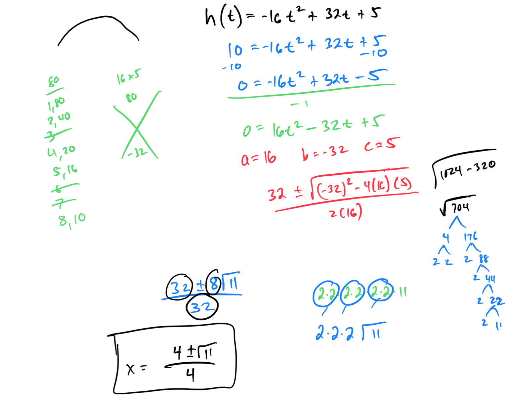

1. A rectangular garden has an area of 60 square feet, and its length is 5 feet more than its width. Find the dimensions of the garden.
