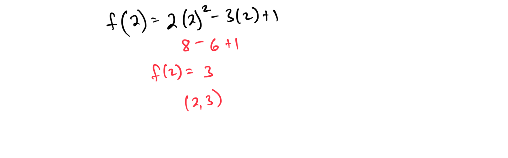
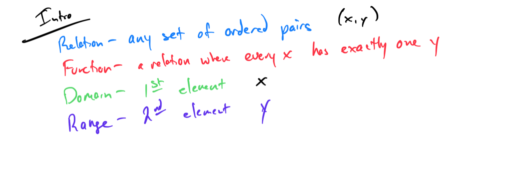
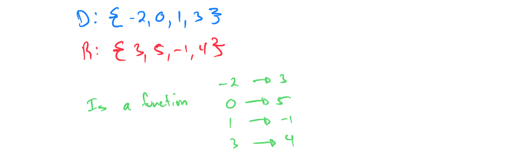
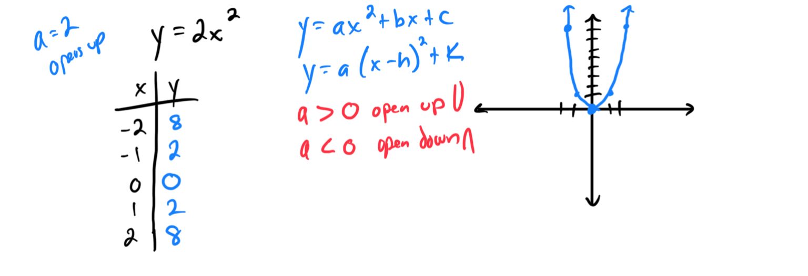
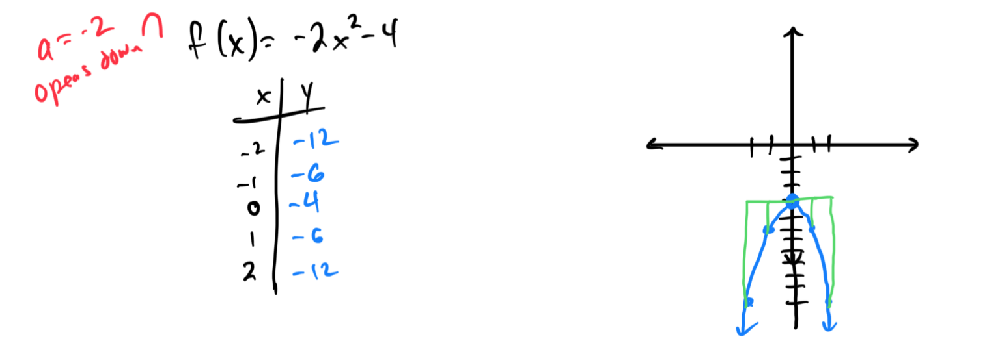
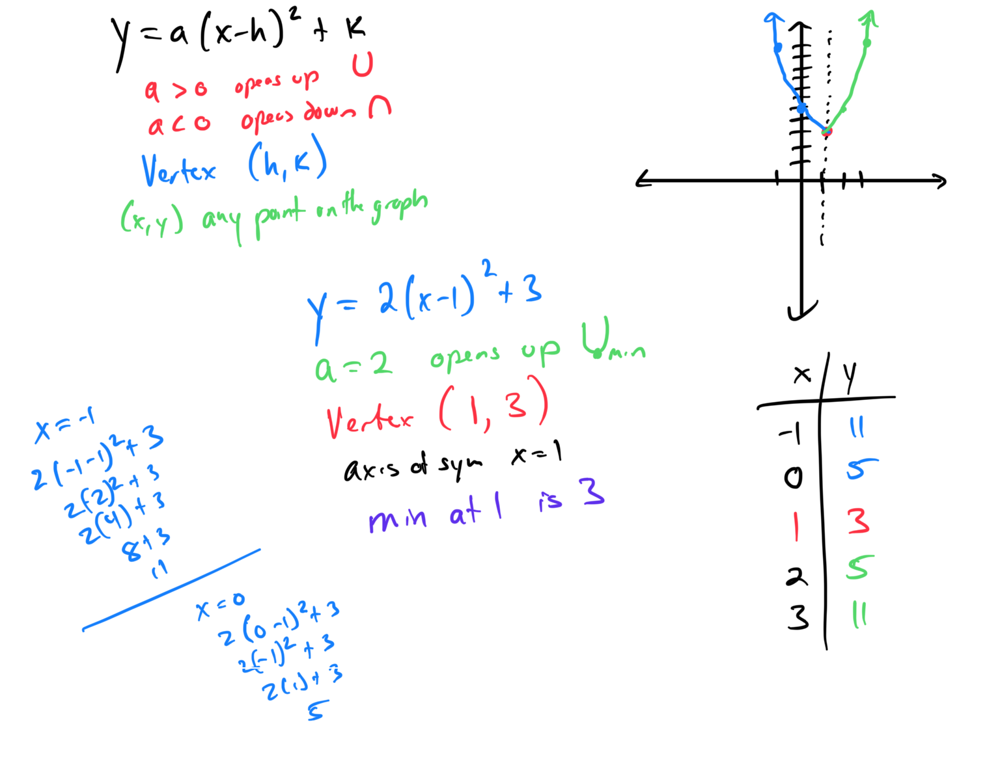
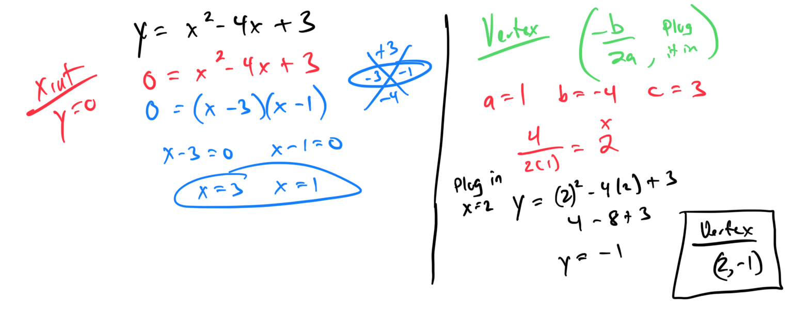
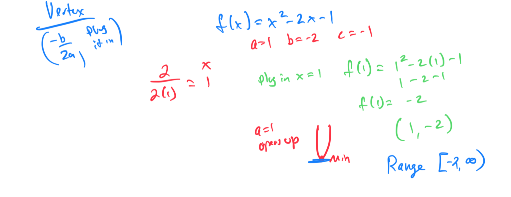

# Module 5 - Quadratic Graphs

[Video](https://youtu.be/e23TuL-6Wa0)

**Topic 1: Evaluating functions: Linear and quadratic or cubic**
1. Evaluate the function f(x) = 2x² - 3x + 1 when x = 2. 

1. Evaluate the function f(x) = x³ + 4x - 5 when x = -1.

**Topic 2: Domain and range from ordered pairs**
1. Find the domain and range of the set of ordered pairs {(-2, 3), (0, 5), (1, -1), (3, 4)}. 

1. Find the domain and range of the set of ordered pairs {(-1, 0), (2, 7), (4, 2), (5, -3)}.
**Topic 3: Domain and range from the graph of a quadratic function**

**Topic 4: Graphing a parabola of the form y = ax²**
1. Graph the parabola y = 2x². 

1. Graph the parabola y = -3x².
**Topic 5: Graphing a function of the form f(x) = ax² + c**
1. Graph the function f(x) = x² + 3. 

1. Graph the function f(x) = -2x² - 4.

**Topic 6: Finding the vertex, intercepts, and axis of symmetry from the graph of a parabola**

**Topic 7: Graphing a parabola of the form y = a(x-h)² + k**
1. Graph the parabola y = 2(x - 1)² + 3. 

1. Graph the parabola y = -(x + 2)² - 1.

**Topic 8: Graphing a parabola of the form y = ax² + bx + c: Integer coefficients**
1. Graph the parabola y = x² + 2x - 3. 

1. Graph the parabola y = 2x² - 4x + 1.
**Topic 9: Finding the x-intercept(s) and the vertex of a parabola**
1. Find the x-intercepts and vertex of the parabola y = x² - 4x + 3. 

1. Find the x-intercepts and vertex of the parabola y = 2x² + 4x - 6.
**Topic 10: Finding the maximum or minimum of a quadratic function**
1. Find the maximum or minimum value of the quadratic function f(x) = -x² + 4x + 1. 

[061C78CB-698C-4E1D-B4AD-9B4C27D66888](attachments/061C78CB-698C-4E1D-B4AD-9B4C27D66888.png)

1. Find the maximum or minimum value of the quadratic function f(x) = 2x² - 8x + 3.
**Topic 11: Word problem involving the maximum or minimum of a quadratic function**

**Topic 12: Word problem involving optimizing area by using a quadratic function**

**Topic 13: Domain and range from the graph of a quadratic function**

**Topic 14: Range of a quadratic function**
1. Find the range of the quadratic function f(x) = x² - 2x + 1. 

1. Find the range of the quadratic function f(x) = -2x² + 4x - 3.
**Topic 15: Choosing a quadratic model and using it to make a prediction**

**Topic 16: Finding the zeros of a quadratic function given its equation**
1. Find the zeros of the quadratic function f(x) = x² - 5x + 6. 

1. Find the zeros of the quadratic function f(x) = 2x² + x - 3.
