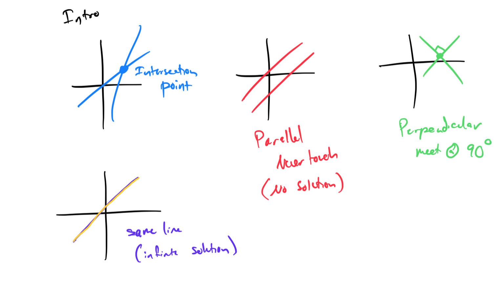

# Module 6 - System of Equations

[Video](https://youtu.be/13zGZehtpuA)

**Topic 1: Product rule with positive exponents: Multivariate**
1. Simplify the expression (2x²y)(3xy³) using the product rule. 

1. Simplify the expression (4x³z²)(5x²z) using the product rule.

**Topic 2: Solving a system of linear equations using substitution**
1. Solve the system of equations using substitution: y = 2x + 3 and 3x + y = 13. 

1. Solve the system of equations using substitution: x = 4y - 1 and 2x - 3y = 3.

**Topic 3: Solving a system of linear equations using elimination with multiplication and addition**
1. Solve the system of equations using elimination: 2x + 3y = 10 and 4x - 5y = -2. 

1. Solve the system of equations using elimination:

**Topic 4: Solving a word problem using a system of linear equations of the form Ax + By = C**

1. A movie theater charges $8 for adult tickets and $5 for child tickets. If 10 tickets were sold for $71, how many adult and child tickets were purchased?

**Topic 5: Solving a system of linear and quadratic equations**
1. Solve the system of equations: 

1. Solve the system of equations: y = x² + 2x - 3 and y = x + 1.
