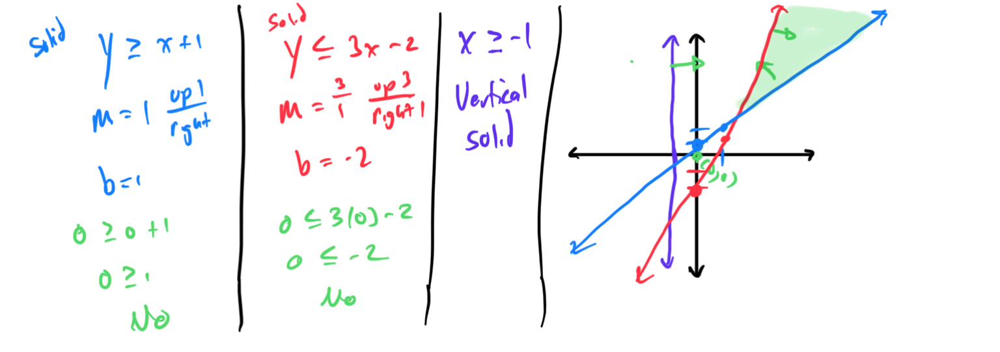
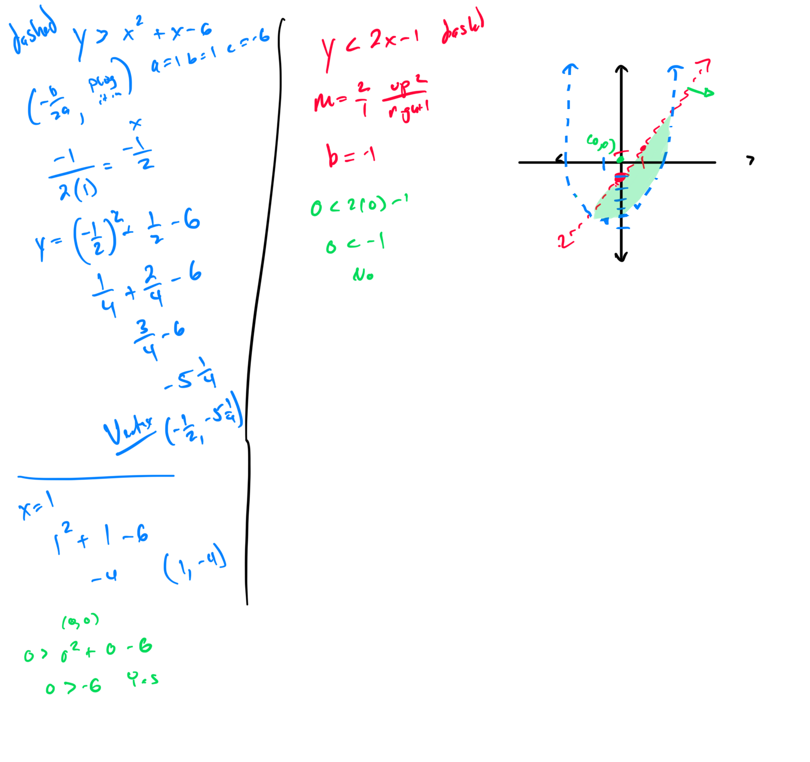

# Module 7 - Systems of Inequalities

[Video](https://youtu.be/y87ogUC-WAM)

**Topic 1: Graphing a linear inequality in the plane: Vertical or horizontal line**
1. Graph the inequality x ≤ 4 in the coordinate plane. 
2. Graph the inequality y > -3 in the coordinate plane. 
4. **Topic 2: Graphing a linear inequality in the plane: Slope-intercept form**
1. Graph the inequality y ≥ 3x - 2 in the coordinate plane. 
2. Graph the inequality y < -2x + 4 in the coordinate plane. 
4. **Topic 3: Graphing a linear inequality in the plane: Standard form**
1. Graph the inequality 3x + 2y ≤ 12 in the coordinate plane. 
2. Graph the inequality 5x - y > 10 in the coordinate plane. 
4. **Topic 4: Graphing a system of two linear inequalities: Basic**
1. Graph the system of inequalities: y ≤ 2x + 3 and y ≥ -x - 1 in the coordinate plane. 
2. [3D91CBAB-D84C-4C1A-95BD-3F41674B0C1F](attachments/3D91CBAB-D84C-4C1A-95BD-3F41674B0C1F.png)Graph the system of inequalities: y > x - 2 and y < -2x + 5 in the coordinate plane. 
4. **Topic 5: Graphing a system of three linear inequalities**
1. Graph the system of inequalities: y ≥ x + 1, y ≤ 3x - 2, and x ≥ -1 in the coordinate plane. 
2. Graph the system of inequalities: y < 2x + 4, y > -x + 1, and y ≤ 5 in the coordinate plane. 
4. **Topic 6: Graphing a system of nonlinear inequalities: Problem type 1**
1. Graph the system of inequalities: y ≤ x² - 3 and y ≥ x + 2 in the coordinate plane. 
2. Graph the system of inequalities: y > x² + x - 6 and y < 2x - 1 in the coordinate plane.

