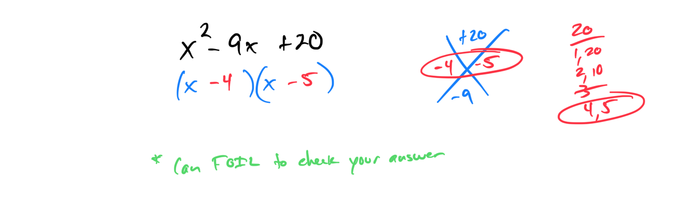
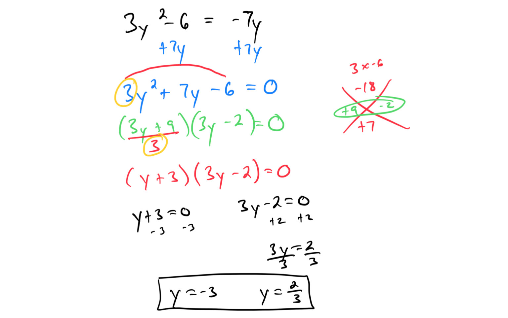
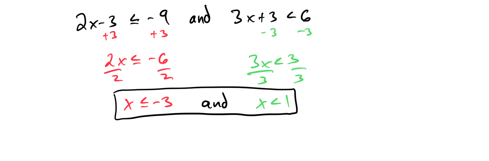
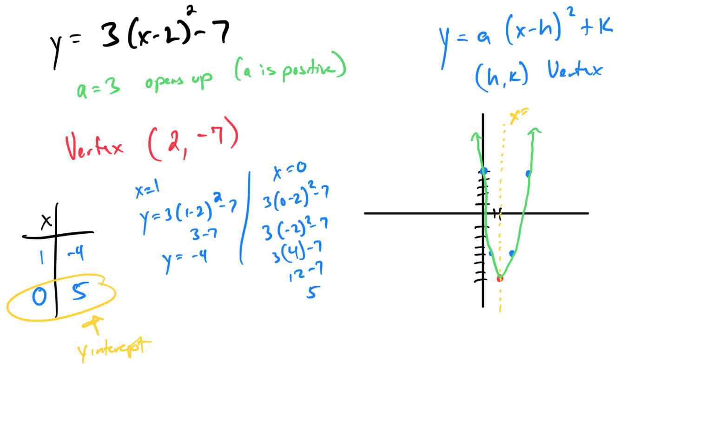

# Module 8 - Linear and Quadratics Exam Review

[Video](https://youtu.be/RzClQ4BtRpI)

**Topic 1: Factoring a quadratic with leading coefficient 1**

**Topic 2: Finding the roots of a quadratic equation with leading coefficient greater than 1**

**Topic 3: Solving a quadratic equation using the square root property: Exact answers, advanced**

On Test Work Page (below).

**Topic 4: Applying the quadratic formula: Exact answers**

On Test Work Page (below).

**Topic 5: Solving a compound linear inequality: Interval notation**

Answer on Test Work Page (below).

**Topic 6: Graphing a function of the form f(x) = ax + b: Integer slope**

**Topic 7: Finding the vertex, intercepts, and axis of symmetry from the graph of a parabola**

**Topic 8: Graphing a parabola of the form y = a(x-h)² + k**

Answer on Test Work Page (below).

**Topic 9: Solving a system of linear equations using elimination with multiplication and addition**

On Test Work Page (below).

**Topic 10: Graphing a system of two linear inequalities: Basic**

