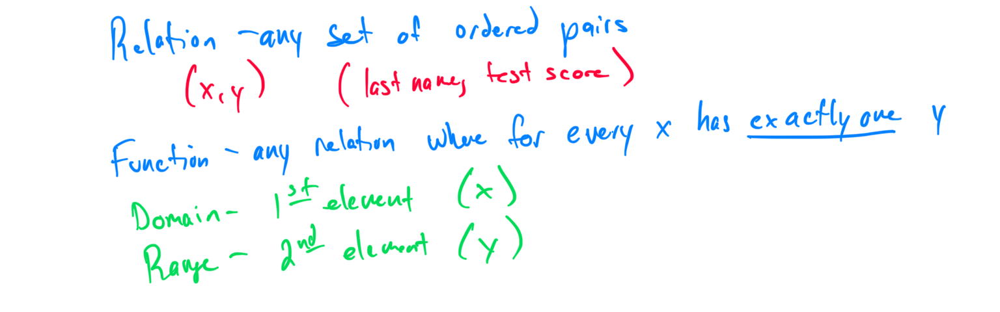
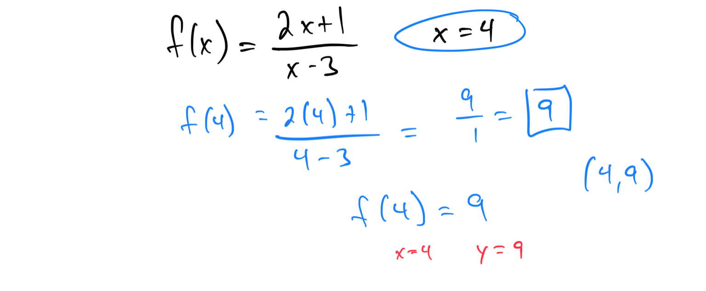
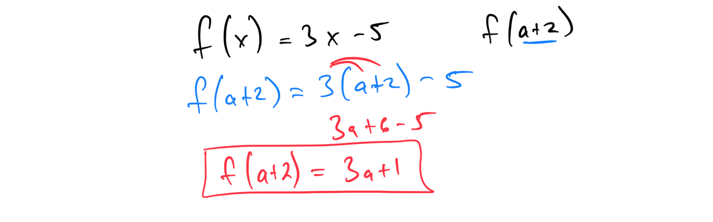
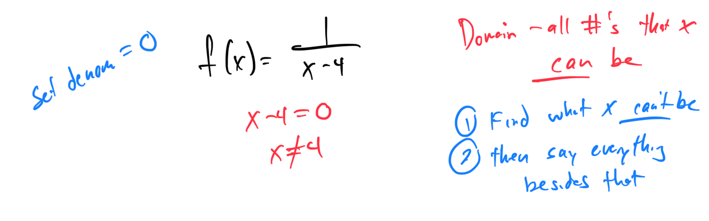

# Module 9 - Relations and Functions

These notes didn’t save!  I’ll try and go back and watch the video soon and make it all match up!

[Video](https://youtu.be/MMnrHzW-54Y)

Topic 1: Identifying functions from relations



Topic 2: Vertical line test







Topic 3: Evaluating a rational function: Problem type 1
Problem 1: Evaluate the rational function f(x) = (2x + 1)/(x - 3) at x = 4. Show all steps and simplify the result.

Problem 2: For the function g(x) = (x - 2)/(x + 5), find g(-1). Provide the computation and the final value.

Topic 4: Variable expressions as inputs of functions: Problem type 1
Problem 1: Given f(x) = 3x - 5, find f(a + 2). Substitute the expression and simplify the result.

Problem 2: For the function h(x) = x^2 + 2x, evaluate h(2x - 1). Show the substitution and simplify the expression.

Topic 5: Domain of a rational function: Excluded values
Problem 1: Find the domain of the rational function f(x) = 1/(x - 4). Identify any excluded values and express the domain in interval notation.

Problem 2: Determine the domain of g(x) = (3x + 2)/(x^2 - 9). Find all values that make the denominator zero and state the domain.

Topic 6: Domain of a square root function: Basic
Problem 1: Find the domain of the function f(x) = √(x - 3). Determine the values of x that make the expression under the square root non-negative.
Problem 2: For the function g(x) = √(2x + 5), identify the domain. Solve the inequality inside the square root and express the domain in interval notation.

Topic 7: Determining if graphs have symmetry with respect to the x-axis, y-axis, or origin

Topic 8: Finding a difference quotient for a linear or quadratic function
Problem 1: For the function f(x) = 2x + 3, find the difference quotient [f(x + h) - f(x)]/h. Simplify the expression fully.
Problem 2: Given the quadratic function g(x) = x^2 - 4x, compute the difference quotient [g(x + h) - g(x)]/h and simplify the result.

Topic 9: Domain and range of a linear function that models a real-world situation
