# Radicals

### Topic 1: Simplifying the square root of a whole number greater than 100  

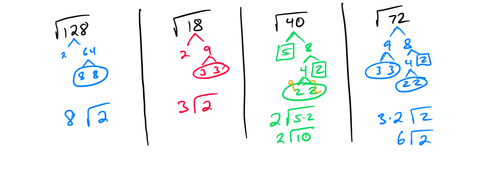

### Topic 2: Simplifying a radical expression with an even exponent  

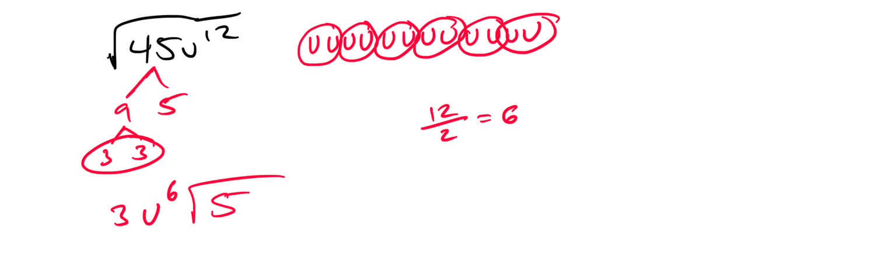

### Topic 3: Simplifying a radical expression with an odd exponent  

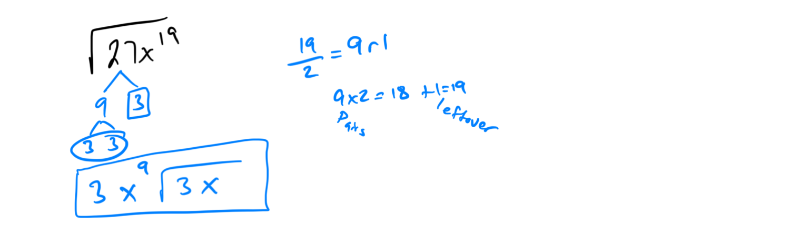

### Topic 4: Simplifying a radical expression with two variables  

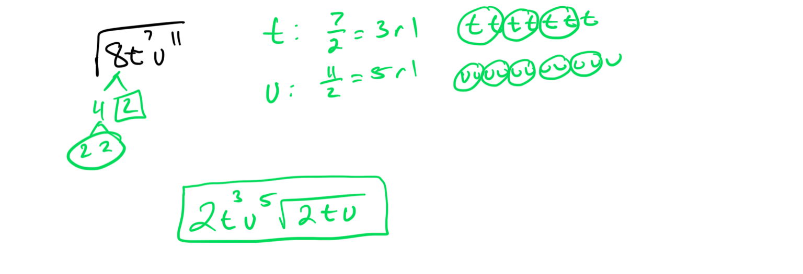

### Topic 5: Simplifying a higher root of a whole number  

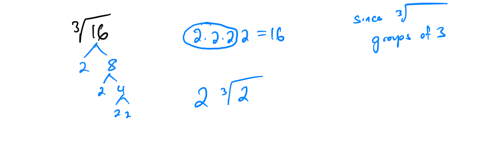

### Topic 6: Introduction to simplifying a higher radical expression  

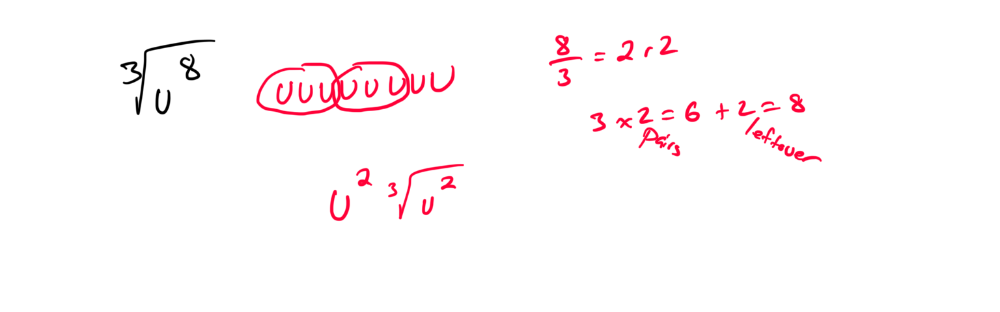

### Topic 7: Simplifying a higher radical expression: Multivariate  

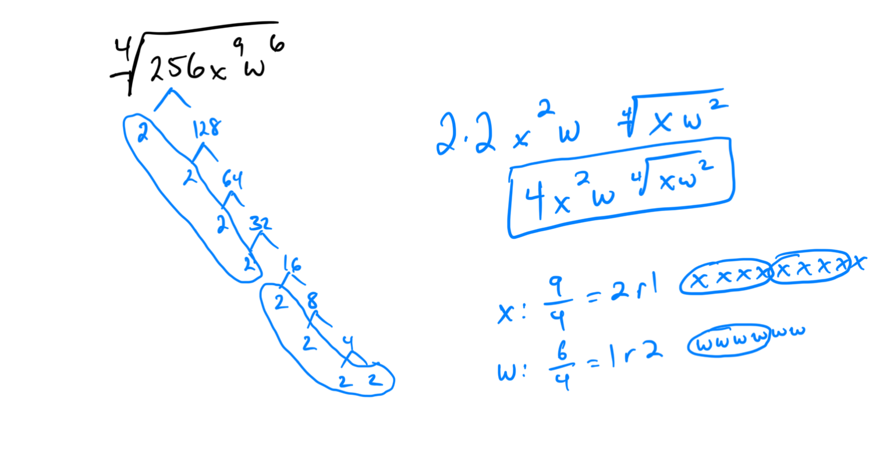

### Topic 8: Square root addition or subtraction  

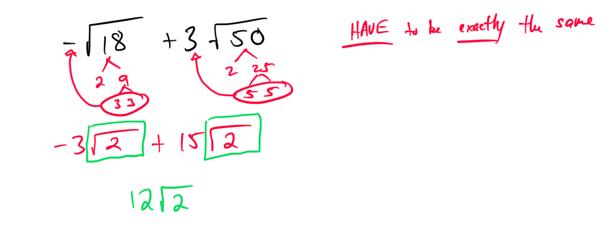

### Topic 9: Introduction to simplifying a sum or difference of radical expressions: Univariate  

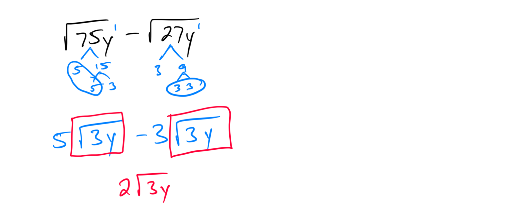

### Topic 10: Simplifying a sum or difference of radical expressions: Univariate  

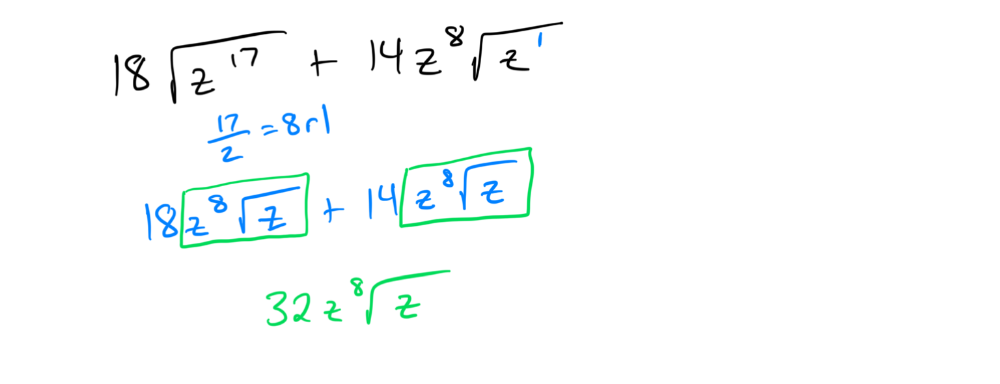

### Topic 11: Simplifying a sum or difference of radical expressions: Multivariate  

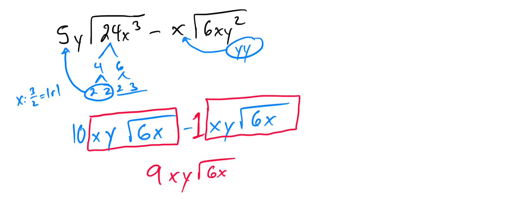

### Topic 12: Simplifying a sum or difference of higher roots  

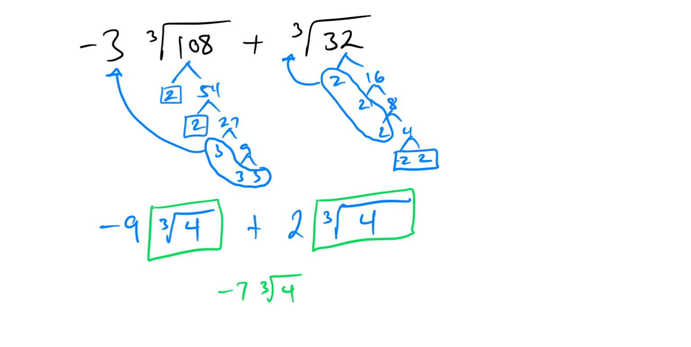

### Topic 13: Square root multiplication: Basic  

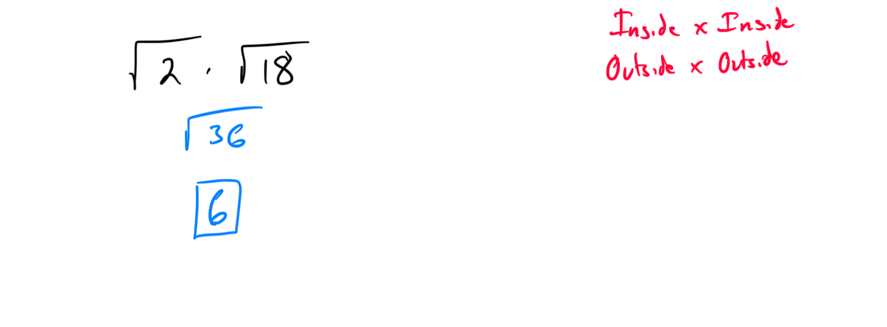

### Topic 14: Square root multiplication: Advanced  

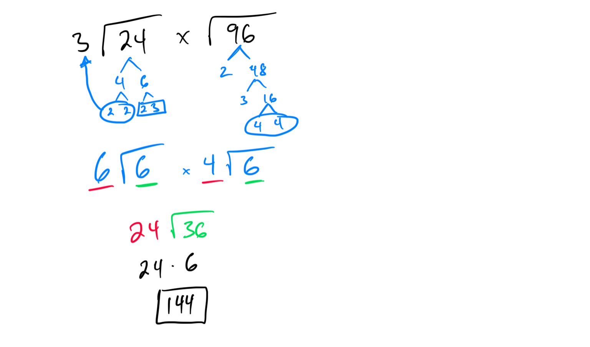

### Topic 15: Introduction to simplifying a product of radical expressions: Univariate  

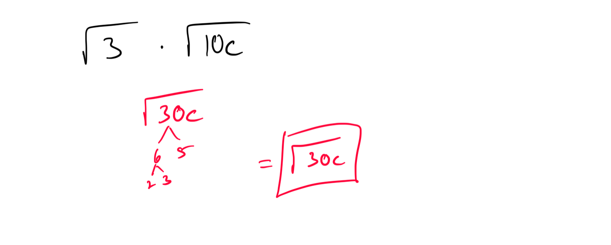

### Topic 16: Simplifying a product of radical expressions: Univariate  

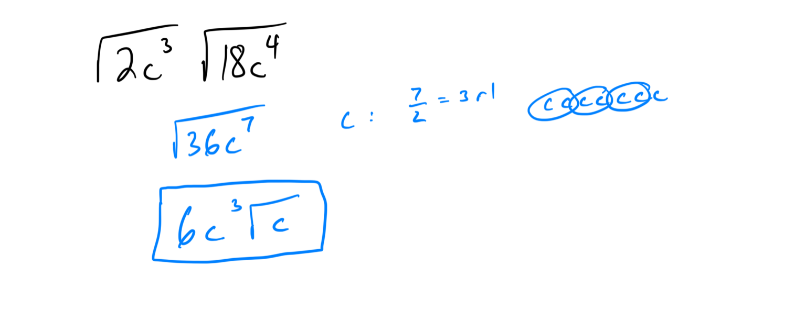

### Topic 17: Simplifying a product of radical expressions: Multivariate  

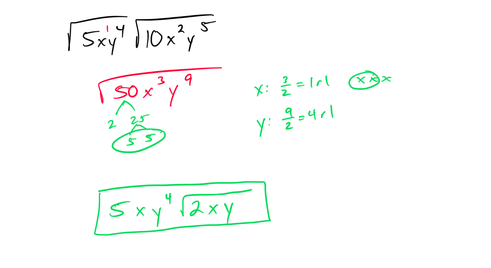

### Topic 18: Introduction to simplifying a product of higher roots  

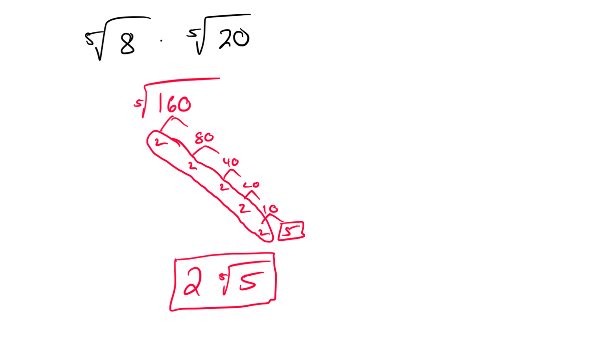

### Topic 19: Simplifying a quotient of square roots  

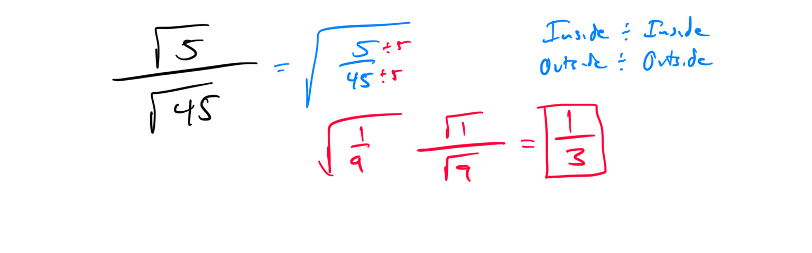

### Topic 20: Simplifying a quotient involving a sum or difference with a square root  

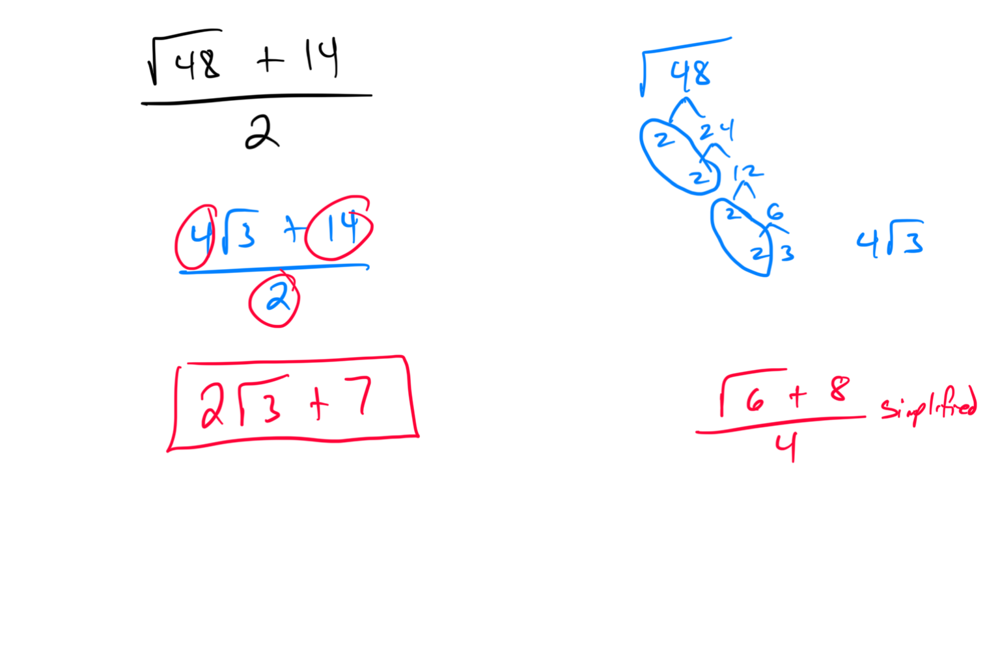

### Topic 21: Rationalizing a denominator: Square root of a fraction  

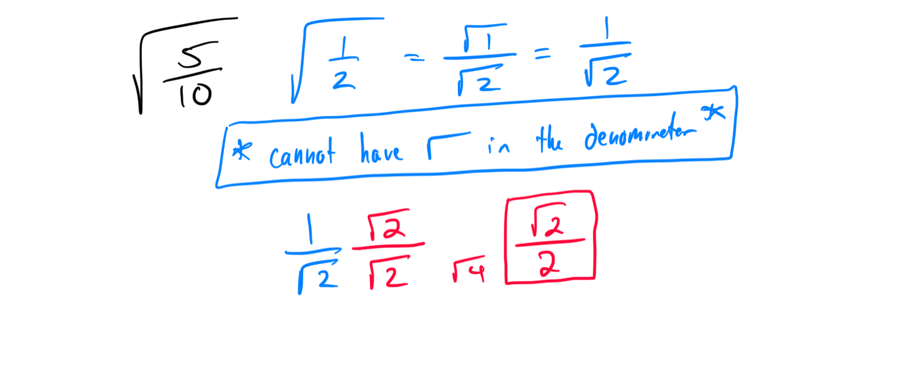

### Topic 22: Rationalizing a denominator using conjugates: Integer numerator  

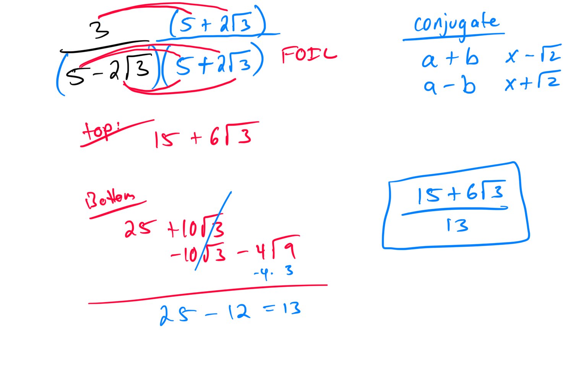

### Topic 23: Rationalizing a denominator using conjugates: Square root in numerator  

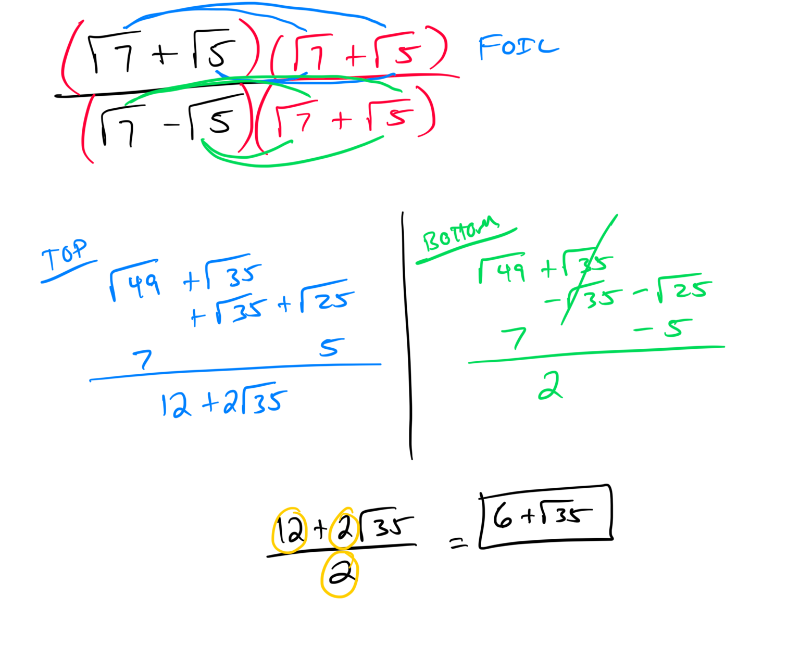

### Topic 24: Finding values and intervals where the graph of a function is zero, positive, or negative

