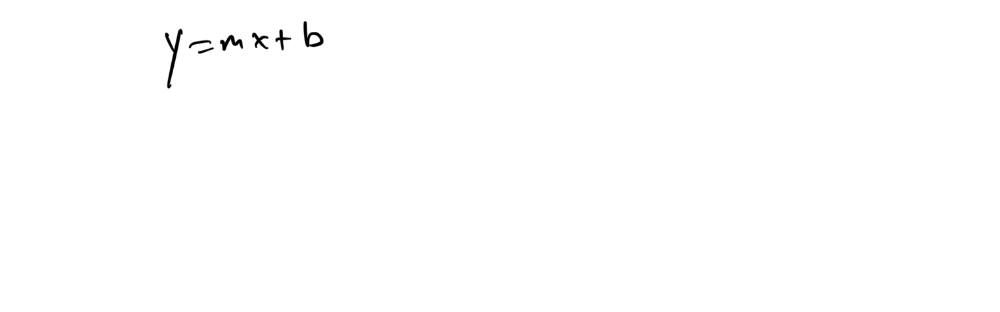
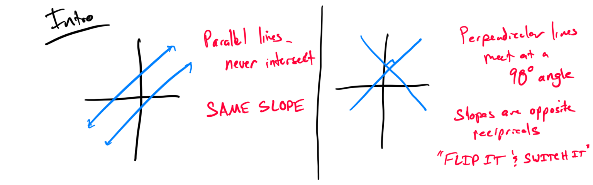

# Writing Linear Equations

[Video](https://youtu.be/JIFVSK5tvCg)

### Topic 1: Writing an equation in slope-intercept form given the slope and a point
Problem 1: Write the equation of a line in slope-intercept form with a slope of 2 and passing through the point (3, 5).

[624EB830-76EF-42D8-8F0E-BABF36879C9D](attachments/624EB830-76EF-42D8-8F0E-BABF36879C9D.png)

Problem 2: Find the equation of a line in slope-intercept form with a slope of -1/2 and passing through the point (-4, 7).

[7620EBF1-26CD-41EF-B5D8-4183BB928189](attachments/7620EBF1-26CD-41EF-B5D8-4183BB928189.png)

### Topic 2: Writing the equation of a line through two given points
Problem 1: Write the equation of the line through the points (1, 2) and (3, 6) in slope-intercept form.

[705BE6EB-A86A-4B7E-A97C-4B91A33BFA30](attachments/705BE6EB-A86A-4B7E-A97C-4B91A33BFA30.png)

Problem 2: Find the equation of the line through the points (-2, 3) and (4, -1) in slope-intercept form.

### Topic 3: Writing the equation of a line given the y-intercept and another point
Problem 1: Write the equation of a line with y-intercept 4 and passing through the point (2, 8) in slope-intercept form.

Problem 2: Find the equation of a line with y-intercept -3 and passing through the point (1, -1) in slope-intercept form.

### Topic 4: Finding slopes of lines parallel and perpendicular to a line given in slope-intercept form
Problem 1: Find the slopes of lines parallel and perpendicular to y = 3x + 2.

Problem 2: Determine the slopes of lines parallel and perpendicular to y = (-1/2)x - 5.

### Topic 5: Finding slopes of lines parallel and perpendicular to a line given in the form Ax + By = C
Problem 1: Find the slopes of lines parallel and perpendicular to 2x - 3y = 6.

Problem 2: Determine the slopes of lines parallel and perpendicular to 4x + 5y = 10.

### Topic 6: Identifying parallel and perpendicular lines from equations
Problem 1: Determine if the lines y = 2x + 1 and 2x - y = 3 are parallel, perpendicular, or neither.

Problem 2: Are the lines y = (-1/3)x + 4 and 3x - y = 2 parallel, perpendicular, or neither?

### Topic 7: Writing equations of lines parallel and perpendicular to a given line through a point
Problem 1: Write the equations of lines perpendicular to y = 4x - 1 passing through (2, 3) in slope-intercept form.

Problem 2: Find the equations of lines parallel to 3x + 2y = 6 passing through (-1, 5) in slope-intercept form.

[2F732D63-D15A-47E7-B1EB-026ED375BAD4](attachments/2F732D63-D15A-47E7-B1EB-026ED375BAD4.png)
