# Module 1- Real Numbers

[Video](https://youtu.be/mH4Ff4rkvMw)

## **Topic 1: Addition or subtraction of fractions with the same denominator**
1. Simplify: 3/8 + 5/8: **1**.

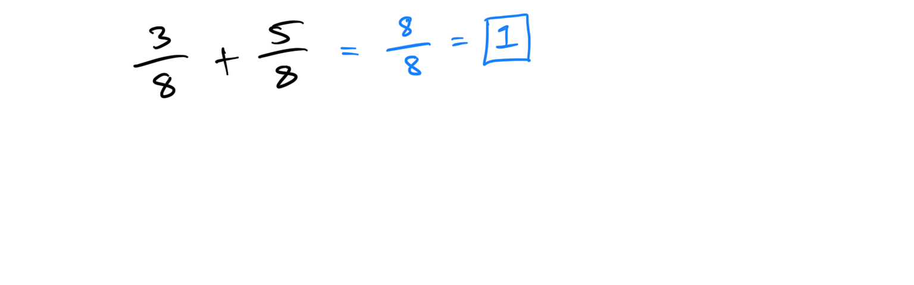

1. Compute: 7/12 - 4/12: **1/4**.

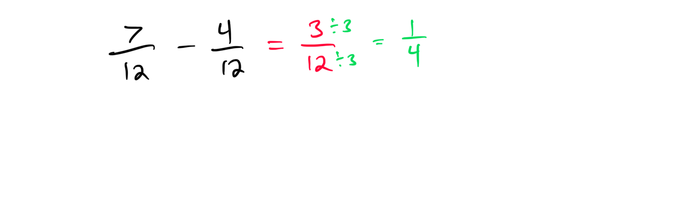

## **Topic 2: Using a calculator to approximate a square root**
1. Use a calculator to approximate √20 to two decimal places: **4.47**.

1. Approximate √50 to two decimal places using a calculator: **7.07**.

## **Topic 3: Exponents and fractions**
1. Evaluate: (1/2)³: **1/8**.

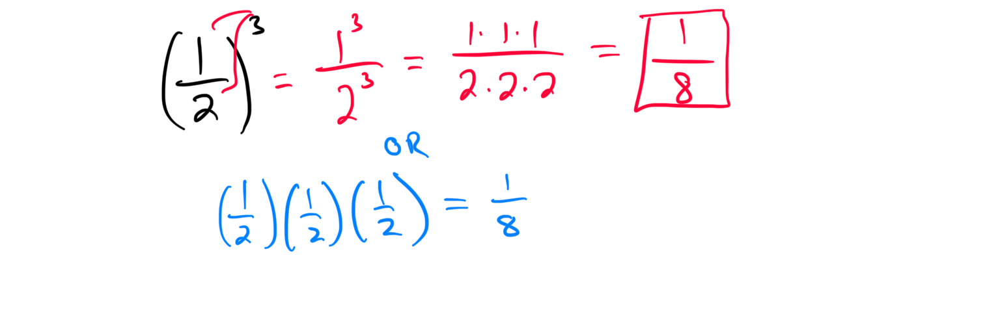

1. Compute: (3/4)²: **9/16**.

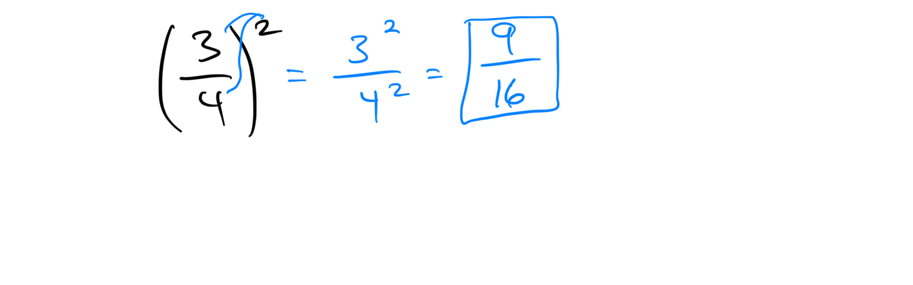

## **Topic 4: Perimeter of a square or a rectangle**
1. Find the perimeter of a rectangle with length 6 cm and width 4 cm: **20 cm**.

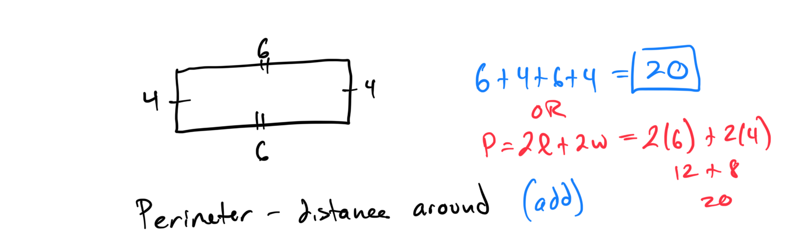

1. Calculate the perimeter of a square with a side length of 5 meters: **20 meters**.

[17422AB7-3CC4-4BF8-8672-0F599F04FDD2](attachments/17422AB7-3CC4-4BF8-8672-0F599F04FDD2.png)

## **Topic 5: Area of a square or a rectangle**
1. Find the area of a rectangle with length 8 cm and width 3 cm: **24 cm²**.

[33CA103E-B93F-449E-9D3B-849DF81742F2](attachments/33CA103E-B93F-449E-9D3B-849DF81742F2.png)

1. Calculate the area of a square with a side length of 7 meters: **49 m²**.

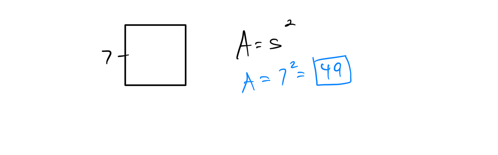

## **Topic 6: Square root of a perfect square**
1. Find the square root of 16: **4**.

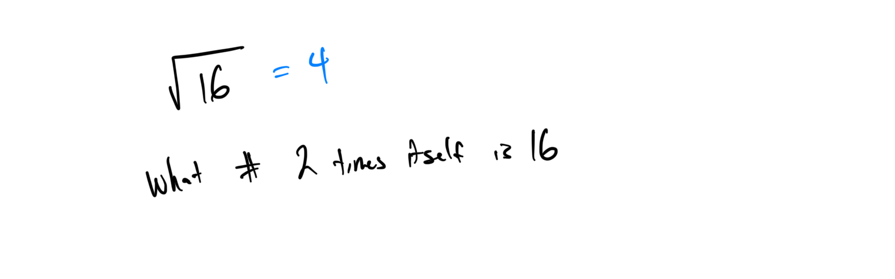

1. Compute the square root of 81: **9**.

## **Topic 7: Writing a one-step expression for a real-world situation**
1. Write an expression for the cost of buying n books at $10 each: **10n**.

1. Write an expression for the total distance traveled at 60 mph for t hours: **60t**.

## **Topic 8: Translating a phrase into a one-step expression**
1. Translate "five more than a number x" into an expression: **x + 5**.

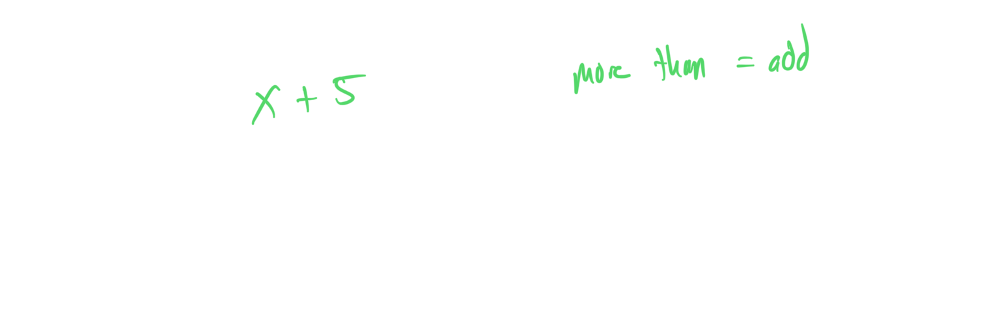

1. Write an expression for "twice a number y": **2y**.

## **Topic 9: Translating a phrase into a two-step expression**
1. Translate "three times a number x plus 4" into an expression: **3x + 4**.

1. Write an expression for "double a number y minus 7": **2y - 7**.

## **Topic 10: Evaluating a linear expression: Integer multiplication with addition or subtraction**
1. Evaluate 3x + 5 when x = 2: **11**.

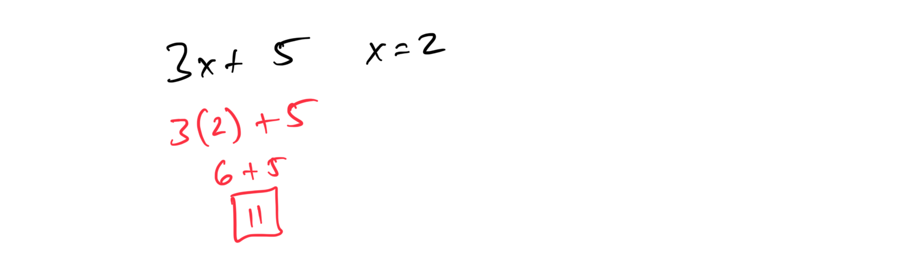

1. Compute 4y - 6 when y = -3: **-18**.

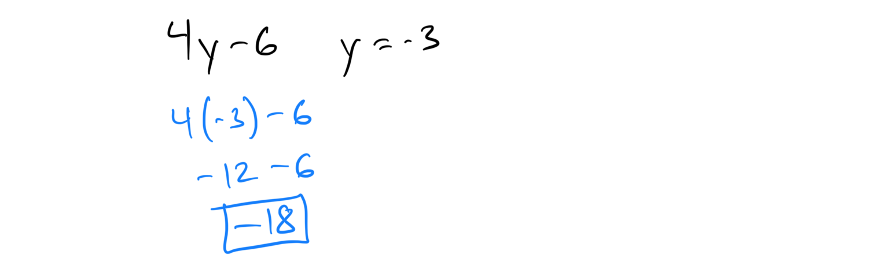

## **Topic 11: Evaluating a quadratic expression: Integers**
1. Evaluate x² + 2x + 1 when x = 3: **16**.

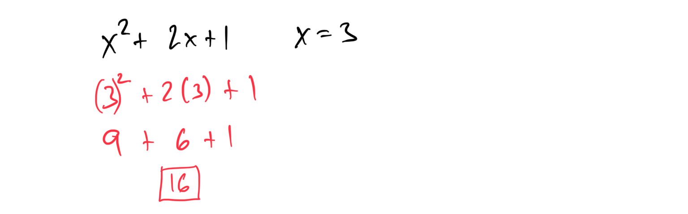

1. Compute 2y² - 4 when y = -2: **4**.

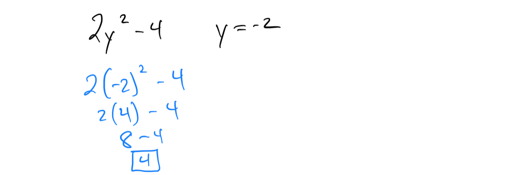

## **Topic 12: Combining like terms: Whole number coefficients**
1. Simplify: 3x + 5x + 2: **8x + 2**.

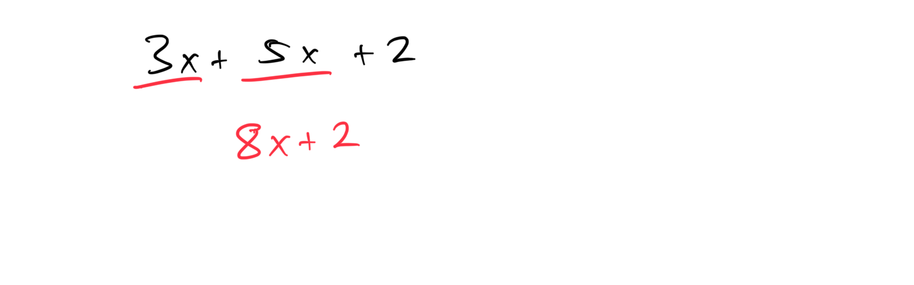

1. Combine like terms: 7y + 4 + 2y: **9y + 4**.

[AD6B4F9D-089B-42A7-B516-7B7614C1C070](attachments/AD6B4F9D-089B-42A7-B516-7B7614C1C070.png)

## **Topic 13: Combining like terms: Integer coefficients**
1. Simplify: 4x - 2x + 5: **2x + 5**.

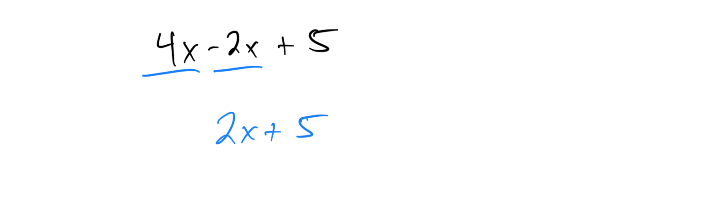

1. Combine like terms: -3y + 7 - 5y: **-8y + 7**.

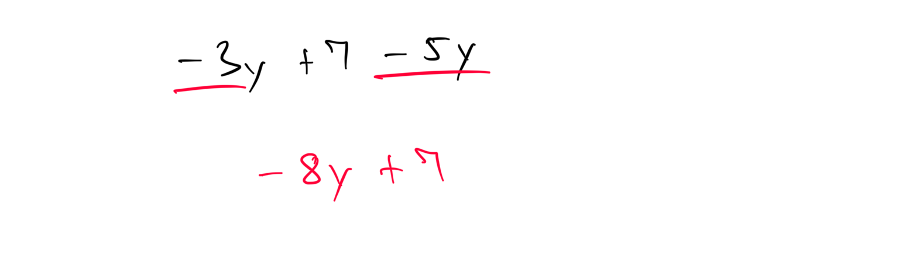

## **Topic 14: Multiplying a constant and a linear monomial**
1. Multiply: 5(3x): **15x**.

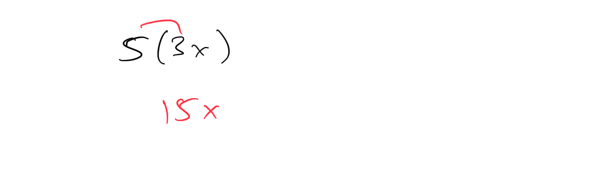

1. Compute: -2(4y): **-8y**.

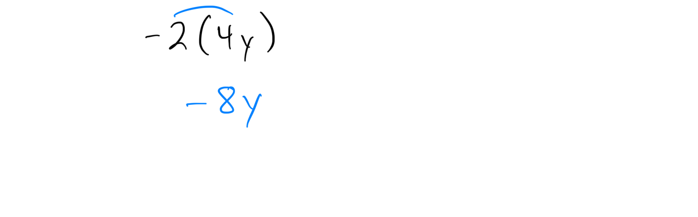

## **Topic 15: Distributive property: Whole number coefficients**
1. Simplify: 3(x + 4): **3x + 12**.

[47DACF67-FEC5-4154-AB87-175CD5259860](attachments/47DACF67-FEC5-4154-AB87-175CD5259860.png)

1. Expand: 6(2y + 1): **12y + 6**.

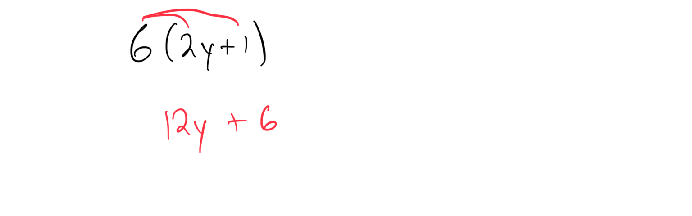

## **Topic 16: Distributive property: Integer coefficients**
1. Simplify: -2(x + 3): **-2x - 6**.

[C2D1CF18-7CB0-4E6E-BA06-79D533524C79](attachments/C2D1CF18-7CB0-4E6E-BA06-79D533524C79.png)

1. Expand: -4(2y - 5): **-8y + 20**.

[409C2968-259B-405A-B436-9768E09B80F7](attachments/409C2968-259B-405A-B436-9768E09B80F7.png)

## **Topic 17: Using distribution and combining like terms to simplify: Univariate**
1. Simplify: 2(x + 3) + 4x: **6x + 6**.

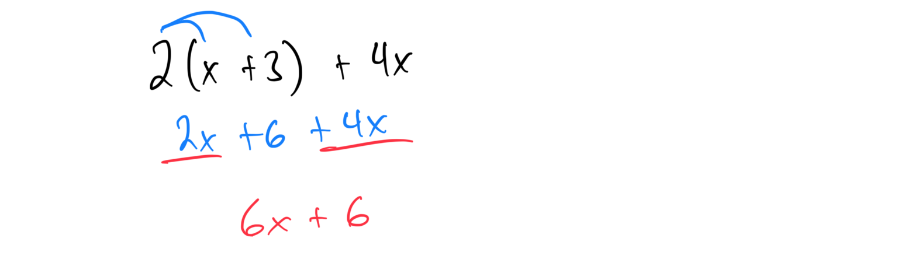

1. Combine and simplify: 3(y - 2) + 5y: **8y - 6**.

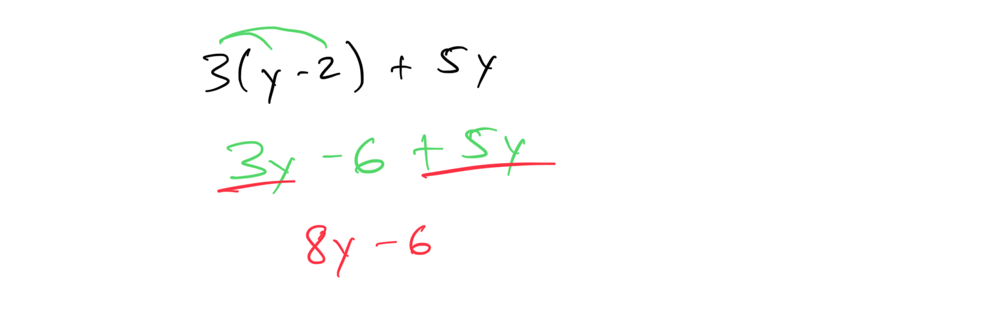

## **Topic 18: Combining like terms in a quadratic expression**
1. Simplify: 2x² + 3x² + 4x - 2x: **5x² + 2x**.

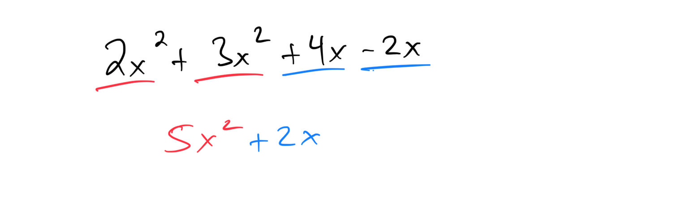

1. Combine like terms: 5y² - 2y + 3y² + 7y: **8y² + 5y**.

[B41D4A35-79AC-439B-9DFB-BE7178A07618](attachments/B41D4A35-79AC-439B-9DFB-BE7178A07618.png)

## **Topic 19: Distinguishing between the area and perimeter of a rectangle**
1. A rectangle has length 10 cm and width 4 cm. Calculate its perimeter and area, and explain the difference: **Perimeter: 28 cm, Area: 40 cm²; perimeter measures the boundary, area measures the enclosed space**.

[45544E88-3FFF-406E-926A-76523E09FF5C](attachments/45544E88-3FFF-406E-926A-76523E09FF5C.png)

1. For a rectangle with length 7 m and width 3 m, find the perimeter and area, and distinguish between the two: **Perimeter: 20 m, Area: 21 m²; perimeter is the total length around, area is the space inside**.

## **Topic 20: Greatest common factor of 2 numbers**
1. Find the greatest common factor of 12 and 18: **6**.

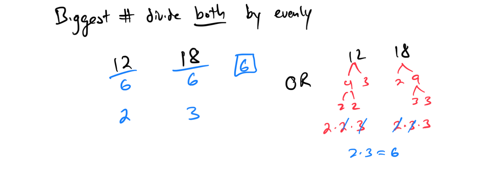

1. Determine the greatest common factor of 24 and 36: **12**.

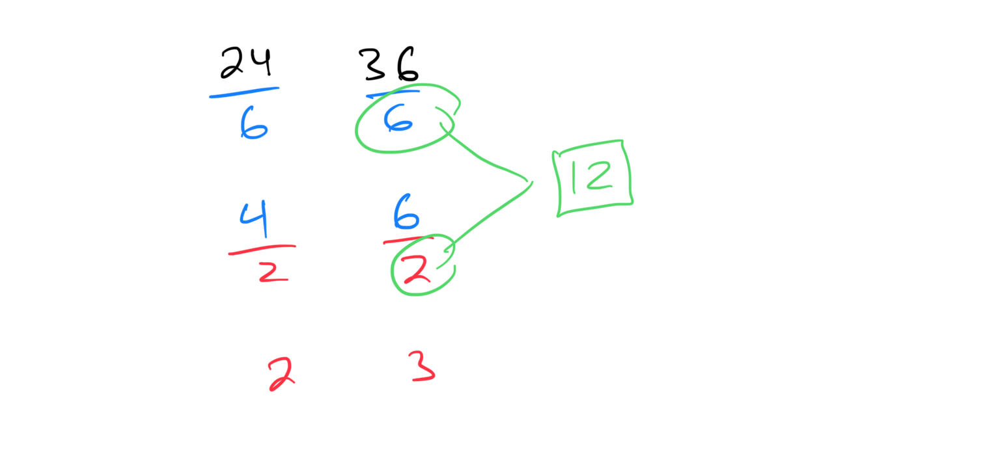