# Module 10 - Rational

[Video](https://youtu.be/v3B94bJXi4g)

Topic 1: Finding the LCD of two fractions
Problem 1: Find the least common denominator (LCD) of 3/4 and 5/6. Show the steps to find the LCD.

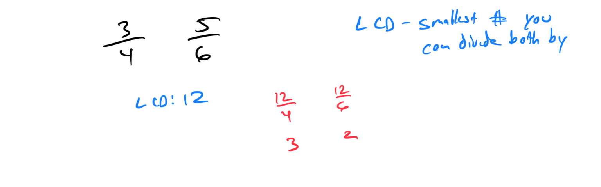

Problem 2: Determine the LCD of 2/9 and 7/12. List the steps and provide the LCD.

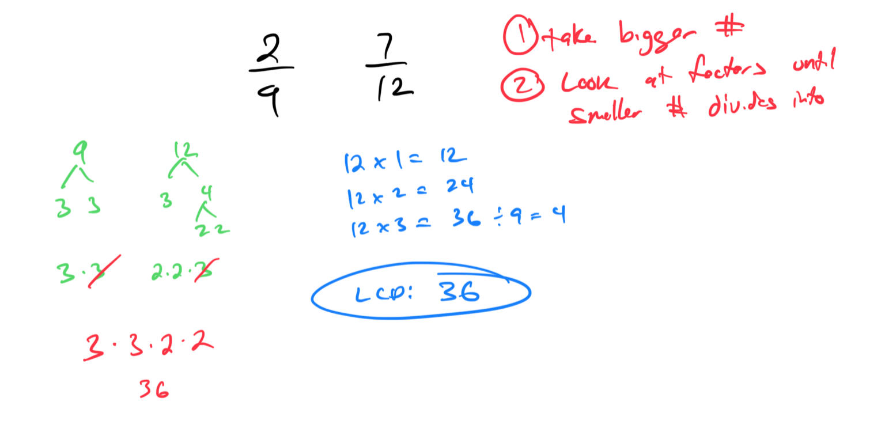

Topic 2: Simplifying a ratio of univariate monomials
Problem 1: Simplify (8x^5)/(4x^2). Apply the quotient rule and simplify the coefficient and exponent.

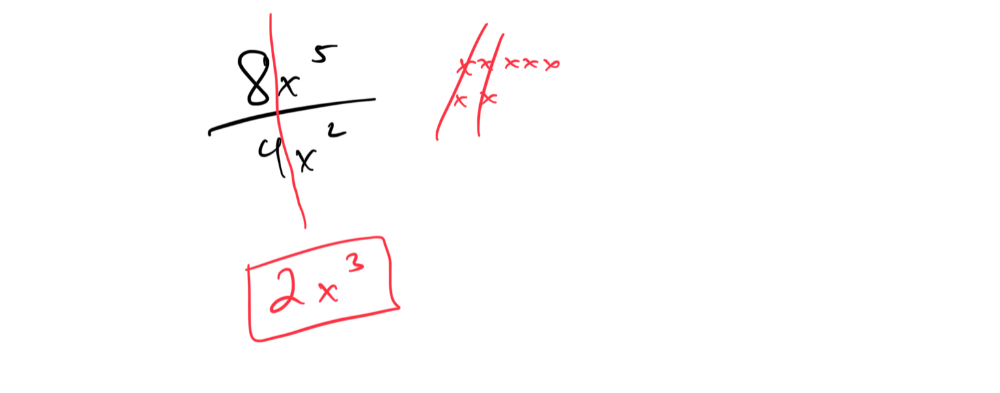

Problem 2: Compute (15y^7)/(5y^3). Use the quotient rule and express the result in simplified form.

Topic 3: Simplifying a ratio of multivariate monomials: Advanced
Problem 1: Simplify (12x^3y^4z)/(3x^2yz^2). Use the quotient rule and simplify all terms.

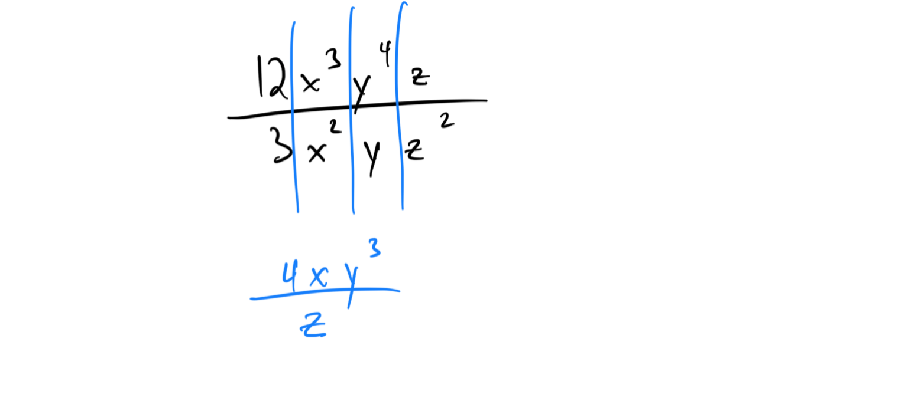

Problem 2: Compute (20a^5b^3c^2)/(4a^2bc). Apply the quotient rule and express the result in simplified form.

Topic 4: Simplifying a ratio of factored polynomials: Linear factors
Problem 1: Simplify [(x + 3)(x - 2)]/[(x - 2)(x + 5)]. Cancel common factors and write the simplified expression.

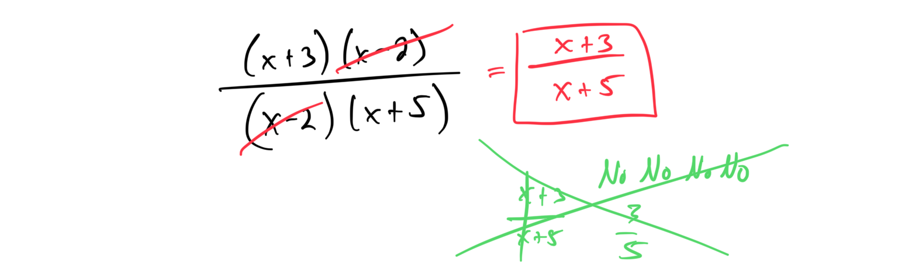

Problem 2: Compute [(x - 4)(x + 1)]/[(x + 1)(x - 3)]. Simplify by canceling common factors.

Topic 5: Simplifying a ratio of factored polynomials: Factors with exponents
Problem 1: Simplify [(x^2)(x - 1)^3]/[(x - 1)(x^2)^2]. Cancel common factors and simplify the exponents.

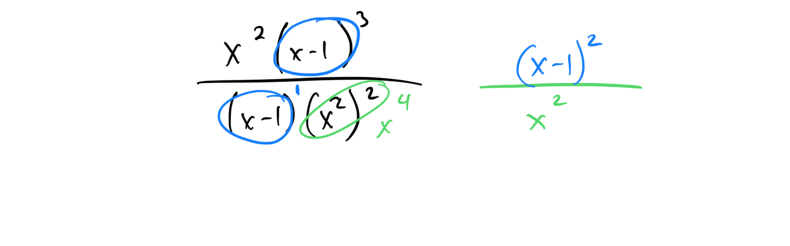

Problem 2: Compute [(y^3)(y + 2)^2]/[(y + 2)(y^2)]. Simplify by canceling and reducing exponents.

Topic 6: Simplifying a ratio of polynomials using GCF factoring
Problem 1: Simplify (6x^2 - 12x)/(3x). Factor the numerator and cancel the GCF to simplify.

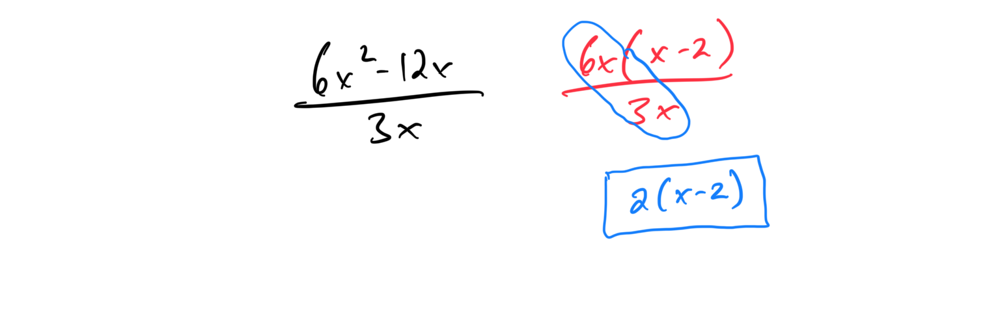

Problem 2: Compute (9y^3 + 18y^2)/(3y^2). Factor the numerator and simplify using the GCF.

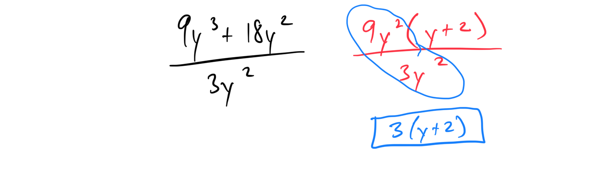

Topic 7: Simplifying a ratio of linear polynomials: 1, -1, and no simplification
Problem 1: Simplify (x + 3)/(x + 3). Determine if the ratio simplifies to 1, -1, or cannot be simplified.

Problem 2: Compute (x - 5)/(5 - x). Check if the ratio simplifies to 1, -1, or remains unchanged.

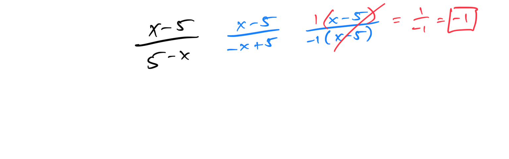

Topic 8: Simplifying a ratio of polynomials by factoring a quadratic with leading coefficient 1
Problem 1: Simplify (x^2 + 5x + 6)/(x + 3). Factor the quadratic numerator and simplify.

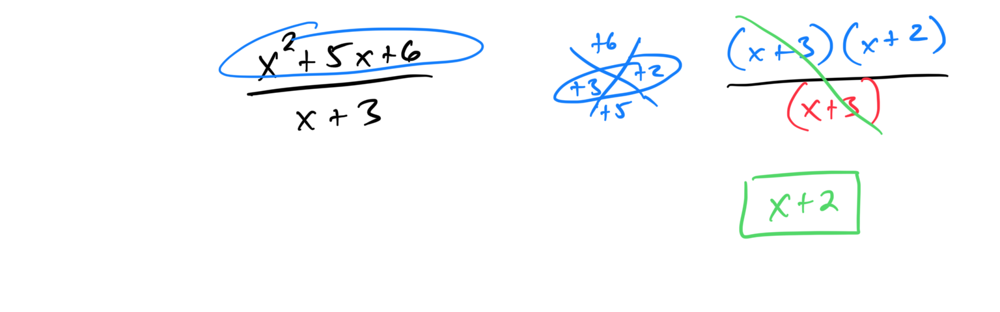

Problem 2: Compute (x^2 - 4x + 4)/(x - 2). Factor the numerator and cancel common factors.

Topic 9: Simplifying a ratio of polynomials: Problem type 1
Problem 1: Simplify (x^2 - 9)/(x^2 + 3x). Factor both numerator and denominator and simplify.

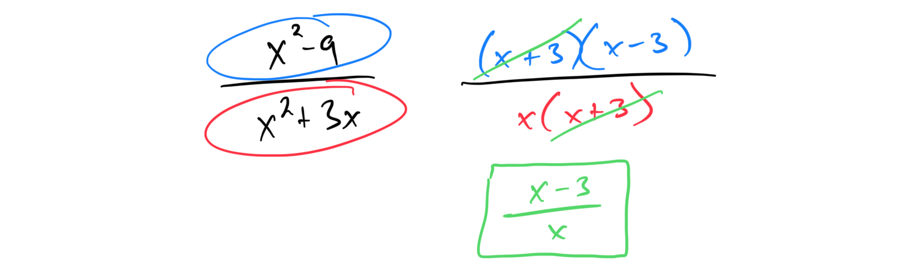

Problem 2: Compute (x^2 - 16)/(x^2 - 4x). Factor the polynomials and reduce the expression.

Topic 10: Multiplying rational expressions involving multivariate monomials
Problem 1: Multiply (2x^2y)/(3z) * (6z^2)/(4xy). Simplify the product and reduce to lowest terms.

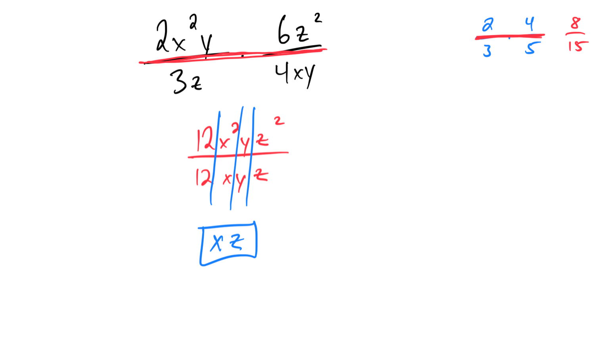

Problem 2: Compute (5a^3b^2)/(7c) * (14c^2)/(10ab). Multiply and simplify the result.

Topic 11: Multiplying rational expressions involving linear expressions
Problem 1: Multiply [(x + 2)/(x - 3)] * [(x - 1)/(x + 2)]. Multiply numerators and denominators, then simplify.

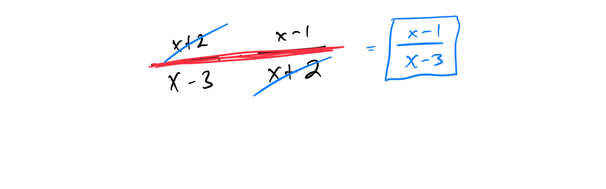

Problem 2: Compute [(x - 4)/(x + 1)] * [(x + 3)/(x - 2)]. Multiply and simplify by canceling common factors.

Topic 12: Multiplying rational expressions involving quadratics with leading coefficients of 1
Problem 1: Multiply [(x^2 + 3x + 2)/(x - 1)] * [(x - 3)/(x^2 - 4)]. Factor, multiply, and simplify.

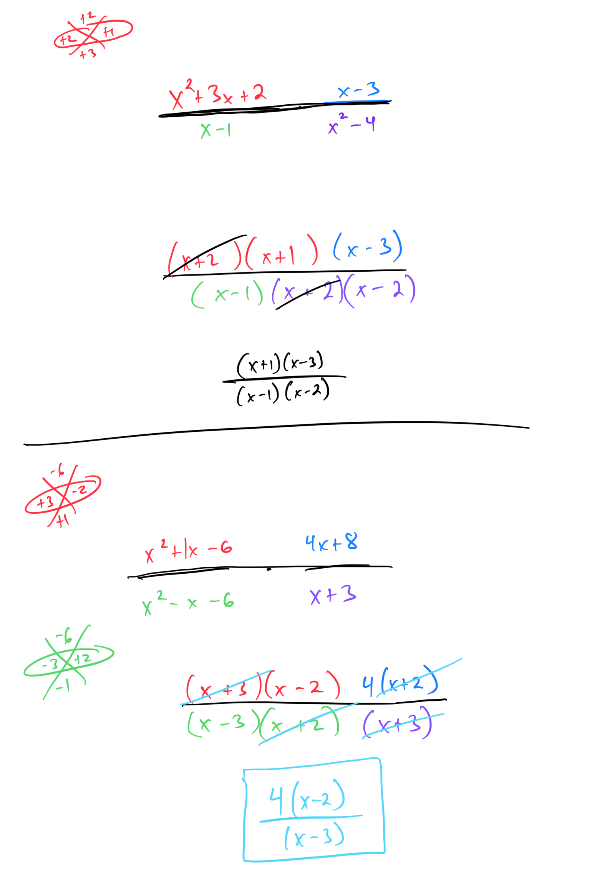

Topic 13: Dividing rational expressions involving multivariate monomials
Problem 1: Divide (8x^3y^2)/(5z) ÷ (4xy)/(10z^2). Rewrite as multiplication and simplify.

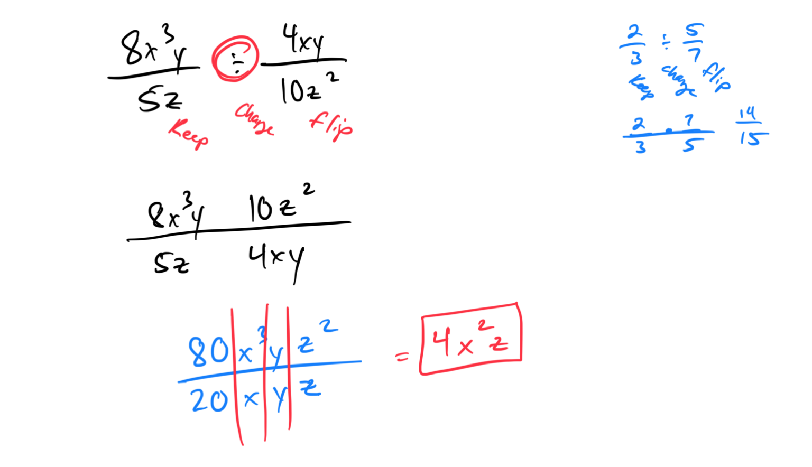

Problem 2: Compute (12a^2b^3)/(9c^2) ÷ (6ab)/(3c). Convert to multiplication and reduce.

Topic 14: Dividing rational expressions involving linear expressions

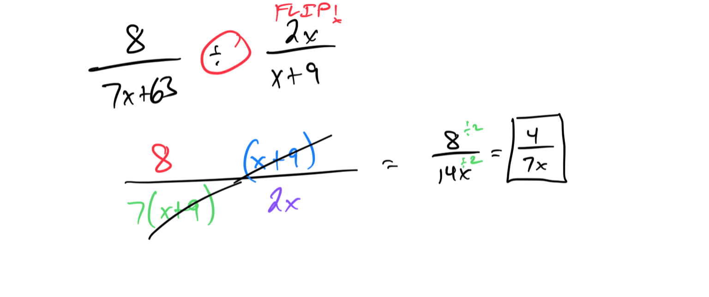

Topic 15: Dividing rational expressions involving quadratics with leading coefficients of 1

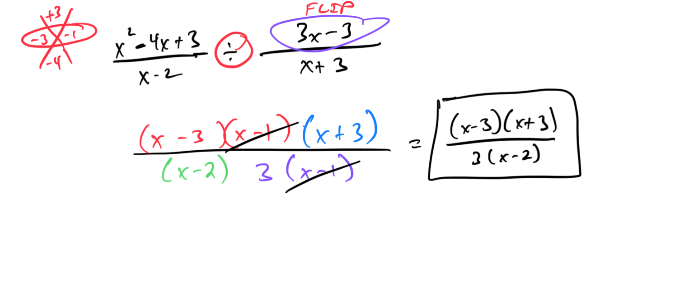

Topic 16: Introduction to the LCM of two monomials
Problem 1: Find the least common multiple (LCM) of 6x^2 and 8x^3. Factor each monomial and determine the LCM.

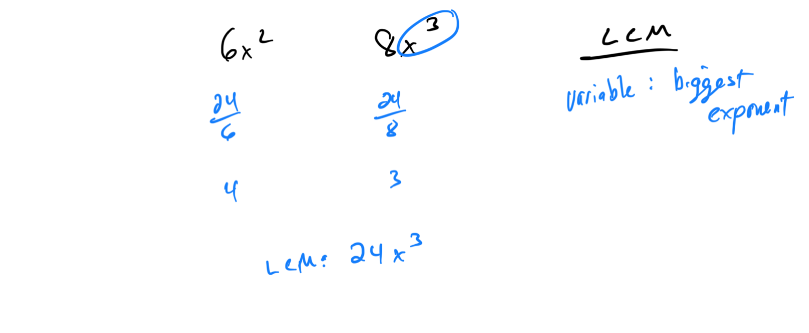

Problem 2: Compute the LCM of 10y^4 and 15y^2. Show the factorization and find the LCM.

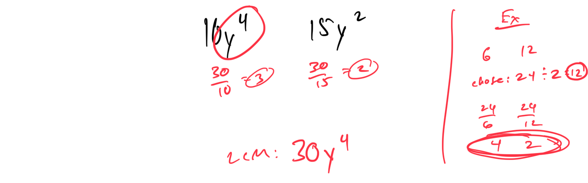

Topic 17: Least common multiple of two monomials
Problem 1: Determine the LCM of 12x^3y and 18xy^2. Factor each term and find the least common multiple.

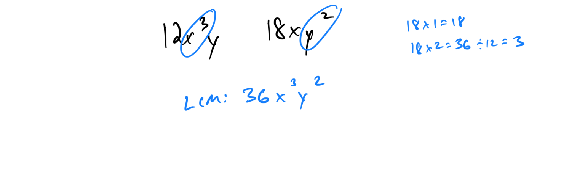

Problem 2: Find the LCM of 9a^2b^3 and 6ab^2. Provide the factorization and the LCM.

Topic 18: Writing equivalent rational expressions with monomial denominators

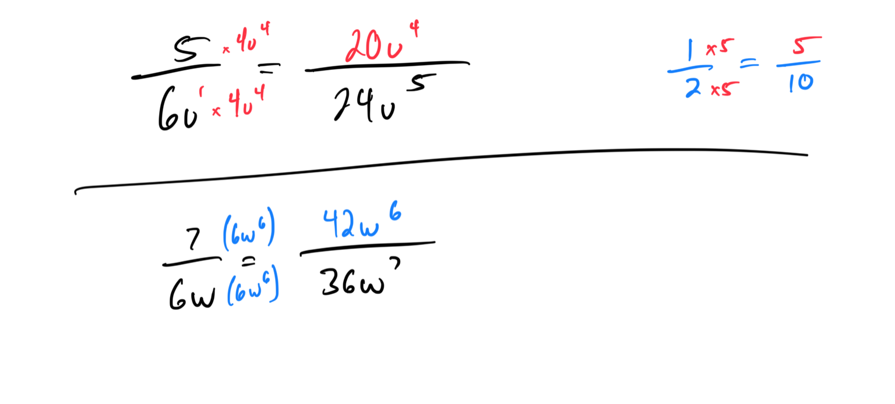

Topic 19: Introduction to adding fractions with variables and common denominators
Problem 1: Add (3x)/(5y) + (2x)/(5y). Combine the numerators and simplify the result.

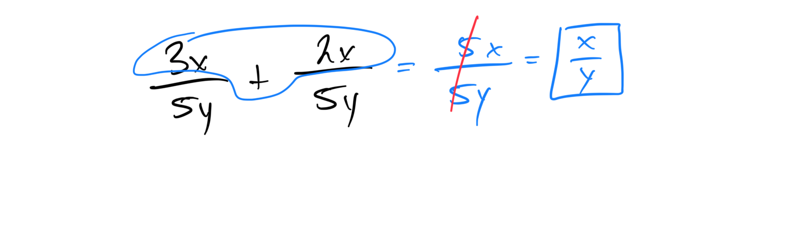

Problem 2: Compute (4a)/(7b) + (a)/(7b). Add the numerators and write the simplified sum.

Topic 20: Adding rational expressions with common denominators and monomial numerators
Problem 1: Add (2x)/(3y^2) + (5x)/(3y^2). Combine the numerators and simplify the expression.

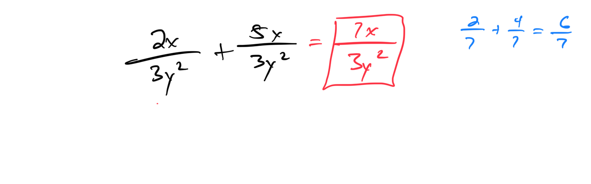

Problem 2: Compute (7a)/(4b^3) + (3a)/(4b^3). Add the numerators and provide the simplified result.

Topic 21: Adding rational expressions with common denominators and binomial numerators
Problem 1: Add [(x + 2)/(x - 1)] + [(x - 3)/(x - 1)]. Combine the numerators and simplify.
Problem 2: Compute [(2x - 5)/(x + 4)] + [(x + 1)/(x + 4)]. Add the numerators and simplify the expression.

Topic 22: Adding rational expressions with common denominators and GCF factoring

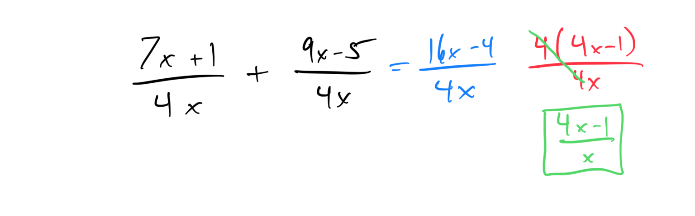

Topic 23: Adding rational expressions with common denominators and quadratic factoring

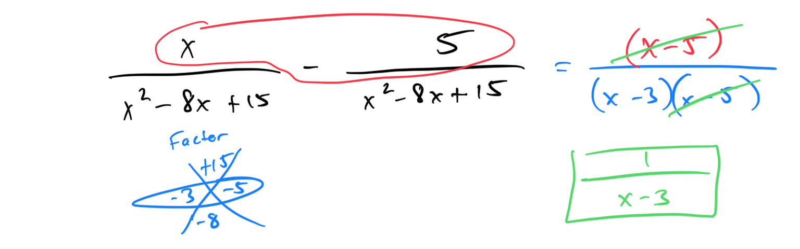

Topic 24: Adding rational expressions with different denominators and a single occurrence of a variable

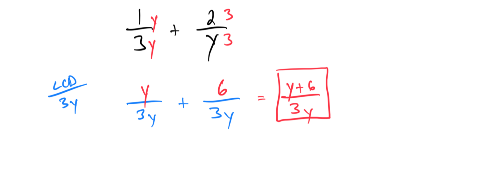

Topic 25: Adding rational expressions with denominators ax and bx: Basic
Problem 1: Add (2)/(3x) + (5)/(2x). Find the LCD, rewrite the fractions, and simplify the sum.

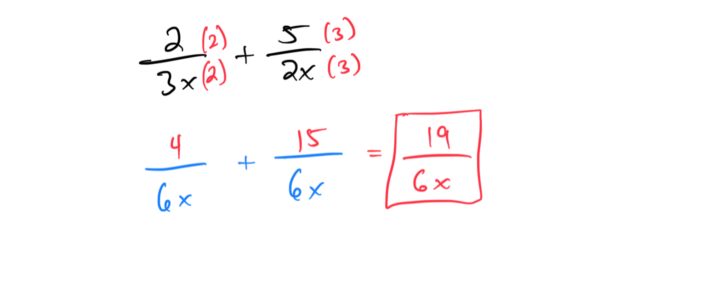

Problem 2: Compute (4)/(5y) + (3)/(10y). Determine the LCD and simplify the resulting expression.

Topic 26: Adding rational expressions with denominators ax^n and bx^m
Problem 1: Add (3)/(2x^2) + (5)/(4x^3). Find the LCD, rewrite each fraction, and simplify.

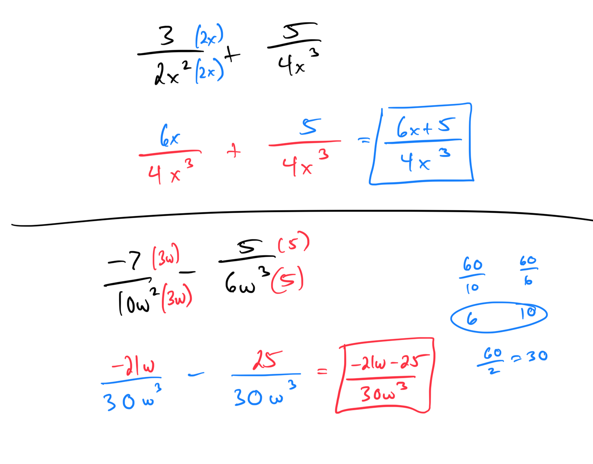
