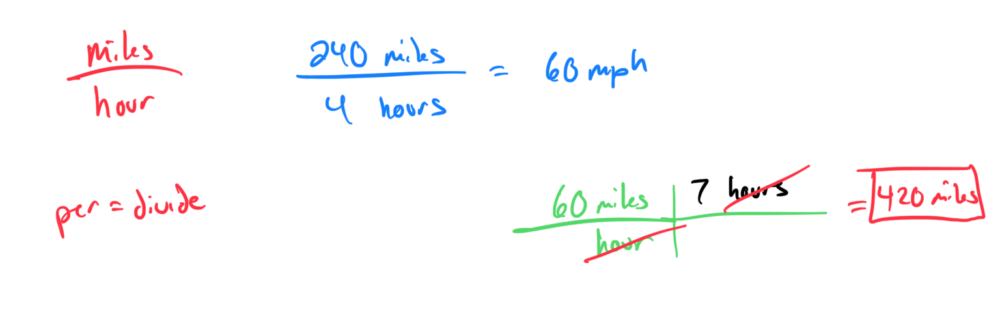
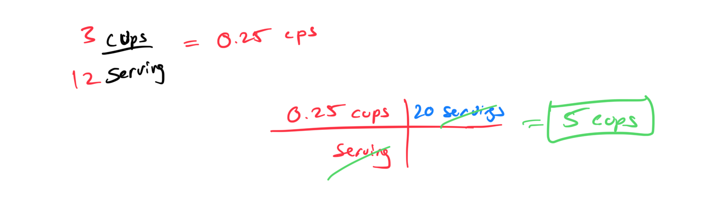
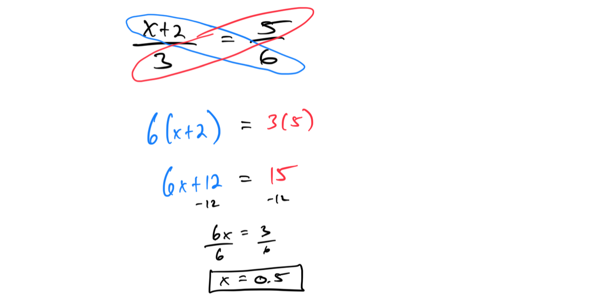
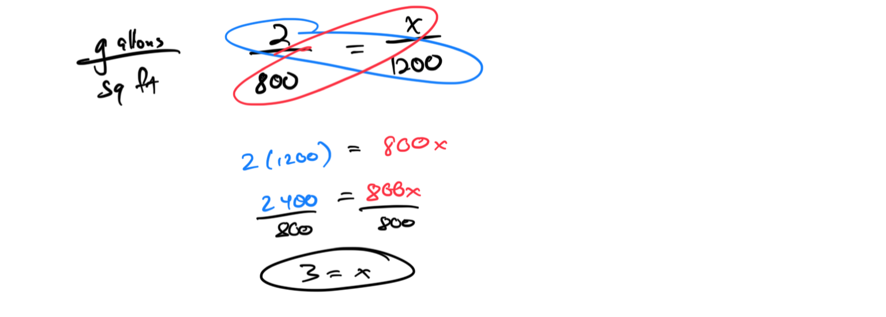
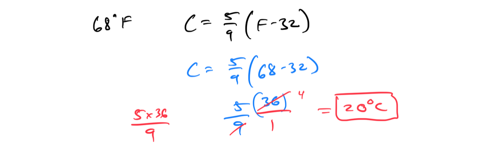
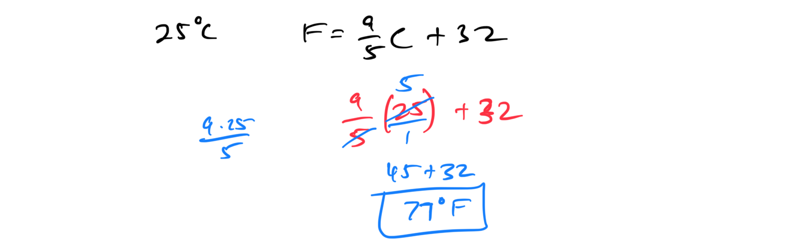
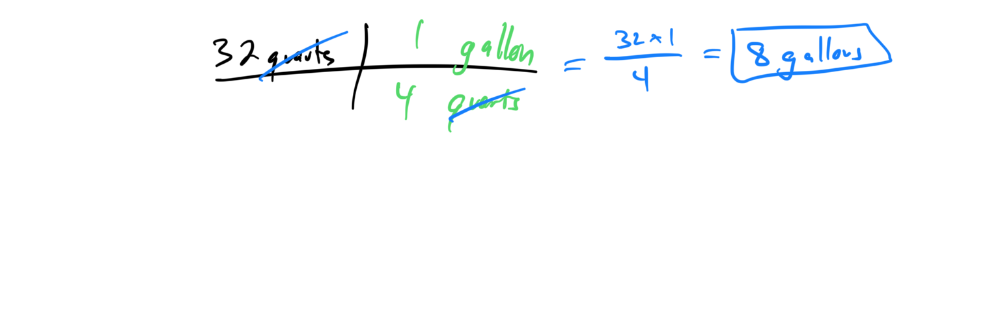
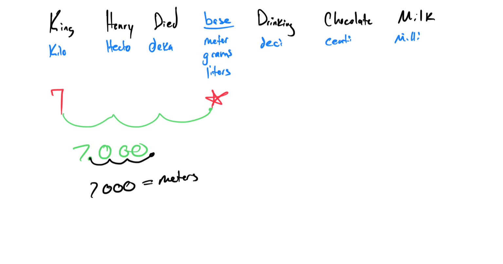
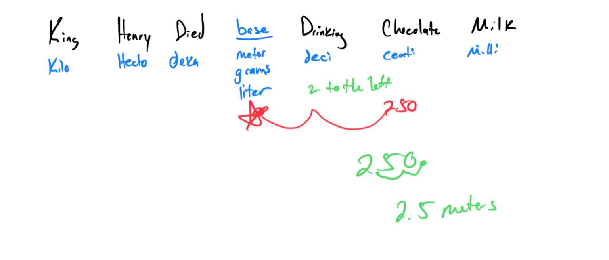
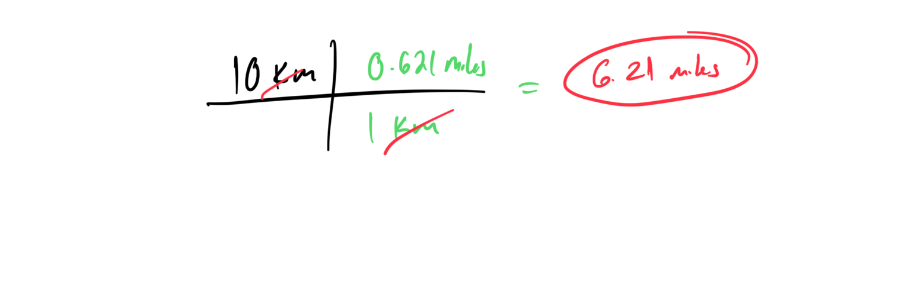

# Module 11 - Rational Applications

[Video](https://youtu.be/fyr7ojRN7Vw)

Topic 1: Solving a word problem on proportions using a unit rate
Problem 1: A car travels 240 miles in 4 hours. Find the unit rate (miles per hour) and use it to calculate how far it travels in 7 hours.

Problem 2: A recipe uses 3 cups of flour for 12 servings. Find the unit rate (cups per serving) and determine how much flour is needed for 20 servings.

Topic 2: Solving a proportion of the form (x+a)/b = c/d
Problem 1: Solve the proportion (x + 2)/3 = 5/6. Cross-multiply and solve for x.

Problem 2: Compute x in the proportion (x - 1)/4 = 3/8. Use cross-multiplication and find the solution.

Topic 3: Word problem on proportions: Problem type 1
Problem 1: If 2 gallons of paint cover 800 square feet, how many gallons are needed to cover 1200 square feet? Set up a proportion and solve.

Problem 2: A map scale is 1 inch = 50 miles. If two cities are 3 inches apart on the map, find the actual distance. Use a proportion to calculate.

Topic 4: Similar polygons

Topic 5: Converting between temperatures in Fahrenheit and Celsius
Problem 1: Convert 68°F to Celsius using the formula C = (5/9)(F - 32). Show the steps and round to the nearest degree.

Problem 2: Convert 25°C to Fahrenheit using the formula F = (9/5)C + 32. Provide the calculation and the result.

Topic 6: U.S. Customary unit conversion with whole number values
Problem 1: Convert 5 feet to inches. Use the conversion factor (1 foot = 12 inches) and show the calculation.

Problem 2: Convert 32 quarts to gallons. Use the conversion factor (1 gallon = 4 quarts) and provide the result.

Topic 7: Metric distance conversion with whole number values
Problem 1: Convert 7 kilometers to meters. Use the conversion factor (1 km = 1000 m) and show the steps.

Problem 2: Convert 250 centimeters to meters. Use the conversion factor (100 cm = 1 m) and provide the result.

Topic 8: Converting between metric and U.S. Customary unit systems
Problem 1: Convert 10 kilometers to miles using the conversion factor (1 km ≈ 0.621 miles). Round to two decimal places.

Problem 2: Convert 50 pounds to kilograms using the conversion factor (1 lb ≈ 0.453592 kg). Round to two decimal places.

Topic 9: Word problem on proportions: Problem type 2
Problem 1: A recipe for 4 people requires 2 cups of sugar. How many cups of sugar are needed for 10 people? Set up a proportion and solve.

Problem 2: If 3 workers can complete a job in 8 hours, how long will it take 5 workers to complete the same job? Use a proportion to find the time.