# Module 13 - Final Exam Review

[Video](https://youtu.be/joVCaZz7GKg)

### Question 1:
- Quotient of expressions involving exponents

Answer questions on Test Work Page

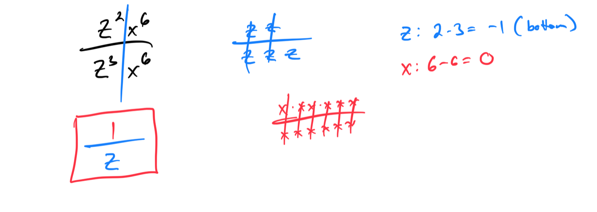
### 
Question 2:
- Power rules with positive exponents: Multivariate quotients

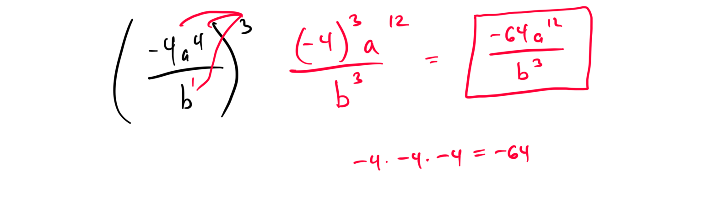
### 
Question 3:
- Quotient rule with negative exponents: Problem type 1

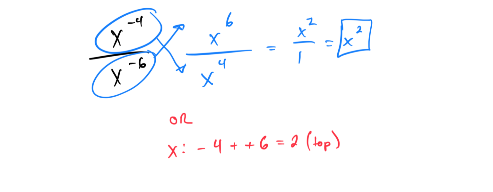
### 
Question 4:
- Converting between scientific notation and standard form in a real-world situation

### 
Question 5:
- Multiplying binomials with leading coefficients greater than 1

Work shown below on Test Work Page.
### 
Question 6:
- Dividing a polynomial by a monomial: Univariate

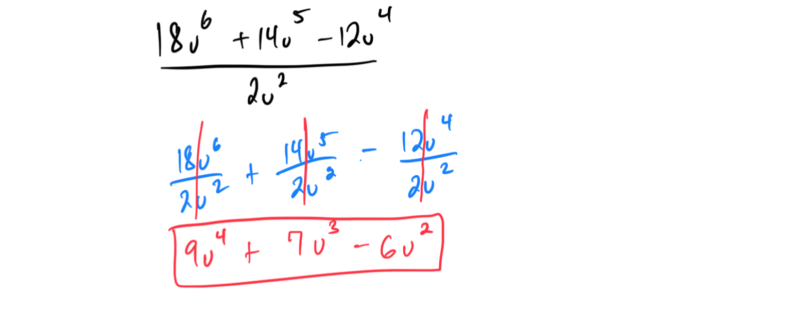
### 
Question 7:
- Factoring out a monomial from a polynomial: Multivariate

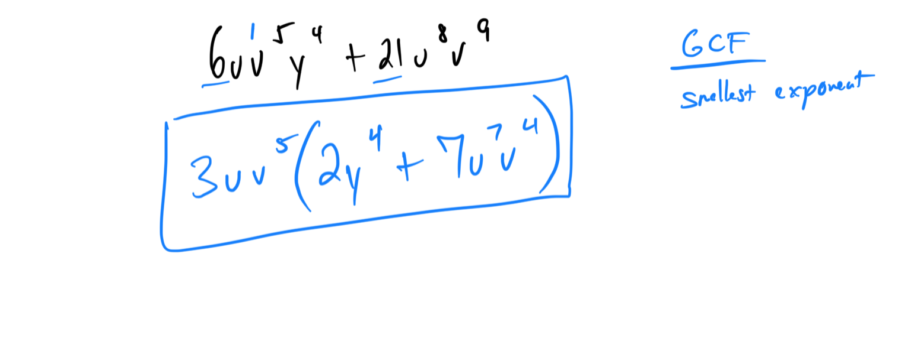
### 
Question 8:
- Factoring out a constant before factoring a quadratic

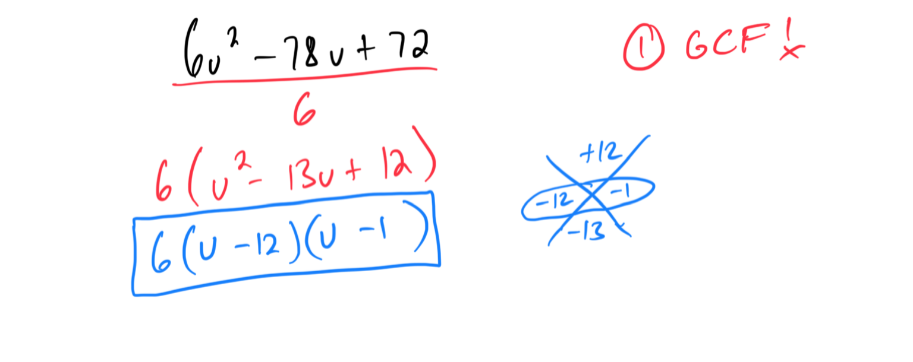
### 
Question 9:
- Factoring a perfect square trinomial with leading coefficient greater than 1

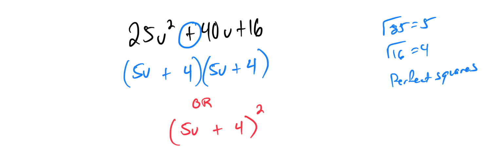
### 
Question 10:
- Finding the roots of a quadratic equation with leading coefficient greater than 1

Another example on Test Work Page below.

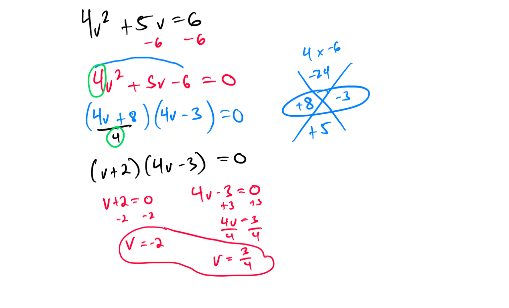
### 
Question 11:
-Dividing rational expressions involving quadratics with leading coefficients of 1

### 
Question 12:
- Adding rational expressions with common denominators and monomial numerators

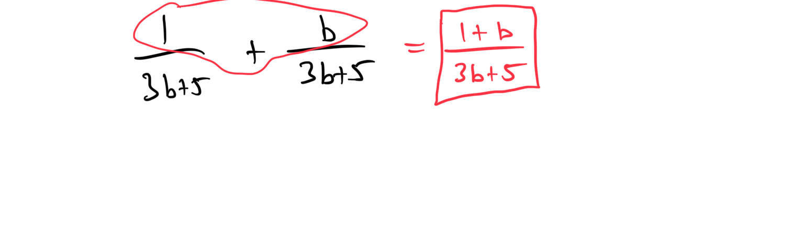
### 
Question 13:
- Adding rational expressions with denominators ax and bx: Basic

Shown on Test Work Page below.

### Question 14:
- Square root addition or subtraction

Shown on Test Work Page below.

### Question 15:
- Square root multiplication: Basic

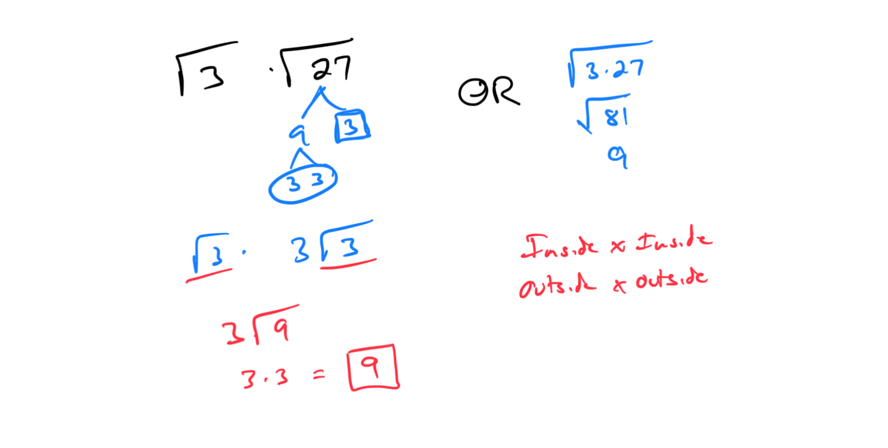

### Question 16:
- Simplifying a product of radical expressions: Multivariate

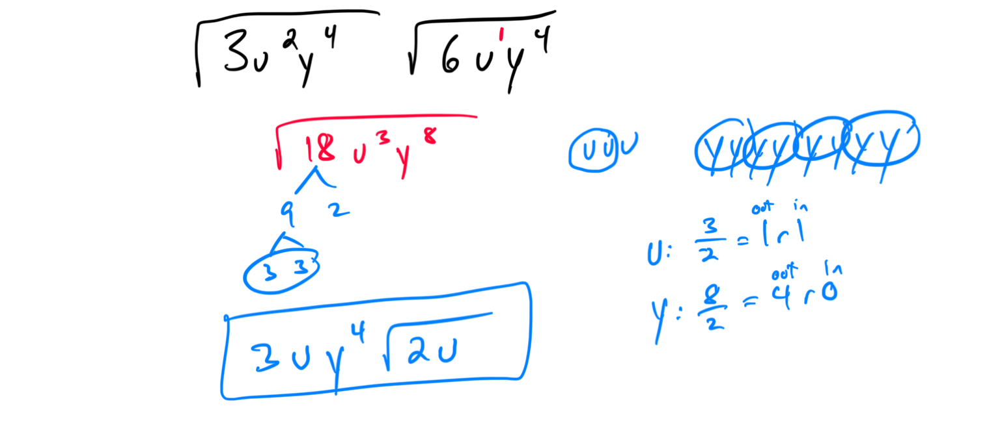
### Question 17:
- Rationalizing a denominator: Quotient involving a monomial

Show on Test Work Page below.

