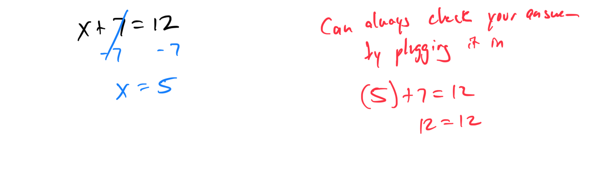
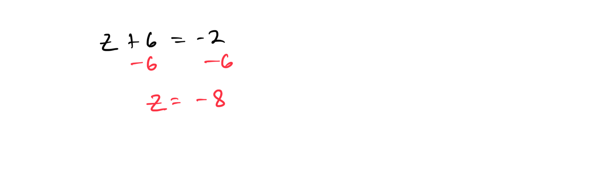
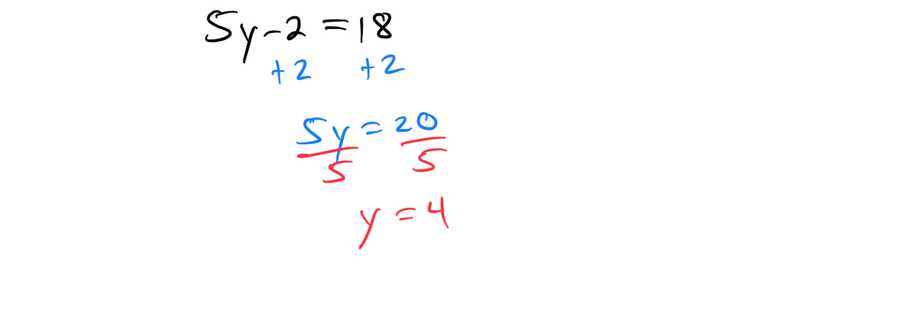
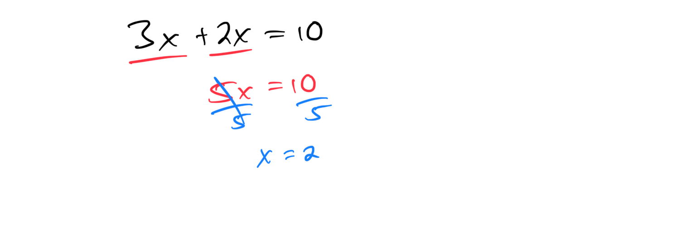
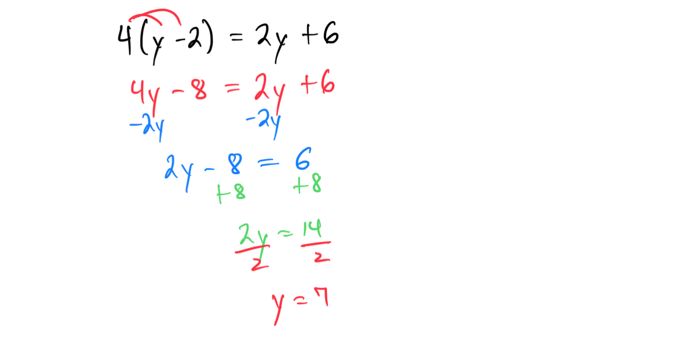
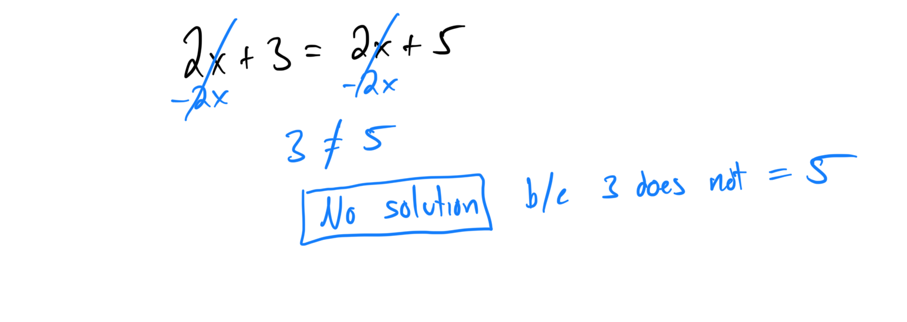
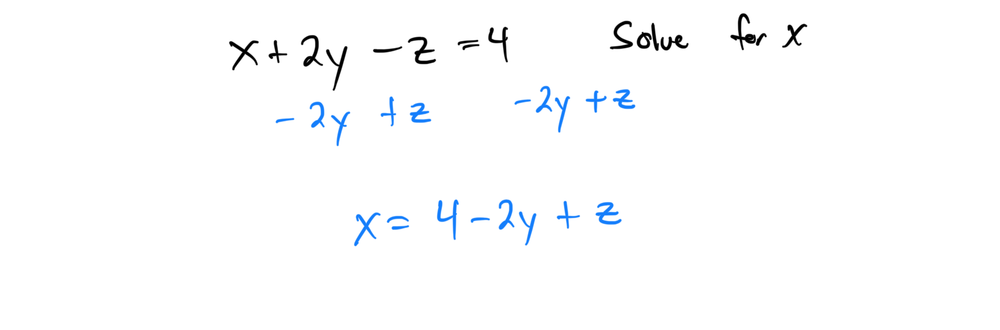
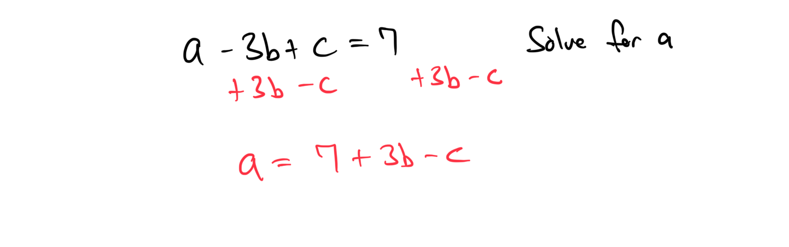
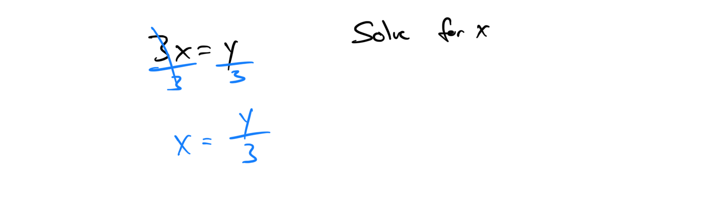
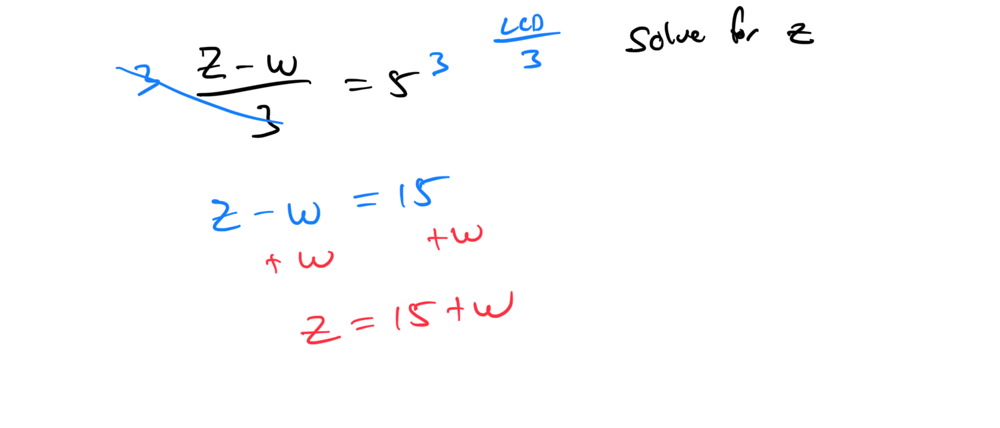

# Module 2 - Equations

[Video](https://youtu.be/yA76aQmMKzo)

**Topic 1: Additive property of equality with whole numbers**
1. If x + 7 = 12, find x.

1. Solve for y: y + 15 = 20.
**Topic 2: Additive property of equality with integers**
1. Solve for x: x + (-4) = 9.

1. If z + 6 = -2, find z. 
2. **Topic 3: Additive property of equality with signed fractions**
1. Solve for x: x + (-1/3) = 2/3.

1. If y + 3/4 = -1/2, find y.

**Topic 4: Multiplicative property of equality with whole numbers**
1. If 3x = 15, find x.

1. Solve for y: 7y = 28.
**Topic 5: Multiplicative property of equality with fractions**
1. Solve for x: (1/2)x = 4.

1. If (2/3)y = 8, find y.

**Topic 6: Multiplicative property of equality with integers**
1. Solve for x: -5x = 20.

1. If 4z = -12, find z.
**Topic 7: Multiplicative property of equality with signed fractions**
1. Solve for x: (-2/3)x = 4/5.

1. If (3/4)y = -9/2, find y.

**Topic 8: Identifying solutions to a linear equation in one variable: Two-step equations**
1. Solve for x: 2x + 5 = 11.

1. If 3y - 7 = 8, find y.
**Topic 9: Additive property of equality with a negative coefficient**
1. Solve for x: -x + 4 = 10.

1. If -y - 3 = 7, find y.
**Topic 10: Using two steps to solve an equation with whole numbers**
1. Solve for x: 4x + 3 = 15.

1. If 5y - 2 = 18, find y.

**Topic 11: Solving a two-step equation with integers**
1. Solve for x: -3x + 4 = -8.

1. If 2z - 5 = -11, find z.
**Topic 12: Introduction to solving an equation with parentheses**
1. Solve for x: 2(x + 3) = 10.
2. If 4(y - 2) = 8, find y.

**Topic 13: Introduction to solving an equation with variables on the same side**
1. Solve for x: 3x + 2x = 10.

1. If 5y - y = 16, find y.
**Topic 14: Solving a linear equation with several occurrences of the variable: Variables on the same side**
1. Solve for x: 4x + 2x - 5 = 13.
2. If 7y - 3y + 4 = 20, find y.

[E690DD0C-75CB-4D70-A721-84254254A911](attachments/E690DD0C-75CB-4D70-A721-84254254A911.png)

**Topic 15: Solving a linear equation with several occurrences of the variable: Variables on both sides**
1. Solve for x: 3x + 4 = 2x + 7.
2. If 5y - 3 = 2y + 6, find y.

[2BD7FFA0-B85E-468F-A1C4-A9453447928C](attachments/2BD7FFA0-B85E-468F-A1C4-A9453447928C.png)

**Topic 16: Solving a linear equation with several occurrences of the variable: Variables on the same side and distribution**
1. Solve for x: 2(x + 3) + 4x = 18.

1. If 3(y - 1) + 2y = 12, find y.
**Topic 17: Solving a linear equation with several occurrences of the variable: Variables on both sides and distribution**
1. Solve for x: 2(x + 1) = 3x - 5.
2. If 4(y - 2) = 2y + 6, find y.

**Topic 18: Solving a linear equation with several occurrences of the variable: Fractional forms with monomial numerators**
1. Solve for x: (2/3)x + (1/3)x = 5.

1. If (3/4)y - (1/2)y = 2, find y.

**Topic 19: Solving equations with zero, one, or infinitely many solutions**
1. Solve for x: 2x + 3 = 2x + 5.

1. If 4y - 8 = 4(y - 2), find y.

**Topic 20: Solving a multi-step equation given in fractional form**
1. Solve for x: (x + 3)/2 = 5.

1. If (2y - 1)/3 = 4, find y.

[EB1A8DBE-7C52-4C19-B162-EE08A58728BB](attachments/EB1A8DBE-7C52-4C19-B162-EE08A58728BB.png)

**Topic 21: Solving for a variable in terms of other variables using addition or subtraction: Basic**
1. Solve for x in terms of y: x + y = 5.

[19B4705C-BC99-4C3A-AF2E-F48FE8166490](attachments/19B4705C-BC99-4C3A-AF2E-F48FE8166490.png)

1. If z - w = 3, solve for z in terms of w.

[8FD681ED-B786-4801-B821-8F027B9E8B56](attachments/8FD681ED-B786-4801-B821-8F027B9E8B56.png)

**Topic 22: Solving for a variable in terms of other variables using addition or subtraction: Advanced**
1. Solve for x in terms of y and z: x + 2y - z = 4.

1. If a - 3b + c = 7, solve for a in terms of b and c.

**Topic 23: Solving for a variable in terms of other variables using multiplication or division: Basic**
1. Solve for x in terms of y: 3x = y.

1. If 2z = w, solve for z in terms of w.

**Topic 24: Solving for a variable in terms of other variables using addition or subtraction with division**
1. Solve for x in terms of y: (x + y)/2 = 3.

[356AF62C-49AE-40A0-8F56-101E3E6624B8](attachments/356AF62C-49AE-40A0-8F56-101E3E6624B8.png)

1. If (z - w)/3 = 5, solve for z in terms of w.

