# Module 3 - Inequalities

[Video](https://youtu.be/icko9hFEmlM)

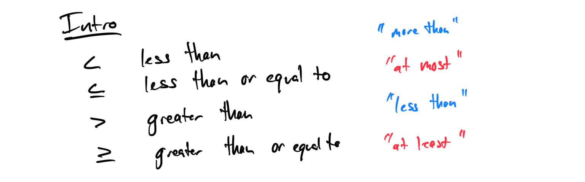
## 
**Topic 1: Translating a sentence by using an inequality symbol**
1. Translate the sentence "x is at least 5" into an inequality: **x ≥ 5**.

1. Write an inequality for "y is less than 12": **y < 12**.

## **Topic 2: Translating a sentence into a one-step inequality**
1. Translate "The number of books is more than 10" into an inequality: **b > 10**.

1. Write an inequality for "The temperature is at most 30 degrees": **t ≤ 30**.

## **Topic 3: Graphing a linear inequality on the number line**
1. Graph the inequality x > 3 on a number line: Open circle at 3, arrow pointing right.

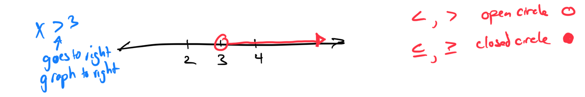

1. Graph the inequality y ≤ -2 on a number line: Closed circle at -2, arrow pointing left.

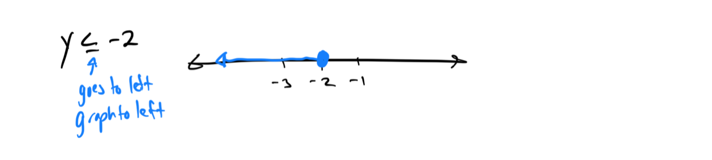

## **Topic 4: Writing an inequality given a graph on the number line**
1. Write the inequality for a number line graph showing all numbers greater than or equal to 4: **x ≥ 4**.

1. Write the inequality for a number line graph showing all numbers less than -1: **x < -1**.

## **Topic 5: Graphing a compound inequality on the number line**
1. Graph the compound inequality 2 < x ≤ 6 on a number line: Open circle at 2, closed circle at 6, shaded between.

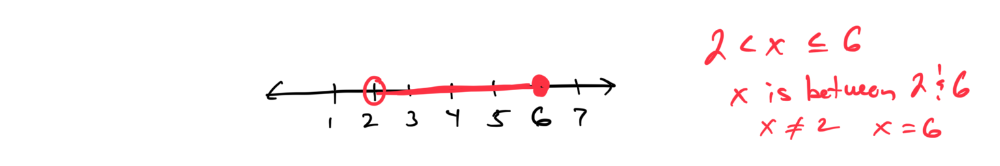

1. Graph the compound inequality -3 ≤ y < 1 on a number line: Closed circle at -3, open circle at 1, shaded between.

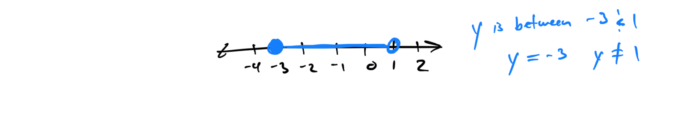

## **Topic 6: Additive property of inequality with whole numbers**
1. Solve for x: x + 4 > 7: **x > 3**.

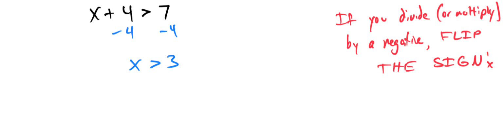

1. If y + 8 ≤ 15, find the solution set for y: **y ≤ 7**.

## **Topic 7: Additive property of inequality with integers**
1. Solve for x: x + (-5) ≥ 2: **x ≥ 7**.

1. If z + 3 < -4, find the solution set for z: **z < -7**.

## **Topic 8: Multiplicative property of inequality with integers**
1. Solve for x: 3x > 12: **x > 4**.

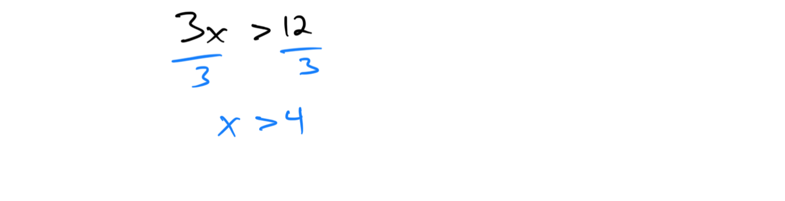

1. If -2y ≤ 8, find the solution set for y: **y ≥ -4**.

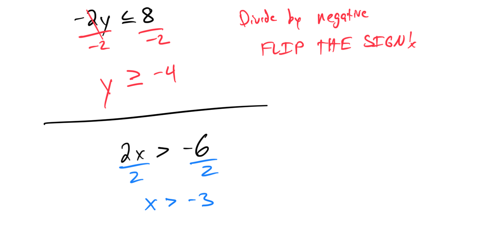

## **Topic 9: Solving a two-step linear inequality: Problem type 1**
1. Solve for x: 2x + 5 < 11: **x < 3**.

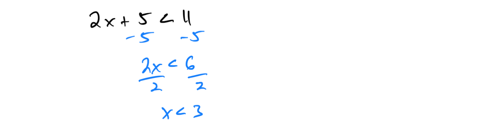

1. If 3y - 4 ≥ 8, find the solution set for y: **y ≥ 4**.

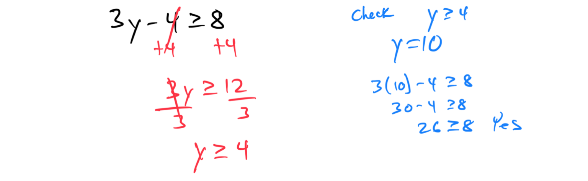

## **Topic 10: Solving a two-step linear inequality: Problem type 2**
1. Solve for x: -3x + 2 > 8: **x < -2**.

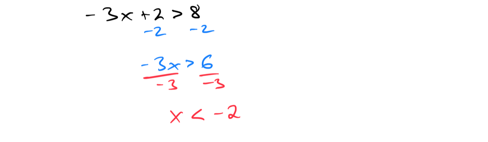

1. If 4y - 7 ≤ -3, find the solution set for y: **y ≤ 1**.

[281810A0-5E63-4D60-8CA4-9208AA1D9D4E](attachments/281810A0-5E63-4D60-8CA4-9208AA1D9D4E.png)

## **Topic 11: Solving a linear inequality with multiple occurrences of the variable: Problem type 1**
1. Solve for x: 5x - 2x + 4 > 10: **x > 2**.

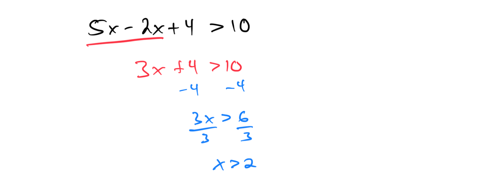

1. If -7y - 3y + 5 ≤ 15, find the solution set for y.

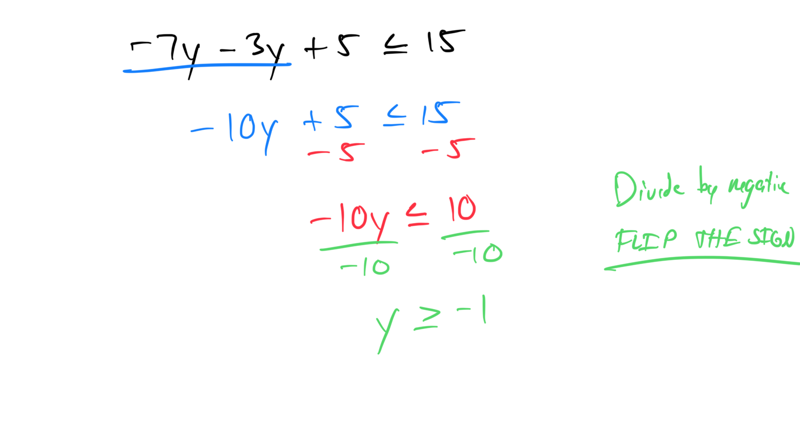