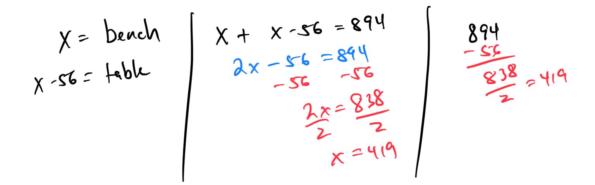
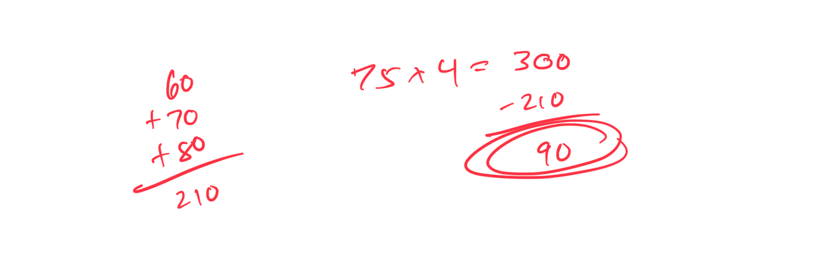

# Module 4 - Linear Applications

[Video](https://youtu.be/qAzraQEwDVo)

**Topic 1: Translating a phrase into a two-step expression**  
1. Translate "three times a number increased by five" into a two-step expression.  

2. Translate "seven less than twice a number" into a two-step expression.  

**Topic 2: Translating a sentence into a one-step equation**  
1. Translate "A number increased by eight equals twelve" into a one-step equation.  

2. Translate "The product of a number and six is thirty" into a one-step equation.  

**Topic 3: Translating a sentence into a multi-step equation**  
1. Translate "Twice a number increased by three is equal to five times the number minus seven" into a multi-step equation.  

2. Translate "Four times a number plus nine equals three times the number plus fifteen" into a multi-step equation.  

**Topic 4: Translating a phrase into a two-step expression**  
1. Translate "five times a number decreased by two" into a two-step expression.  

2. Translate "a number multiplied by four plus ten" into a two-step expression.  

**Topic 5: Translating a sentence into a one-step equation**  
1. Translate "A number divided by four equals eight" into a one-step equation.  

2. Translate "Nine more than a number is twenty-one" into a one-step equation.  

**Topic 6: Translating a sentence into a multi-step equation**  
1. Translate "Three times a number minus five equals twice the number plus four" into a multi-step equation.  

2. Translate "Six times a number plus seven is equal to four times the number plus eleven" into a multi-step equation.  

**Topic 7: Solving a word problem with two unknowns using a linear equation**  

A garden table and a bench cost $894 combined. The garden table costs $56 less than the bench. What is the cost of the bench?

 

**Topic 8: Solving a word problem involving consecutive integers**  
1. The sum of two consecutive integers is 47. Find the integers.  

[19DEC444-32AF-43FA-9357-4092FCE167B8](attachments/19DEC444-32AF-43FA-9357-4092FCE167B8.png)

2. The sum of three consecutive even integers is 72. Find the integers.  

[734212E8-029B-484B-9C4E-9BECF8899EA2](attachments/734212E8-029B-484B-9C4E-9BECF8899EA2.png)

**Topic 9: Applying the percent equation: Problem type 1**  
1. What is 20% of 150?  

2. 30 is what percent of 120?  

**Topic 10: Finding a percentage of a total amount: Real-world situations**  
1. A restaurant bill is $80, and you want to leave a 15% tip. How much is the tip?  

2. A car dealer offers a 10% discount on a $25,000 vehicle. How much is the discount?  

**Topic 11: Finding a percentage of a total amount without a calculator: Sales tax, commission, discount**  
1. A shirt costs $40, and the sales tax is 5%. How much is the tax? 

 
2. A salesperson earns a 3% commission on a $2,000 sale. How much is the commission?  

**Topic 12: Finding the sale price given the original price and percent discount**  
1. A jacket originally priced at $120 is discounted by 25%. What is the sale price?  

2. A laptop originally costs $800 and is on sale with a 15% discount. What is the sale price?  

**Topic 13: Finding the sale price without a calculator given the original price and percent discount**  
1. A book priced at $20 is discounted by 10%. What is the sale price?  

2. A pair of shoes costing $50 is on sale with a 20% discount. What is the sale price?  

**Topic 14: Finding the total cost including tax or markup**  
1. A phone costs $300, and the sales tax is 8%. What is the total cost?  

2. A store marks up a $40 item by 15%. What is the total cost?  

**Topic 15: Finding the original price given the sale price and percent discount**  
1. A shirt on sale for $36 was discounted by 20%. What was the original price?  

2. A gadget on sale for $200 had a 25% discount. What was the original price?  

**Topic 16: Finding a side length given the perimeter and side lengths with variables**  
1. The perimeter of a rectangle is 48 cm. If the length is 3x and the width is x + 2, find the length and width. 
 

2. A triangle has a perimeter of 36 cm. If one side is 2x, another is x + 3, and the third is x + 1, find the side lengths.  

**Topic 17: Solving a one-step word problem using the formula d = rt**  
1. A car travels at 60 mph for 2 hours. How far does it travel?  

2. A cyclist rides 45 miles in 3 hours. What is the cyclist’s speed?  

**Topic 18: Finding the value for a new score that will yield a given mean**  
1. A student’s test scores are 80, 85, and 90. What score is needed on the next test to have a mean of 88?  

2. A team’s game scores are 60, 70, and 80. What score is needed in the next game for a mean of 75? 
