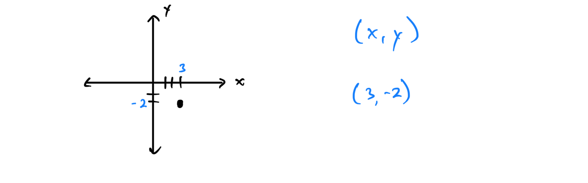
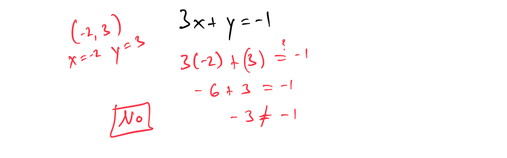

# Module 5 - Graphing Linear Equations

[Video](https://youtu.be/Auc5B0bgM4M)

**Topic 1: Reading a point in the coordinate plane**  
1. Identify the coordinates of the point located at (3, -2) on the coordinate plane.  

2. What are the coordinates of the point at (-5, 4) on the coordinate plane?  

**Topic 2: Plotting a point in the coordinate plane**  
1. Plot the point (2, 7) on the coordinate plane.  

2. Plot the point (-4, -3) on the coordinate plane.  

**Topic 3: Table for a linear equation**  
1. Create a table of values for the linear equation y = 2x + 1 for x = -2, -1, 0, 1, 2.  

2. Construct a table of values for the linear equation y = -3x + 4 for x = -1, 0, 1, 2, 3.  

**Topic 4: Identifying solutions to a linear equation in two variables**  
1. Determine if the point (1, 3) is a solution to the equation y = 2x + 1.  

2. Check if the point (-2, 3) is a solution to the equation 3x + y = -1.  

**Topic 5: Finding a solution to a linear equation in two variables**  
1. Find a solution to the linear equation y = 3x - 2 by choosing x = 4.  

2. Find a solution to the linear equation 2x + y = 8 by choosing x = 2.  

[2331BB72-CDE3-4FC8-9E5A-C884BE11DE90](attachments/2331BB72-CDE3-4FC8-9E5A-C884BE11DE90.png)

**Topic 6: Graphing a linear equation of the form y = mx**  
1. Graph the linear equation y = 4x on the coordinate plane.  

2. Graph the linear equation y = -2x on the coordinate plane.  

**Topic 7: Graphing a line given its equation in slope-intercept form: Integer slope**  
1. Graph the line given by the equation y = 3x - 2.  

2. Graph the line given by the equation y = -5x + 1.  

**Topic 8: Graphing a line given its equation in slope-intercept form: Fractional slope**  
1. Graph the line given by the equation y = (1/2)x + 3.  

2. Graph the line given by the equation y = (-2/3)x - 1.  

**Topic 9: Graphing a line given its equation in standard form**  
1. Graph the line given by the equation 2x + 3y = 6.  

[064A46E3-974E-4ECB-B302-569DA32ED491](attachments/064A46E3-974E-4ECB-B302-569DA32ED491.png)

2. Graph the line given by the equation 4x - y = 8.  

[645208E2-5D24-483F-BE76-D7F337B4D9BB](attachments/645208E2-5D24-483F-BE76-D7F337B4D9BB.png)

**Topic 10: Graphing a vertical or horizontal line**  
1. Graph the line x = 5 on the coordinate plane.  

2. Graph the line y = -3 on the coordinate plane.  

**Topic 11: Finding x- and y-intercepts given the graph of a line on a grid**  
1. Find the x- and y-intercepts of a line on a grid.  

2. Determine the x- and y-intercepts of a line passing through (0, -3) and (6, 0) on a grid.  

**Topic 12: Finding x- and y-intercepts of a line given the equation: Basic**  
1. Find the x- and y-intercepts of the equation y = 2x - 4.  

2. Find the x- and y-intercepts of the equation y = -3x + 6.  

**Topic 13: Finding x- and y-intercepts of a line given the equation: Advanced**  
1. Find the x- and y-intercepts of the equation 3x + 5y = 15.  

2. Find the x- and y-intercepts of the equation 2x - 4y = 8.  

**Topic 14: Graphing a line given its x- and y-intercepts**  
1. Graph the line with x-intercept (3, 0) and y-intercept (0, 6).  

2. Graph the line with x-intercept (4, 0) and y-intercept (0, -2).  

**Topic 15: Graphing a line by first finding its x- and y-intercepts**  
1. Graph the line 2x + y = 4 by finding its x- and y-intercepts.  

2. Graph the line 3x - 2y = 6 by finding its x- and y-intercepts.  

**Topic 16: Classifying slopes given graphs of lines**  
1. Classify the slope of a line passing through (1, 2) and (3, 6) as positive, negative, zero, or undefined.  

[BB5A592A-05D9-40A3-BA8F-1D900D4B22EE](attachments/BB5A592A-05D9-40A3-BA8F-1D900D4B22EE.png)

2. Classify the slope of a line passing through (2, 5) and (2, -1) as positive, negative, zero, or undefined.  

**Topic 17: Finding slope given the graph of a line on a grid**  
1. Find the slope of a line passing through the points (0, 3) and (4, 7) on a grid.  

2. Find the slope of a line passing through the points (-2, 1) and (3, -4) on a grid.  

**Topic 18: Finding slope given two points on a line**  
1. Find the slope of a line passing through the points (2, 3) and (5, 9).  

[9C1475E3-B3D9-4812-B168-502652D8568A](attachments/9C1475E3-B3D9-4812-B168-502652D8568A.png)

2. Find the slope of a line passing through the points (-1, 4) and (3, -2).  

**Topic 19: Finding the slopes of horizontal and vertical lines**  
1. Find the slope of the line y = 7.  

2. Find the slope of the line x = -4.  

**Topic 20: Graphing a line given its equation in standard form**  
1. Graph the line given by the equation 5x + 2y = 10.  
[BBF1B21D-243E-46DF-BABD-6BBCACA9ECA5](attachments/BBF1B21D-243E-46DF-BABD-6BBCACA9ECA5.png)
2. Graph the line given by the equation 3x - 4y = 12.  

**Topic 21: Graphing a line given its slope and y-intercept**  
1. Graph the line with a slope of 2 and a y-intercept of (0, -3).  

2. Graph the line with a slope of -1 and a y-intercept of (0, 5).  

**Topic 22: Finding the slope and y-intercept of a line given its equation in the form y = mx + b**  
1. Find the slope and y-intercept of the equation y = 4x - 3.  

2. Find the slope and y-intercept of the equation y = (-1/2)x + 6.  

**Topic 23: Finding the slope and y-intercept of a line given its equation in the form Ax + By = C**  
1. Find the slope and y-intercept of the equation 2x + 3y = 9.  

2. Find the slope and y-intercept of the equation 4x - 2y = 8.  

**Topic 24: Graphing a line by first finding its slope and y-intercept**  
1. Graph the line 3x + y = 5 by finding its slope and y-intercept.  

[B0CA3F2D-CA17-4567-85DE-1490632F02A8](attachments/B0CA3F2D-CA17-4567-85DE-1490632F02A8.png)

2. Graph the line 2x - 3y = 6 by finding its slope and y-intercept.