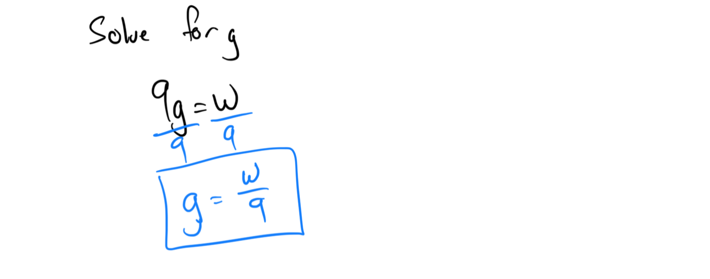
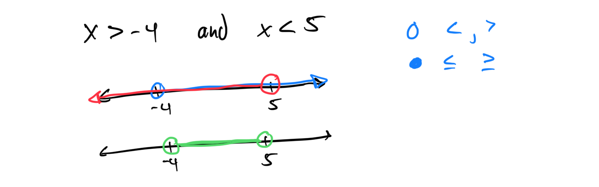
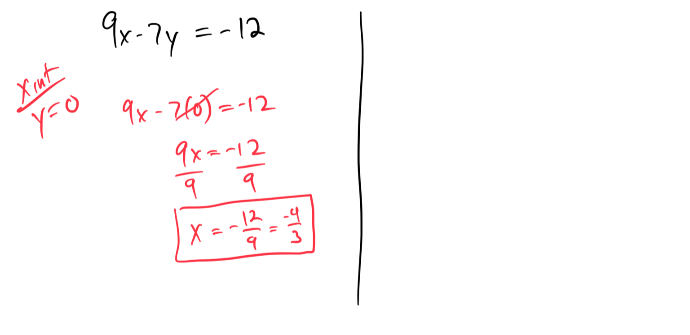

# Module 6 - Midterm Review

[Video](https://youtu.be/vdxOMmLIdto)

**Topic 1: Using distribution and combining like terms to simplify: Univariate**

Shown below on Test Work Page.

**Topic 2: Solving a two-step equation with integers**

[E3C53613-BBCD-47F1-B881-73FEFF7F52A4](attachments/E3C53613-BBCD-47F1-B881-73FEFF7F52A4.png)

**Topic 3: Solving a linear equation with several occurrences of the variable: Fractional forms with monomial numerators**

Shown below on Test Work Page and another example below.

[732FEF0C-D595-409C-A494-1366C61697E8](attachments/732FEF0C-D595-409C-A494-1366C61697E8.png)

### Topic 4: Solving for a variable in terms of other variables using addition or subtraction: Advanced (1m)

**Topic 5: Solving for a variable in terms of other variables using multiplication or division: Basic**

**Topic 6: Solving a one-step word problem using the formula d = rt**

**Topic 7: Graphing a compound inequality on the number line**

**Topic 8: Solving a two-step linear inequality: Problem type 2**

Shown below on Test Work Page.

**Topic 9: Graphing a line given its equation in slope-intercept form: Fractional slope**

Shown below on Test Work Page.

**Topic 10: Graphing a vertical or horizontal line**

Shown below on Test Work Page.

**Topic 11: Finding x- and y-intercepts of a line given the equation: Advanced**

**Topic 12: Classifying slopes given graphs of lines**

**Topic 13: Finding the slope and y-intercept of a line given its equation in the form Ax + By = C**

Shown below on Test Work Page.

