# Module 7 - Exponents

[Video](https://youtu.be/z5YM5MFPNxQ)

Topic 1: Power of 10: Positive exponent
Problem 1: Evaluate 10^3. Write the result in standard form.

Problem 2: Compute 10^5 and express the answer as a number without exponents.

Topic 2: Exponents and integers: Problem type 1
Problem 1: Simplify (-2)^4. Show the steps and provide the final value.

Problem 2: Evaluate 3^3. Compute and verify the result.

Topic 3: Exponents and integers: Problem type 2
Problem 1: Simplify (-5)^2 and compare it to -5^2. Explain the difference in the results.

Problem 2: Compute (-3)^3 and -3^3. Describe why the answers differ.

Topic 4: Exponents and signed fractions
Problem 1: Evaluate (-1/2)^3. Show the calculation and simplify the fraction.

Problem 2: Simplify (2/3)^2. Provide the steps and the final answer in fraction form.

Topic 5: Order of operations with integers and exponents
Problem 1: Evaluate 2^3 + 4 * (-3)^2. Follow the order of operations and show each step.

Problem 2: Compute -5^2 + 3 * 2^2 - 1. Use the correct order of operations and provide the final value.

Topic 6: Understanding the product rule of exponents
Problem 1: Explain why x^2 * x^3 = x^5 using the product rule of exponents. Provide a numerical example to illustrate.

Problem 2: Use the product rule to justify why 2^4 * 2^2 = 2^6. Verify with a calculation.

Topic 7: Introduction to the product rule of exponents
Problem 1: Simplify a^3 * a^4 using the product rule of exponents. Write the result as a single power.

Problem 2: Combine b^5 * b^2 using the product rule. Express the answer in exponential form.

Topic 8: Product rule with positive exponents: Univariate
Problem 1: Simplify x^6 * x^3. Apply the product rule and write the result as a single term.

Problem 2: Compute y^4 * y^7 using the product rule. Provide the simplified expression.

Topic 9: Product rule with positive exponents: Multivariate
Problem 1: Simplify (2x^3)(3x^5). Use the product rule and combine like terms.

[ED2E95B3-3C9D-4DEB-8707-84B2FFE8B14E](attachments/ED2E95B3-3C9D-4DEB-8707-84B2FFE8B14E.png)

Problem 2: Compute (4a^2b)(a^3b^2). Apply the product rule and simplify the expression.

Topic 10: Simplifying a ratio of multivariate monomials: Basic
Problem 1: Simplify (6x^3y^2)/(2xy). Use the quotient rule and simplify the coefficients and variables.

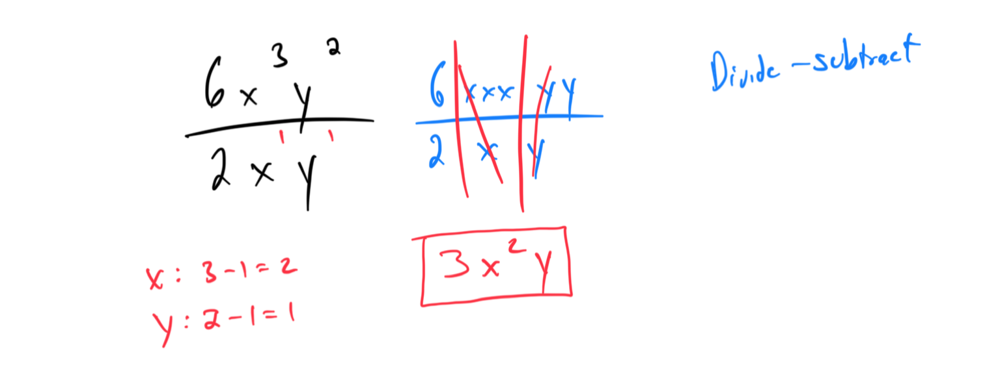

Problem 2: Compute (8a^4b^3)/(4a^2b). Apply the quotient rule and express the result in simplified form.

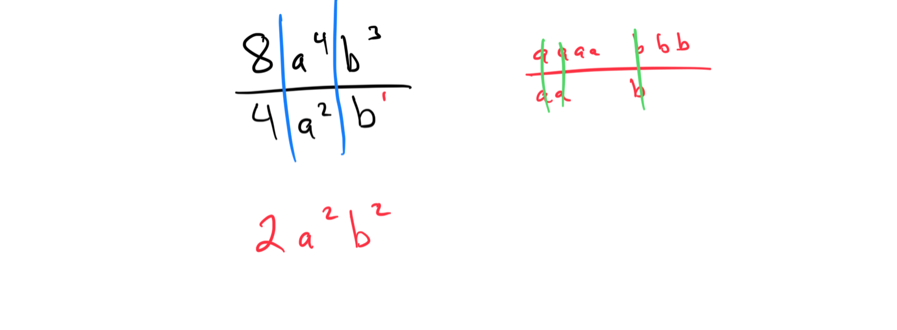

Topic 11: Introduction to the quotient rule of exponents
Problem 1: Simplify x^7 / x^3 using the quotient rule of exponents. Write the result as a single power.

Problem 2: Compute y^8 / y^2 using the quotient rule. Provide the simplified expression.

Topic 12: Simplifying a ratio of univariate monomials
Problem 1: Simplify (10x^5)/(2x^2). Apply the quotient rule and simplify the coefficient.

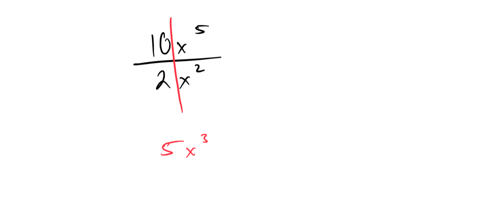

Problem 2: Compute (15y^6)/(3y^4). Use the quotient rule and express the result in simplified form.

Topic 13: Quotient of expressions involving exponents
Problem 1: Simplify (4x^6y^3)/(2x^2y). Apply the quotient rule and simplify the coefficients and variables.

Problem 2: Compute (9a^5b^4)/(3a^2b^2). Use the quotient rule and provide the simplified expression.

Topic 14: Simplifying a ratio of multivariate monomials: Advanced
Problem 1: Simplify (12x^4y^3z^2)/(3x^2yz). Use the quotient rule and simplify all terms.

Problem 2: Compute (16a^6b^4c^3)/(4a^3b^2c). Apply the quotient rule and express the result in simplified form.

Topic 15: Understanding the power rules of exponents
Problem 1: Explain why (x^2)^3 = x^6 using the power rule of exponents. Provide a numerical example to illustrate.

Problem 2: Use the power rule to justify why (a^4)^2 = a^8. Verify with a calculation.

Topic 16: Introduction to the power of a power rule of exponents
Problem 1: Simplify (x^3)^2 using the power of a power rule. Write the result as a single power.

Problem 2: Compute (y^5)^3 using the power of a power rule. Provide the simplified expression.

Topic 17: Introduction to the power of a product rule of exponents
Problem 1: Simplify (xy)^3 using the power of a product rule. Express the result in expanded form.

Problem 2: Compute (2ab^4)^2 using the power of a product rule. Simplify the expression.

Topic 18: Power rules with positive exponents: Multivariate products
Problem 1: Simplify (2xy^2)^3. Apply the power of a product rule and simplify all terms.

Problem 2: Compute (3a^2b)^2. Use the power of a product rule and provide the simplified result.

Topic 19: Power rules with positive exponents: Multivariate quotients
Problem 1: Simplify (x^2/y)^3. Apply the power rule for quotients and simplify the expression.

Problem 2: Compute (2a/b^2)^2. Use the power rule for quotients and express the result in simplified form.

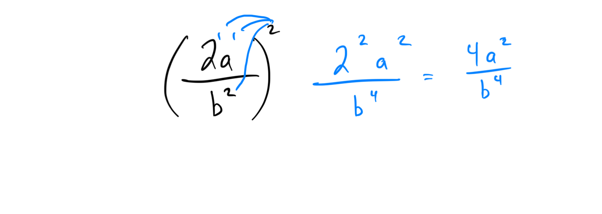

Topic 20: Power and product rules with positive exponents
Problem 1: Simplify (x^2y^3)(xy)^2. Use both the product and power rules and simplify the result.

Problem 2: Compute (2a^3b)(ab^2)^2. Apply the product and power rules and provide the simplified expression.

Topic 21: Power and quotient rules with positive exponents
Problem 1: Simplify (x^5/y^2)/(x^2/y). Use the quotient and power rules to simplify the expression.

Problem 2: Compute (a^4b^3)/(a^2b)*(2a^3)/(ab)^2. Apply the quotient and power rules and simplify the result.

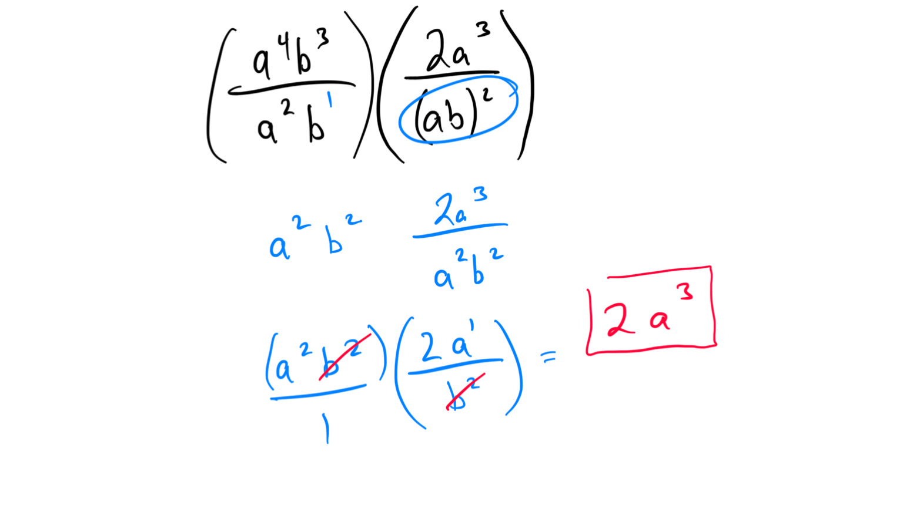

Topic 22: Evaluating expressions with exponents of zero
Problem 1: Evaluate 7^0. Explain why the result is 1 using the zero exponent rule.

Problem 2: Compute (4x^3y^2)^0. Use the zero exponent rule and provide the result.

Topic 23: Evaluating an expression with a negative exponent: Whole number base
Problem 1: Evaluate 2^(-3). Rewrite using a positive exponent and compute the value.

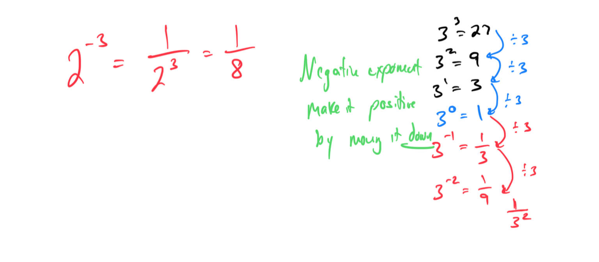

Problem 2: Simplify 5^(-2). Express with a positive exponent and find the numerical value.
 

Topic 24: Evaluating an expression with a negative exponent: Positive fraction base
Problem 1: Evaluate (1/3)^(-2). Rewrite with a positive exponent and compute the result.

Problem 2: Simplify (2/5)^(-3). Express with a positive exponent and calculate the value.

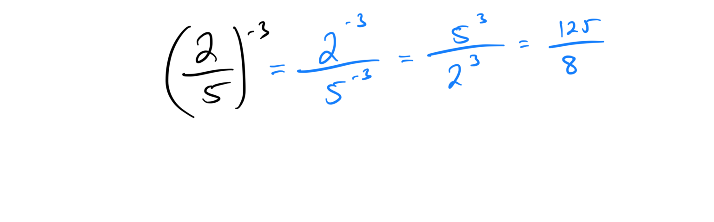

Topic 25: Evaluating an expression with a negative exponent: Negative integer base
Problem 1: Evaluate (-2)^(-3). Rewrite with a positive exponent and compute the result.

Problem 2: Simplify (-4)^(-2). Express with a positive exponent and find the numerical value.

Topic 26: Rewriting an algebraic expression without a negative exponent
Problem 1: Rewrite x^(-4) without a negative exponent. Simplify to a fraction if necessary.

Problem 2: Express 3y^(-2) without a negative exponent. Provide the simplified form.

Topic 27: Introduction to the product rule with negative exponents
Problem 1: Simplify x^(-2) * x^(-3) using the product rule. Express the result with a positive exponent.

Problem 2: Compute y^(-4) * y^(-1) using the product rule. Rewrite with a positive exponent.

Topic 28: Product rule with negative exponents
Problem 1: Simplify (2x^(-3))(3x^(-2)). Apply the product rule and express with positive exponents.

Problem 2: Compute (4a^(-5))(a^(-3)). Use the product rule and simplify with positive exponents.

Topic 29: Quotient rule with negative exponents: Problem type 1
Problem 1: Simplify x^(-5)/x^(-2). Apply the quotient rule and rewrite with a positive exponent.

Problem 2: Compute y^(-7)/y^(-4). Use the quotient rule and express the result with a positive exponent.

Topic 30: Quotient rule with negative exponents: Problem type 2
Problem 1: Simplify (6x^(-4))/(2x^(-1)). Apply the quotient rule and simplify the coefficient and exponent.

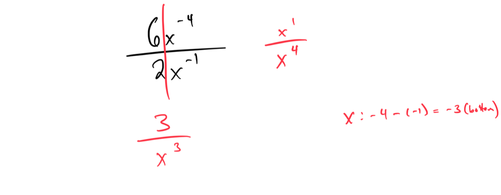

Problem 2: Compute (8y^(-3))/(4y^(-5)). Use the quotient rule and express with positive exponents.

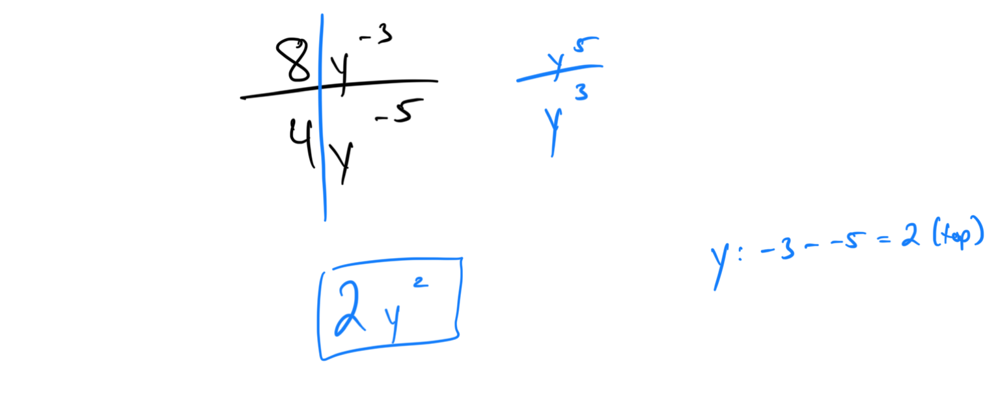

Topic 31: Power of a power rule with negative exponents
Problem 1: Simplify (x^(-2))^3. Apply the power of a power rule and rewrite with a positive exponent.

Problem 2: Compute (y^(-4))^2. Use the power of a power rule and express with a positive exponent.

Topic 32: Power rules with negative exponents
Problem 1: Simplify (2x^(-3))^2. Apply the power rule and rewrite with positive exponents.

Problem 2: Compute (3a^(-2)b)^3. Use the power rule and simplify with positive exponents.

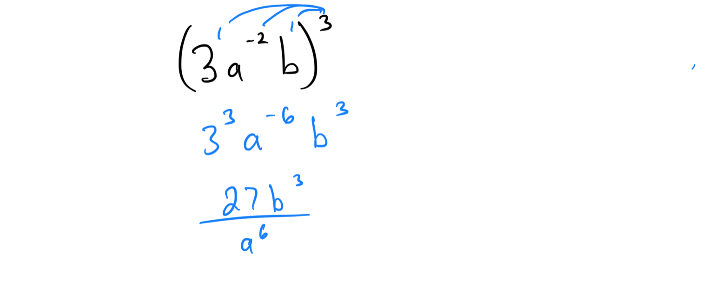

Topic 33: Power and quotient rules with negative exponents: Problem type 1
Problem 1: Simplify (x^(-4)/y^(-2))^3. Apply the power and quotient rules and express with positive exponents.

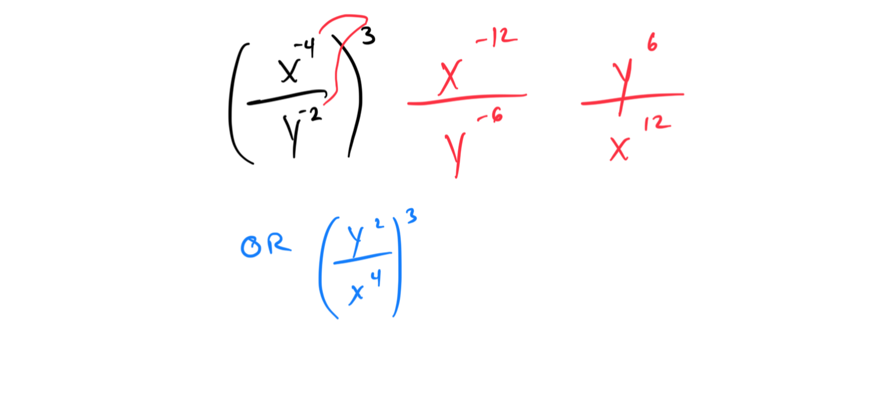

Problem 2: Compute (2a^(-3)/b^(-1))^2. Use the power and quotient rules and simplify the result.

Topic 34: Power of 10: Negative exponent
Problem 1: Evaluate 10^(-3). Rewrite with a positive exponent and compute the value.

Problem 2: Simplify 10^(-5). Express with a positive exponent and find the numerical value.

Topic 35: Scientific notation with a positive exponent
Problem 1: Write 450,000 in scientific notation with a positive exponent.

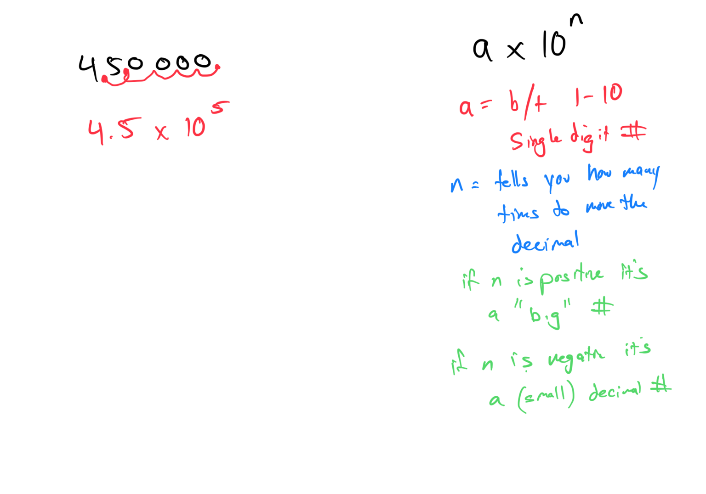

Problem 2: Express 7,200,000 in scientific notation using a positive exponent.

Topic 36: Scientific notation with a negative exponent
Problem 1: Write 0.0034 in scientific notation with a negative exponent.

Problem 2: Express 0.000072 in scientific notation using a negative exponent.

Topic 37: Converting between scientific notation and standard form in a real-world situation
Problem 1: The distance to a star is 4.5 x 10^8 kilometers. Convert this to standard form in the context of astronomical measurements.

Problem 2: A cell’s diameter is 2.3 x 10^(-5) meters. Convert this to standard form for a biology lab report.

Topic 38: Multiplying numbers written in scientific notation: Basic
Problem 1: Multiply (3 x 10^4) * (2 x 10^3). Express the result in scientific notation.

Problem 2: Compute (5 x 10^2) * (4 x 10^5). Write the answer in scientific notation. 
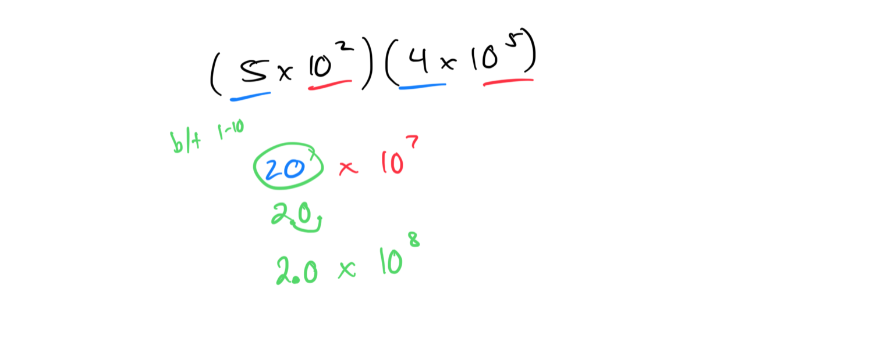

Topic 39: Dividing numbers written in scientific notation: Basic
Problem 1: Divide (6 x 10^5)/(2 x 10^2). Simplify and express the result in scientific notation. 

Problem 2: Compute (2 x 10^-7)/(4 x 10^3). Provide the answer in scientific notation. 
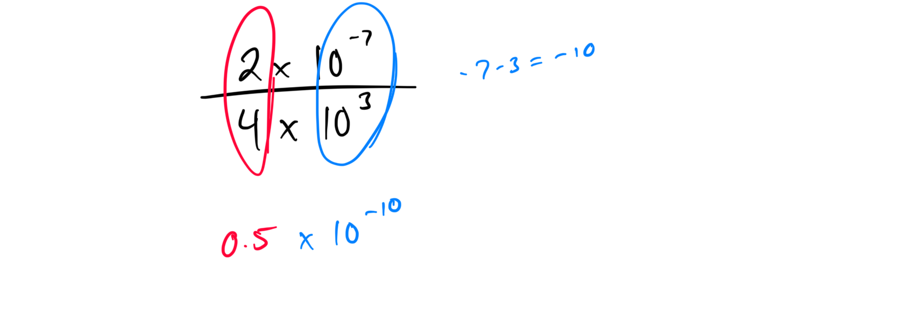