# Module 8 - Polynomials

[Video](https://youtu.be/CdFMnyUbZE4)

Topic 1: Using distribution with double negation and combining like terms to simplify: Multivariate
Problem 1: Simplify -(-2x^2 + 3xy - 4y^2) + 5x^2 - 2xy + y^2. Distribute and combine like terms to find the simplified expression. 
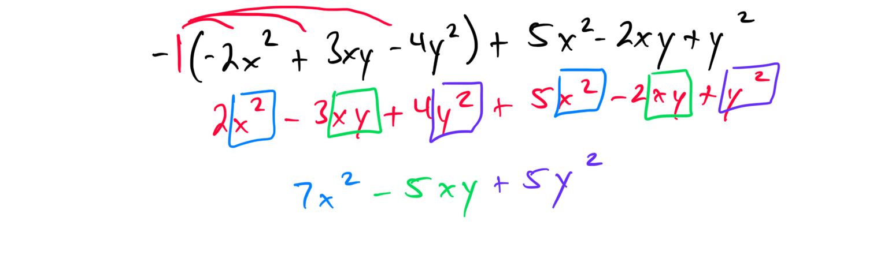
Problem 2: Compute -(-3a^2 - 2ab + 5b^2) - a^2 + 4ab - 3b^2. Apply distribution and combine like terms to simplify.

Topic 2: Degree and leading coefficient of a univariate polynomial
Problem 1: Determine the degree and leading coefficient of the polynomial 4x^3 - 2x^2 + 5x - 1. Explain your reasoning. 
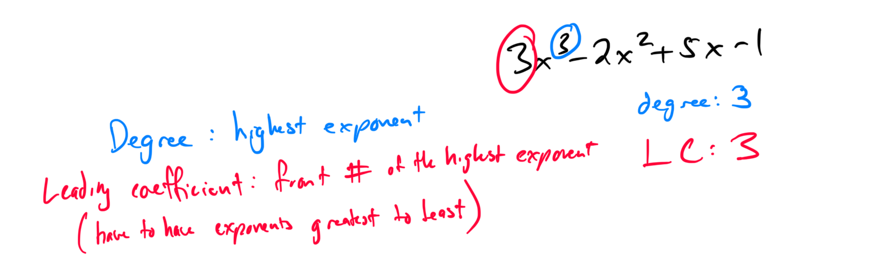
Problem 2: Find the degree and leading coefficient of the polynomial -7x^5 + 3x^3 - x + 2. Provide the values and justify. 
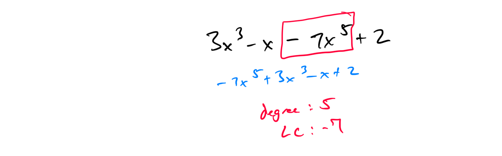

Topic 3: Simplifying a sum or difference of two univariate polynomials
Problem 1: Simplify (3x^2 - 5x + 2) + (2x^2 + 4x - 3). Combine like terms and write the resulting polynomial.

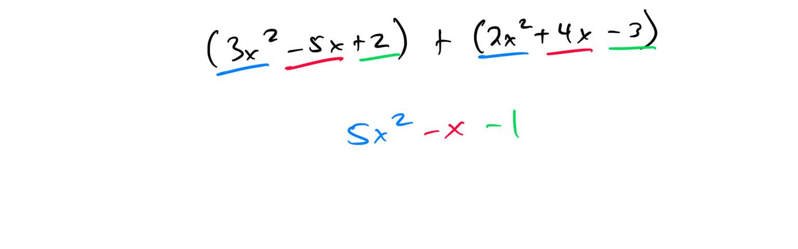

Problem 2: Compute (6x^3 - 2x + 1) - (4x^3 + x - 5). Simplify by combining like terms.

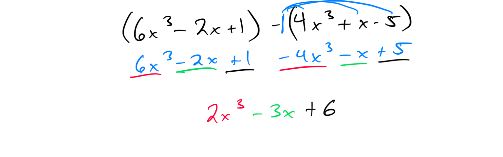

Topic 4: Simplifying a sum or difference of multivariate polynomials
Problem 1: Simplify (2x^2y - 3xy^2 + 4) + (x^2y + 2xy^2 - 1). Combine like terms to find the simplified polynomial.

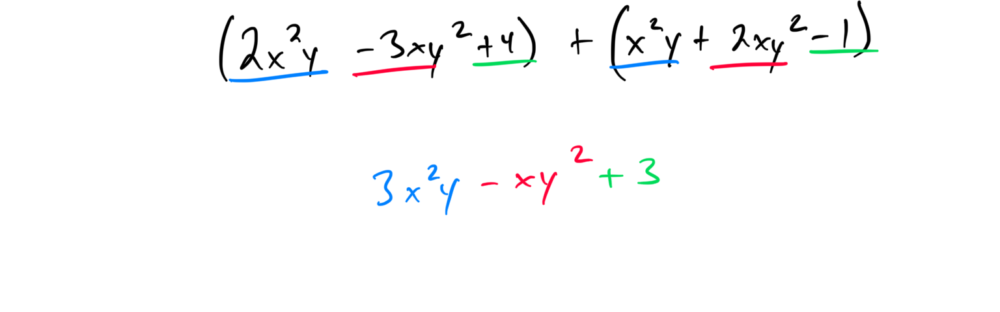

Problem 2: Compute (5a^2b  + 3a) - (3a^2b + ab^2 - 2a). Simplify by combining like terms.

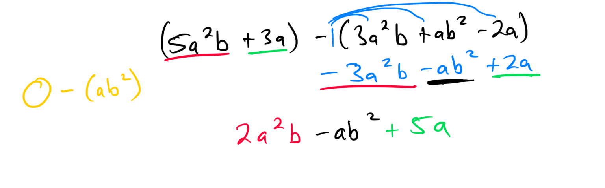

Topic 5: Multiplying a univariate polynomial by a monomial with a positive coefficient
Problem 1: Multiply 3x (2x^2 + 4x - 5). Distribute and simplify the result.

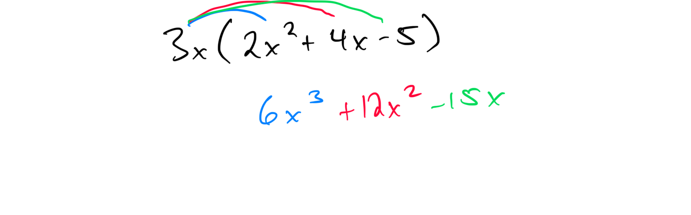

Problem 2: Compute 5x^2 (x^3 - 2x + 1). Apply the distributive property and simplify.

Topic 6: Multiplying a univariate polynomial by a monomial with a negative coefficient
Problem 1: Multiply -2x (3x^2 - 5x + 4). Distribute and simplify the resulting polynomial.

Problem 2: Compute -4x^3 (2x^2 + x - 3). Use the distributive property and simplify.

Topic 7: Multiplying a multivariate polynomial by a monomial
Problem 1: Multiply 2xy (3x^2y - 4xy^2 + 5). Distribute and simplify the expression.

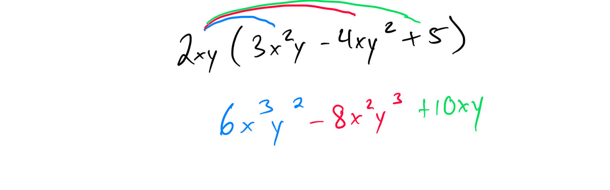

Problem 2: Compute 3a^2b (2ab^2 - a^2 + 4b). Apply the distributive property and simplify.

Topic 8: Multiplying binomials with leading coefficients of 1
Problem 1: Multiply (x + 3)(x - 5). Use the FOIL method and simplify the result.

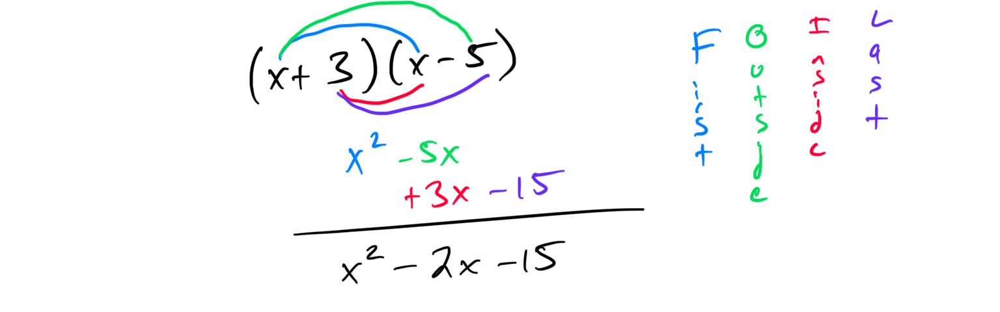

Problem 2: Compute (x - 2)(x + 7). Apply the FOIL method and combine like terms.

Topic 9: Multiplying binomials with leading coefficients greater than 1
Problem 1: Multiply (2x + 3)(3x - 4). Use the FOIL method and simplify the resulting polynomial.

Problem 2: Compute (5x - 1)(2x + 6). Apply the FOIL method and combine like terms.

Topic 10: Multiplying binomials in two variables
Problem 1: Multiply (x + 2y)(x - 3y). Use the FOIL method and simplify the expression.

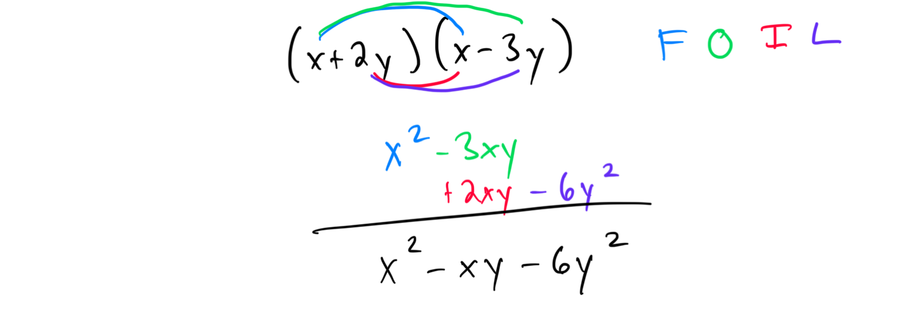

Problem 2: Compute (2a + b)(3a - 2b). Apply the FOIL method and combine like terms.

Topic 11: Multiplying conjugate binomials: Univariate
Problem 1: Multiply (x + 4)(x - 4). Recognize the conjugate pair and simplify using the difference of squares formula.

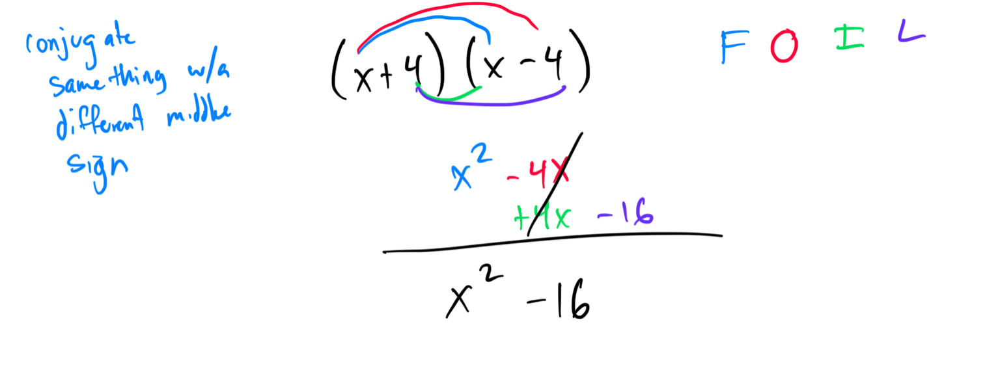

Problem 2: Compute (3x + 5)(3x - 5). Use the difference of squares formula and simplify.

Topic 12: Multiplying conjugate binomials: Multivariate
Problem 1: Multiply (2x + y)(2x - y). Apply the difference of squares formula and simplify the result.

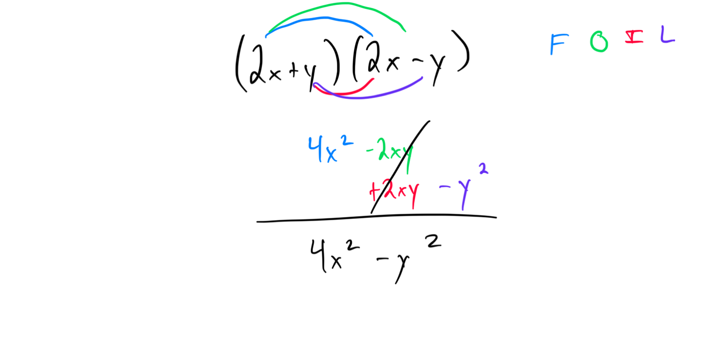

Problem 2: Compute (a + 3b)(a - 3b). Use the difference of squares formula and simplify.

Topic 13: Squaring a binomial: Univariate
Problem 1: Simplify (x + 3)^2. Use the binomial square formula and expand to verify.

Problem 2: Compute (2x - 5)^2. Apply the binomial square formula and simplify.

[CFDD9928-26BD-4512-8CF5-7FB475E4A3F3](attachments/CFDD9928-26BD-4512-8CF5-7FB475E4A3F3.png)

Topic 14: Squaring a binomial: Multivariate
Problem 1: Simplify (x + 2y)^2. Use the binomial square formula and expand to confirm.
Problem 2: Compute (3a - b)^2. Apply the binomial square formula and simplify the expression.

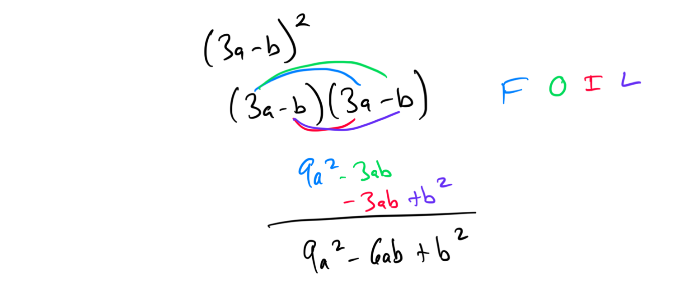

Topic 15: Multiplying binomials with negative coefficients
Problem 1: Multiply (-2x + 3)(-x - 4). Use the FOIL method and simplify the result.
Problem 2: Compute (-3x + 2)(-2x - 5). Apply the FOIL method and combine like terms.

Topic 16: Multiplication involving binomials and trinomials in one variable
Problem 1: Multiply (x + 2)(x^2 - 3x + 1). Distribute and simplify the resulting polynomial.

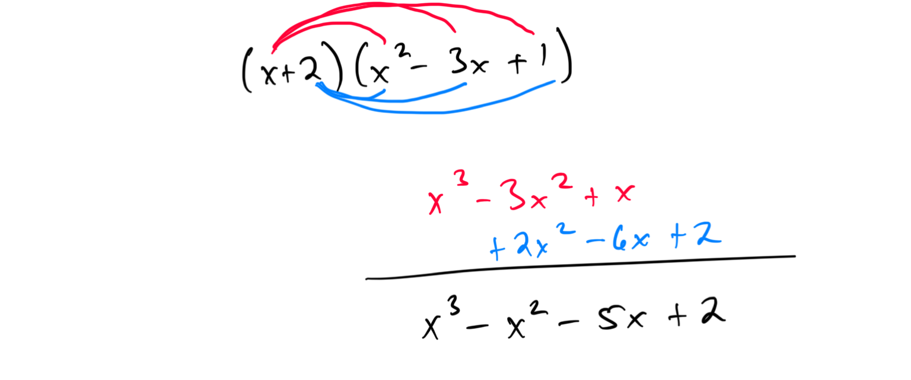

Problem 2: Compute (2x - 1)(x^2 + 4x - 3). Use the distributive property and combine like terms.

Topic 17: Dividing a polynomial by a monomial: Univariate
Problem 1: Divide (6x^3 - 9x^2 + 3x) / 3x. Simplify each term and write the result.

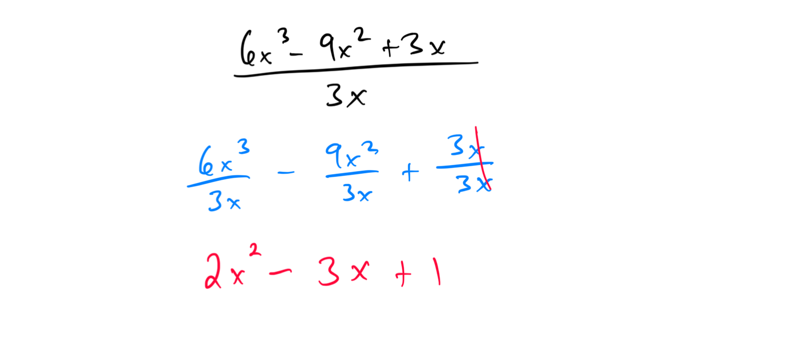

Problem 2: Compute (10x^4 + 5x^3 - 15x^2) / 5x^3. Divide each term and simplify.

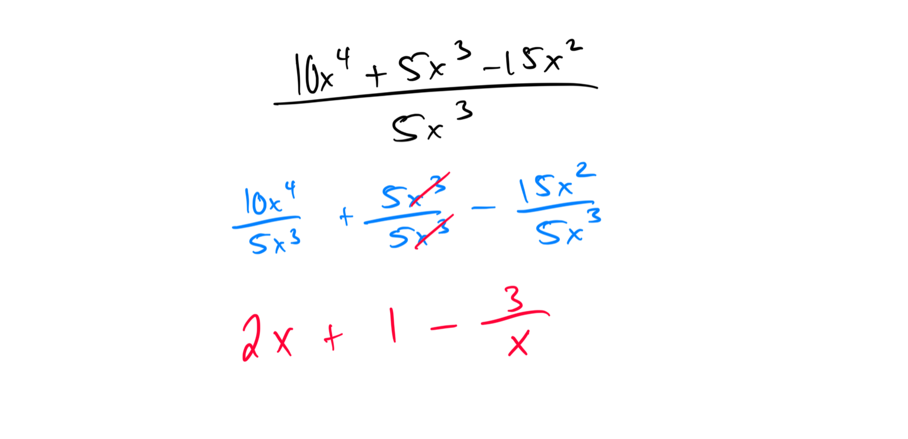

Topic 18: Dividing a polynomial by a monomial: Multivariate
Problem 1: Divide (8x^2y^3 - 4xy^2 + 12x^2y) / 2xy. Simplify each term and provide the result.
Problem 2: Compute (15a^3b^2 - 10a^2b + 5ab^2) / 5ab. Divide each term and simplify the expression.

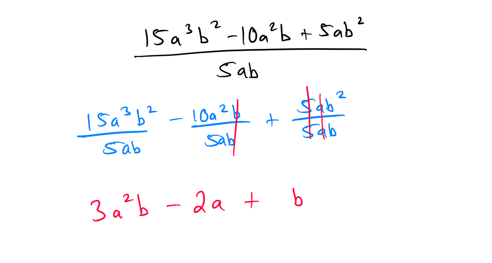