# Module 9 - Factoring

[Video - Part 1](https://youtu.be/1qk0K3tfNbk)

[Video - Part 2](https://youtu.be/ZNBP2Cy-2hA)

Topic 1: Factors
Problem 1: Find all factors of 24. List them in ascending order.

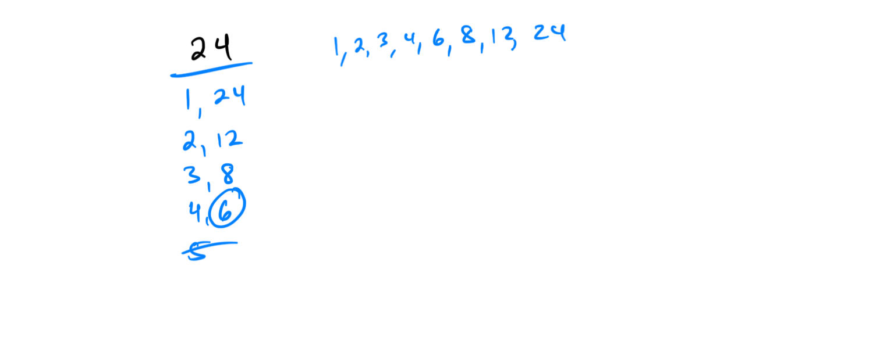

Problem 2: Determine the factors of 108. Express them as a set.

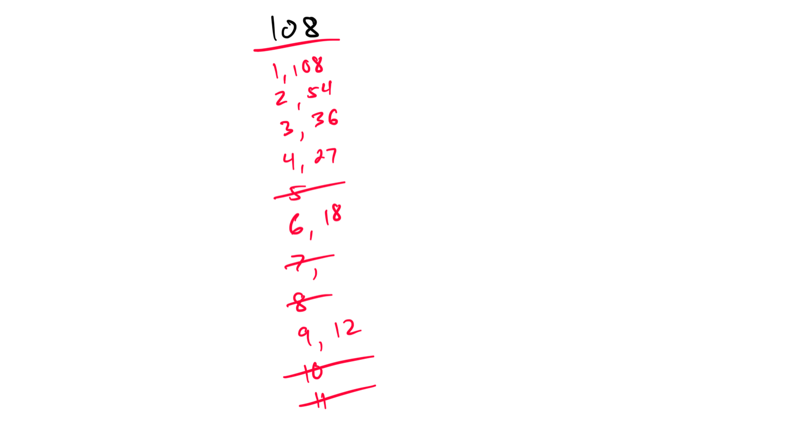

Topic 2: Factoring a linear binomial
Problem 1: Factor 6x - 12 completely. Identify the greatest common factor and write the factored form.

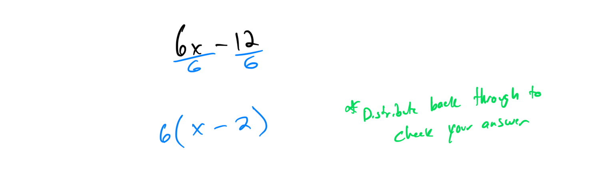

Problem 2: Factor 8x + 16. Find the GCF and express the result as a product.

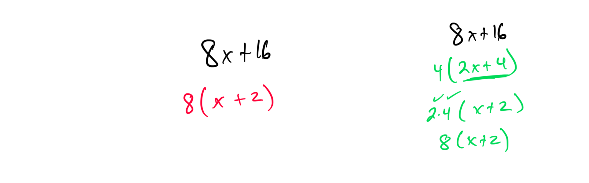

Topic 3: Introduction to the GCF of two monomials
Problem 1: Find the greatest common factor of 12x^3 and 18x^2. Show the steps to determine the GCF.

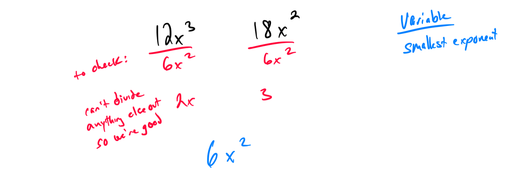

Problem 2: Determine the GCF of 15y^4 and 25y^2. Explain the process and provide the result.

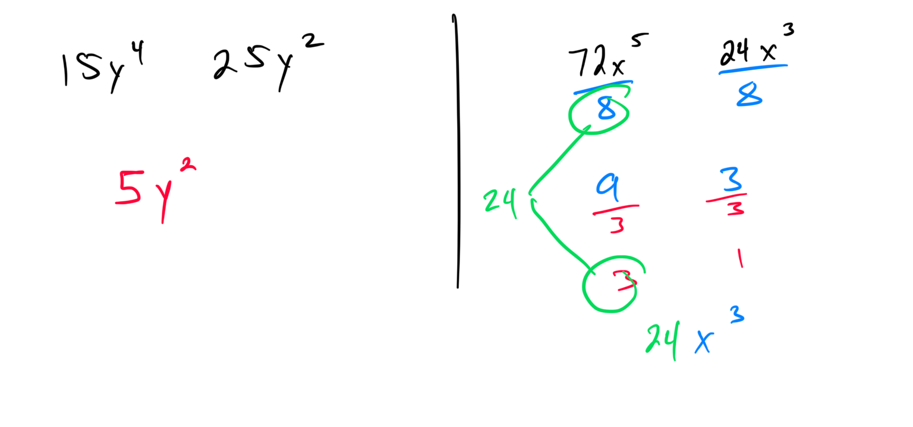

Topic 4: Greatest common factor of three univariate monomials
Problem 1: Find the GCF of 6x^2, 9x^3, and 12x^5. Break down each term and identify the common factor.

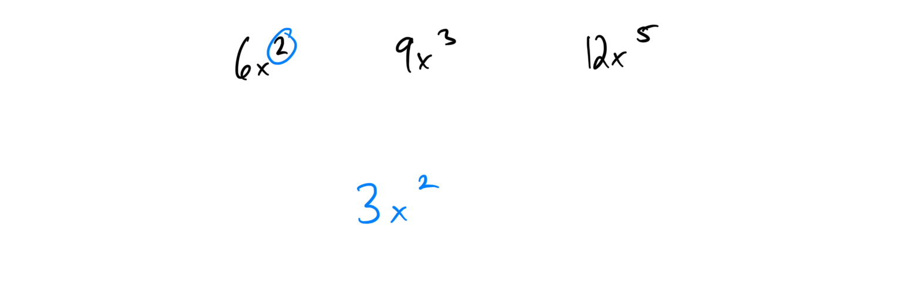

Problem 2: Determine the GCF of 10y^3, 20y^5, and 30y^2. Show the factorization and the GCF.

Topic 5: Greatest common factor of two multivariate monomials
Problem 1: Find the GCF of 8x^2y^3 and 12x^4y. Factor each monomial and determine the common factor.

Problem 2: Compute the GCF of 15a^3b^2 and 9a^2b^4. Show the steps and provide the GCF.

Topic 6: Factoring out a monomial from a polynomial: Univariate
Problem 1: Factor 4x^3 - 8x^2 + 12x by factoring out the GCF. Write the factored form.

Problem 2: Factor 9x^4 + 6x^3 - 3x^2 using the GCF. Provide the simplified factored expression.

Topic 7: Factoring out a monomial from a polynomial: Multivariate
Problem 1: Factor 6x^2y - 9xy^2 + 3xy by factoring out the GCF. Write the factored form.
Problem 2: Factor 12a^2b^3 - 8ab^2 + 4a^3b using the GCF. Simplify and express the result.

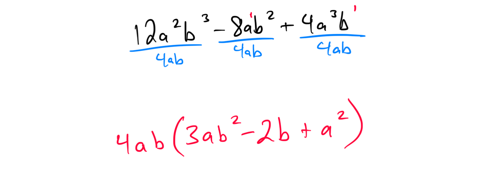

Topic 8: Factoring out a binomial from a polynomial: GCF factoring, basic
Problem 1: Factor (x + 2)^2 + 3(x + 2). Identify the common binomial and write the factored form. 

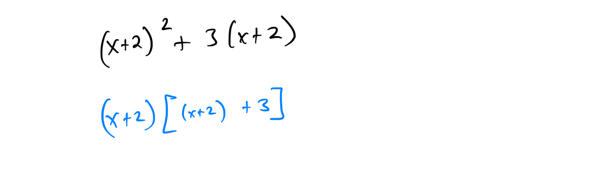

Problem 2: Factor 5(x - 1) - 2x(x - 1). Find the common binomial and express the factored result.

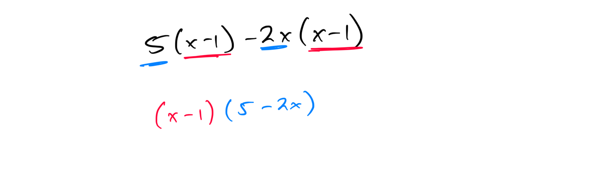

Topic 9: Factoring a univariate polynomial by grouping: Problem type 1
Problem 1: Factor x^3 + 2x^2 - 3x - 6 by grouping. Group terms appropriately and factor completely.

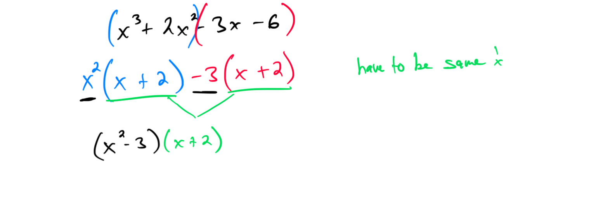

Problem 2: Factor 2x^3 - x^2 + 4x - 2 by grouping. Show the steps and provide the factored form. 

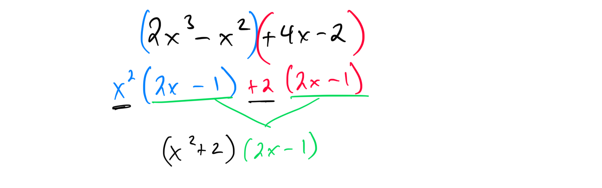

Topic 10: Factoring a univariate polynomial by grouping: Problem type 2
Problem 1: Factor x^3 - 3x^2 - 4x + 12 by grouping. Pair terms and factor completely.

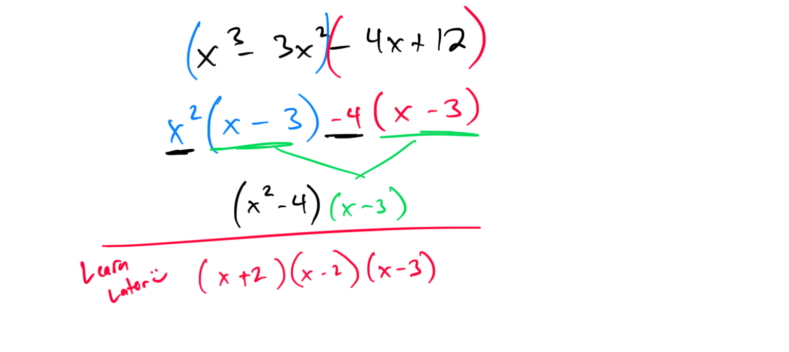

Problem 2: Factor 3x^3 + 6x^2 - x - 2 by grouping. Show the grouping and final factored expression.

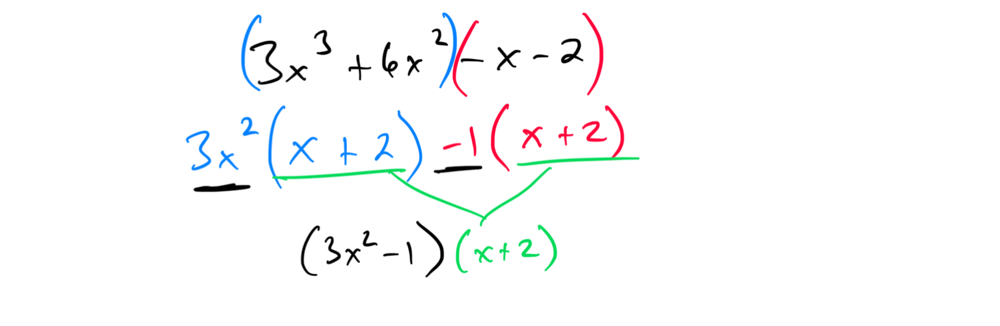

Topic 11: Factoring a multivariate polynomial by grouping: Problem type 1
Problem 1: Factor xy + 2x - 3y - 6 by grouping. Group terms and write the factored form.

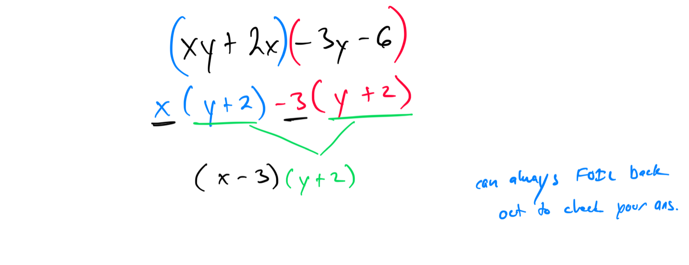

Problem 2: Factor ab - 4a + 2b - 8 by grouping. Show the steps and provide the factored result.

Topic 12: Factoring a quadratic with leading coefficient 1
Problem 1: Factor x^2 + 5x + 6. Find two numbers that multiply to 6 and add to 5, and write the factored form.

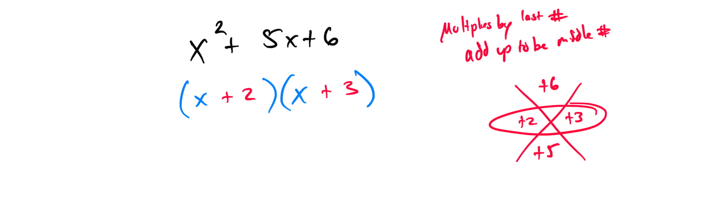

Problem 2: Factor x^2 - 7x + 12. Identify the factors and express the quadratic in factored form.

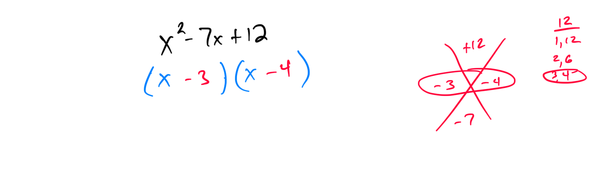

Topic 13: Factoring a quadratic in two variables with leading coefficient 1
Problem 1: Factor x^2 + xy - 6y^2. Find the factors and write the factored expression.

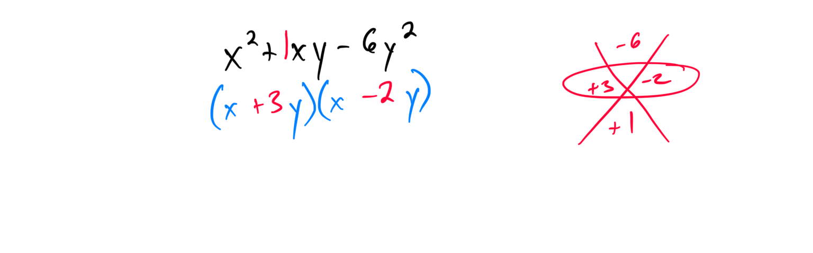

Problem 2: Factor a^2 - 2ab - 3b^2. Determine the factors and provide the factored form.

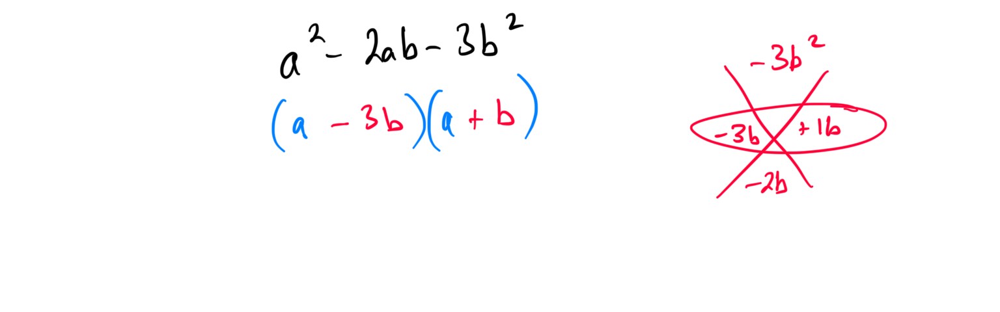

Topic 14: Factoring out a constant before factoring a quadratic
Problem 1: Factor 2x^2 + 4x - 6 completely. Factor out the GCF and then factor the quadratic.

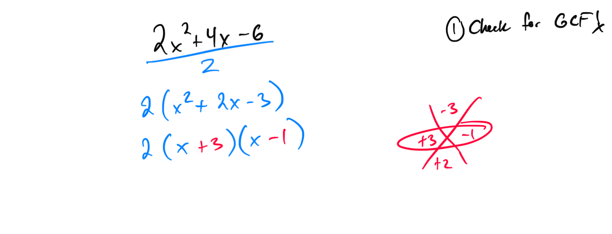

Problem 2: Factor 3x^2 - 6x - 72. Factor out the GCF and then factor the resulting quadratic.

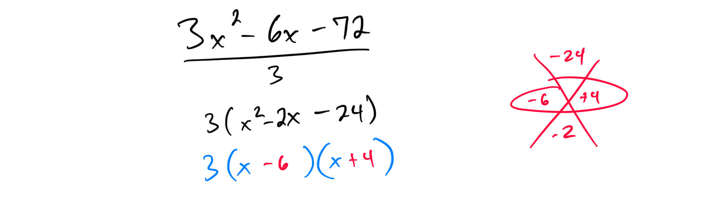

Topic 15: Factoring a quadratic with leading coefficient greater than 1: Problem type 1
Problem 1: Factor 2x^2 + 7x + 3. Use trial and error or another method to find the factors.

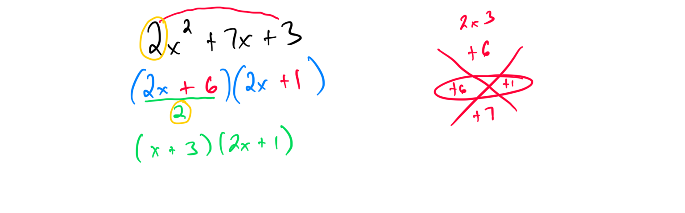

Problem 2: Factor 3x^2 - 5x - 2. Determine the factors and write the factored form.

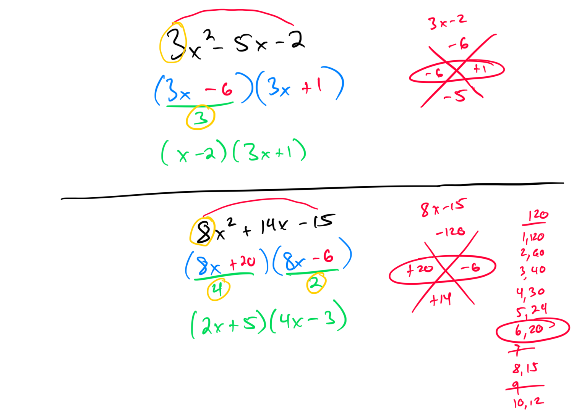

Topic 16: Factoring a quadratic with leading coefficient greater than 1: Problem type 2
Problem 1: Factor 6x^2 + 11x - 10.

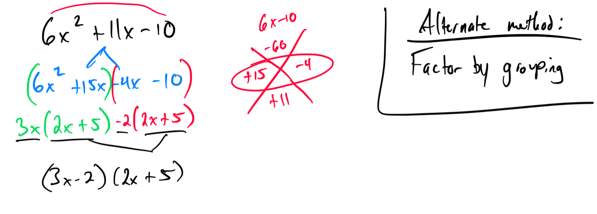

Problem 2: Factor 4x^2 - 4x - 15. Use an appropriate method and provide the factored expression.

Topic 17: Factoring a quadratic in two variables with leading coefficient greater than 1
Problem 1: Factor 2x^2 + 5xy + 3y^2. Find the factors and write the factored form.

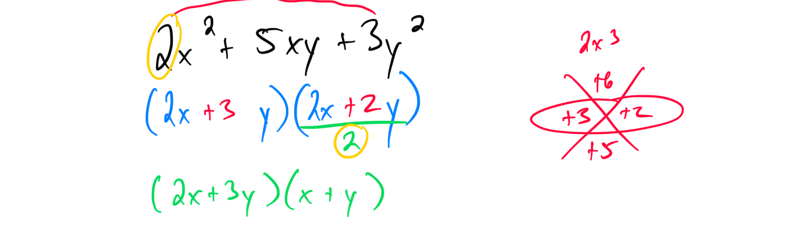

Problem 2: Factor 3a^2 - 2ab - 5b^2. Determine the factors and express the factored result.

Topic 18: Factoring a quadratic with a negative leading coefficient
Problem 1: Factor -x^2 + 4x - 3. Factor out the negative and then factor the quadratic.

[BCB81B80-66C4-4045-A614-152D84997B3A](attachments/BCB81B80-66C4-4045-A614-152D84997B3A.png)

Problem 2: Factor -2x^2 - 5x + 3. Factor out the negative and find the factors of the quadratic.

Topic 19: Factoring a product of a quadratic trinomial and a monomial
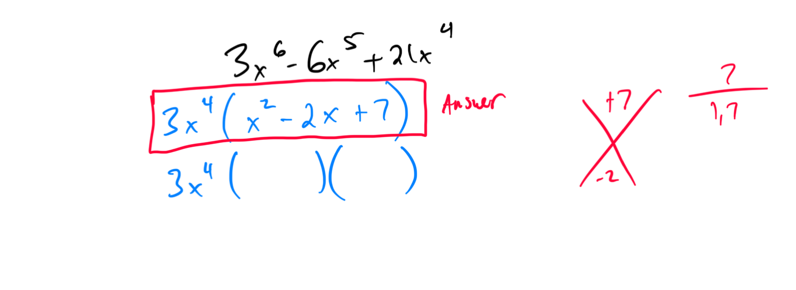

Topic 20: Factoring a perfect square trinomial with leading coefficient 1
Problem 1: Factor x^2 + 6x + 9. Recognize it as a perfect square trinomial and write the factored form.

Problem 2: Factor x^2 - 8x + 16. Identify the perfect square trinomial and express it in factored form.

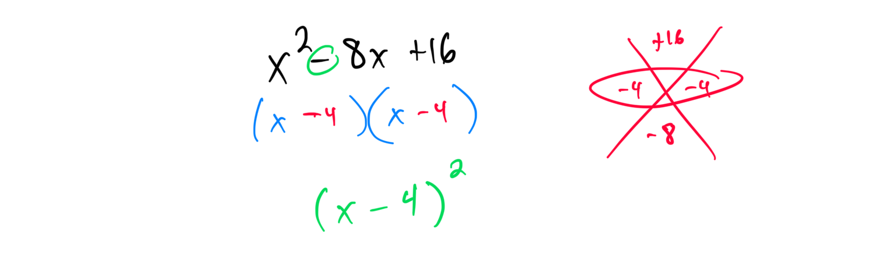

Topic 21: Factoring a perfect square trinomial with leading coefficient greater than 1
Problem 1: Factor 4x^2 + 12x + 9. Verify it as a perfect square trinomial and write the factored form.

Problem 2: Factor 9x^2 - 30x + 25. Confirm it is a perfect square trinomial and provide the factored expression.

Topic 22: Factoring a perfect square trinomial in two variables
Problem 1: Factor x^2 + 2xy + y^2. Recognize the perfect square trinomial and write the factored form.
Problem 2: Factor a^2 - 4ab + 4b^2. Identify it as a perfect square trinomial and express it in factored form.

Topic 23: Factoring a difference of squares in one variable: Basic
Problem 1: Factor x^2 - 16. Use the difference of squares formula and write the factored form.

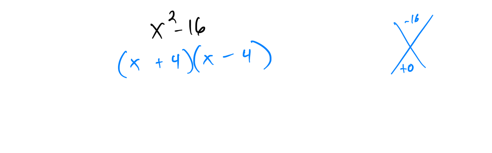

Problem 2: Factor y^2 - 25. Apply the difference of squares formula and provide the factored result.

Topic 24: Factoring a difference of squares in one variable: Advanced
Problem 1: Factor 4x^2 - 9. Recognize the difference of squares and write the factored expression.
Problem 2: Factor 25x^2 - 36. Use the difference of squares formula and simplify.

Topic 25: Factoring a difference of squares in two variables
Problem 1: Factor x^2 - y^2. Apply the difference of squares formula and write the factored form.

Problem 2: Factor 9a^2 - 16b^2. Use the difference of squares formula and provide the factored result.

Topic 26: Factoring a polynomial involving a GCF and a difference of squares: Univariate
Problem 1: Factor 3x^3 - 12x. Factor out the GCF and then factor the difference of squares.
Problem 2: Factor 5x^4 - 20x^2. Factor out the GCF and apply the difference of squares formula. 
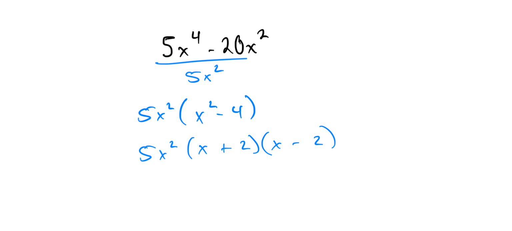

Topic 27: Solving an equation written in factored form
Problem 1: Solve (x - 3)(x + 2) = 0. Use the zero product property to find the solutions.

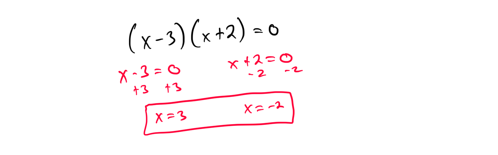

Problem 2: Solve (2x + 1)(x - 5) = 0. Apply the zero product property and provide the solutions.

Topic 28: Finding the roots of a quadratic equation of the form ax^2 + bx = 0
Problem 1: Find the roots of 2x^2 + 6x = 0. Factor and use the zero product property to solve.
Problem 2: Solve 3x^2 - 9x = 0. Factor the equation and find the roots.

[6DFF955A-1238-407B-8528-E5B29651CB15](attachments/6DFF955A-1238-407B-8528-E5B29651CB15.png)

Topic 29: Finding the roots of a quadratic equation with leading coefficient 1
Problem 1: Solve x^2 + 7x + 10 = 0. Factor the quadratic and find the roots.

[1CB343D8-E1DE-43C7-82A0-85254BA3A1E8](attachments/1CB343D8-E1DE-43C7-82A0-85254BA3A1E8.png)

Problem 2: Find the roots of x^2 - 5x + 6 = 0. Factor and use the zero product property.

Topic 30: Finding the roots of a quadratic equation with leading coefficient greater than 1
Problem 1: Solve 2x^2 + 5x - 3 = 0. Factor the quadratic and find the roots.
Problem 2: Find the roots of 3x^2 - 10x = - 8.  Factor and solve using the zero product property.

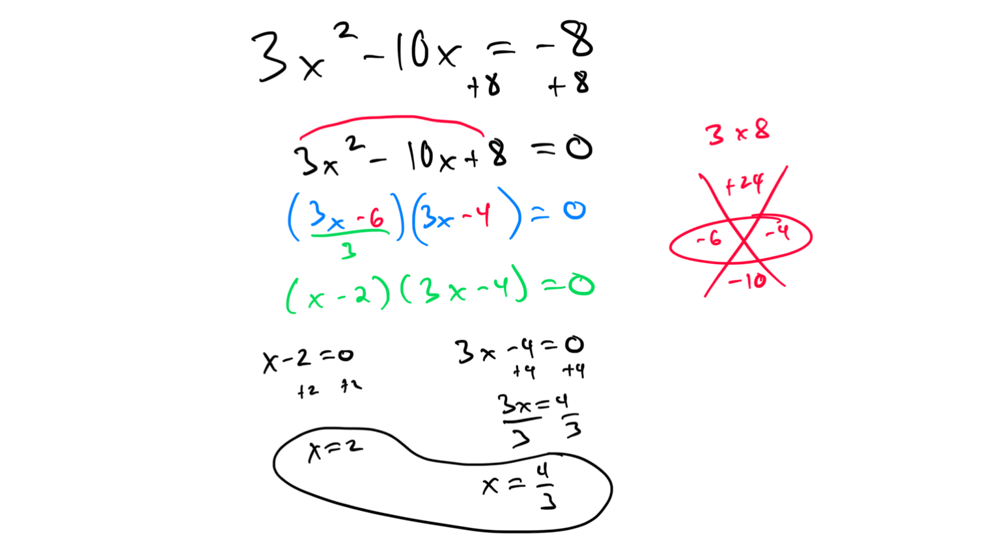

Topic 31: Introduction to the Pythagorean Theorem
Problem 1: In a right triangle, the legs are 3 cm and 4 cm. Use the Pythagorean Theorem to find the length of the hypotenuse.

[D46E6186-3FC6-46B2-B9B2-09B4AAD548F3](attachments/D46E6186-3FC6-46B2-B9B2-09B4AAD548F3.png)

Problem 2: A right triangle has legs of lengths 5 m and 12 m. Apply the Pythagorean Theorem to calculate the hypotenuse.

Topic 32: Word problem involving the Pythagorean Theorem
Problem 1: A ladder is 10 ft long and reaches 8 ft up a wall. How far is the base of the ladder from the wall? Use the Pythagorean Theorem.

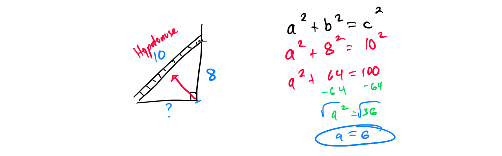

Problem 2: A rectangle has a diagonal of 13 cm and a width of 5 cm. Find the length using the Pythagorean Theorem.

[AE48847A-5648-420E-A8AE-82EC5DEED99B](attachments/AE48847A-5648-420E-A8AE-82EC5DEED99B.png)